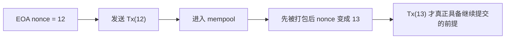

# 账户、Nonce 与顺序约束

## 先理解什么

很多前端在做 dApp 时，最熟悉的是“地址”。你知道用户地址、合约地址、token 地址，但对地址背后的账户模型往往理解得不够深。以太坊里的账户不是一个单纯字符串，而是一个能承载余额、nonce、代码和 storage 的状态对象。

最需要优先抓住的，是两类账户：

- 外部账户（EOA）
- 合约账户（Contract Account）

以及一个几乎每次发交易都会遇到的字段：

- `nonce`

你越早把这三者的关系理清，后面很多交易层现象就越容易解释。

### 先把几个词钉牢

**外部账户（EOA, Externally Owned Account）** 是由私钥直接控制、能够主动发起交易并支付 gas 的账户。直觉上它更像链上世界里真正能先迈出第一步的“操作员”。工程上这意味着用户钱包、签名动作、交易顺序和手续费承担，首先都绑定在 EOA 上。

**合约账户（Contract Account）** 是由部署在链上的代码控制、负责保存状态和执行业务逻辑的账户。直觉上它更像一台被调用时才开始工作的自动机，而不是会自己点按钮的人。工程上这意味着合约可以持有余额、代码和 storage，但它的动作入口依赖外部交易或其他合约调用来触发。

**Nonce** 是 EOA 级别的递增计数器，每发送一笔新交易都要消耗下一个编号。直觉上你可以把它看成“这个账户自己的排队号”，链借此判断同一发送者的多笔意图谁先谁后。工程上它既决定 pending 堵塞和替换交易的行为，也承担最基础的抗重放作用。

## 为什么重要

账户模型决定了链上“谁在发起动作、谁在承接逻辑、谁在保存状态”。而 nonce 决定了同一个账户的交易顺序和可替换性。

这会直接影响真实工程里的很多场景：

- 为什么用户一笔 pending 交易会把后续交易卡住
- 为什么“加速交易”和“取消交易”本质上都在用同一个 nonce 做替换
- 为什么签名离开链和上下文约束时会引出重放问题

如果没有账户和 nonce 这层理解，你会把很多现象错误地归咎于 RPC 慢、钱包抽风或链上“不稳定”。

## 核心机制

### 1. 账户是状态入口，不只是地址标签

从开发者角度最实用的理解是：

- EOA 主要由私钥控制，能主动发起交易
- 合约账户由代码控制，不能自己“主动点按钮”

外部账户通常关心：

- 余额
- nonce

合约账户通常还会额外关心：

- 代码
- storage

所以当你看到一个地址时，应该逐渐习惯去想：它背后是哪个账户类型，它在这次交互里扮演什么角色。

### 2. Nonce 让同一账户的交易有了严格顺序

对 EOA 来说，每发出一笔交易，nonce 都会递增。这个机制承担了两个核心职责：

- 防止同一笔交易被无约束重复使用
- 强制同一账户的交易按序进入执行序列

可以先把它理解成“账户级流水号”。如果你先发出 nonce 为 12 的交易，又发出 nonce 为 13 的交易，那么大多数情况下，13 不能绕过 12 独立完成状态提交。



### 3. 替换交易本质上是“同 nonce 竞争”

你平时看到的钱包“加速”或“取消”交易，并不是魔法。它通常依赖同一个 nonce 的新交易去替换旧交易。

例如：

```ts
const replacementTx = {
  nonce: 12,
  to: userAddress,
  value: 0n,
  maxFeePerGas: higherFee,
  maxPriorityFeePerGas: higherTip
};
```

如果网络接受了这笔同 nonce 且手续费更有竞争力的交易，那么旧交易就可能被替代。  
这也是为什么说“取消交易”很多时候并不是删除旧交易，而是用新的同 nonce 交易覆盖它。

### 4. 合约账户没有“自己递增发交易的 nonce”这层产品语义

合约在内部调用其他合约时，也会发生调用序列，但它和 EOA 主动签名发交易是两个层次。对前端和应用工程师来说，最关键的仍然是理解用户账户的 nonce 如何约束交易队列。

只要你还在处理钱包、签名和 pending 状态，nonce 就会不断出现。

## 常见误区

### 误区一：把地址当成静态身份标签

地址当然代表身份入口，但工程上更重要的是它背后对应什么账户类型、当前有什么状态、能否主动发交易。

### 误区二：以为 pending 只是网络慢

有些 pending 是网络拥堵，但有些 pending 来自更根本的账户顺序约束。前一个 nonce 没解决，后一个 nonce 经常就会被卡住。

### 误区三：以为取消交易就是“删除上一笔”

在很多钱包体验里，你看到的是取消按钮；在底层机制里，更接近“发一笔新的同 nonce 交易，把旧的竞争掉”。

## 工程判断

以后你在前端里处理交易状态时，要主动把账户级顺序考虑进去。

第一，如果用户短时间连续发多笔交易，不要只展示单笔局部状态，要知道它们可能是一个账户序列。

第二，设计“加速”“取消”这类交互时，要清楚它们依赖的是同 nonce 替换，而不是独立旁路。

第三，后面学签名与重放时，要把 nonce 看成“顺序约束 + 抗重放上下文”的一部分，而不是一个钱包自动填的附属字段。

## 本节小结

账户模型告诉你谁在持有状态、谁能主动发交易。nonce 告诉你同一账户的交易如何排序、如何替换、如何避免简单重放。把这两个概念补上以后，很多链上交互问题就会从“现象”变成“可解释机制”。
