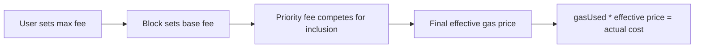

# 费用、回执与失败语义

## 先理解什么

对很多刚进入 Web3 的开发者来说，交易的“费用”和“结果”常常是两团模糊信息。钱包里你会看到：

- gas limit
- max fee
- priority fee
- estimated fee

交易结束后你又会看到：

- status
- gas used
- logs
- revert

如果这些词只是散着记住，你很难建立稳定判断。更成熟的理解应该是：费用字段属于“执行前的资源承诺”，receipt 属于“执行后的结果摘要”，revert 属于“执行过程中失败的语义”。

## 为什么重要

这层理解的重要性非常直接。

第一，它影响你如何给用户做交易提示。  
第二，它影响你如何 debug 一笔失败交易。  
第三，它影响你是否会把“失败”误解成“没发生任何事”。

很多前端在用户体验上做得不够成熟，就是因为把“签名弹窗里的费用信息”和“上链后的回执信息”混成了一团。

## 核心机制

### 1. Gas limit 是你给执行准备的上限，不是实际花费

发交易前你会看到 gas limit。它更接近：

- 你愿意为这次执行准备多少 gas
- 这次执行最多能消耗到哪里

真正花掉多少，要看执行后的 `gasUsed`。这也是为什么 gas limit 很大，并不代表你一定花那么多。

### 2. EIP-1559 之后，费用更像“上限 + 小费 + 实际结算”

对现代以太坊用户来说，更值得先抓住的不是历史演化，而是当前字段语义：

- `baseFeePerGas`：区块基础费用
- `maxPriorityFeePerGas`：给打包者的小费空间
- `maxFeePerGas`：你愿意支付的总上限

### 3. Receipt 是执行后的摘要，不是业务解释器

一笔交易完成后，receipt 里通常最值得你先看的是：

- `status`
- `gasUsed`
- `blockNumber`
- `logs`

但 receipt 的职责是摘要，不是替你解释业务意图。比如 `status = 0` 说明失败了，但不等于它自动告诉你“为什么失败”。`logs` 告诉你发出了什么事件，但不等于它自动帮你确认业务状态已经被链下系统消费。

### 4. Revert 失败不等于“完全没成本”

这是很多人最容易误解的点。一笔交易即使执行失败，也往往已经消耗了执行过程中的资源。因为 EVM 已经做了一部分工作，只是最终状态没有成功提交。

所以你应该把失败理解成：

- 业务状态回滚
- 资源成本已经发生

而不是像没发过一样完全不留痕迹。

### 5. 前端应该把费用和失败语义一起设计

一个成熟的前端不只是展示“手续费预计多少”，还应该能在失败时告诉用户：

- 是签名取消
- 是广播失败
- 是执行回滚
- 是链上确认后 `status` 失败

只有这样，用户才不会把所有失败都看成“钱包又坏了”。

## 工程判断

以后你在处理一笔交易时，建议先分三层看：

1. 发送前：用户将面对什么费用上限
2. 执行后：实际花了多少，receipt 告诉了什么
3. 失败时：失败属于哪一层，用户应该得到什么解释

只要这三层分清，很多交易 UX 和 debug 质量都会明显提升。

## 本节小结

Gas fee 是执行前的成本承诺，receipt 是执行后的结果摘要，revert 是执行失败的语义表达。把这三者连起来，你才真正开始理解一笔交易“花了什么、做成了什么、失败在哪”。
