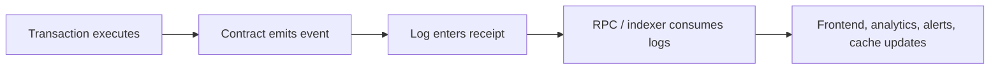

# Event 能做什么，不能做什么

## 先理解什么

很多前端开发第一次觉得 Web3 很“顺手”，往往是在监听事件的时候。因为和纯看状态相比，事件天然更像前端熟悉的消息流：

- 有名字
- 有参数
- 有时间顺序
- 可以被链下消费

于是很容易形成一种误解：  
“既然事件这么方便，那是不是只要 emit 足够多信息，很多链上状态都可以不存了？”

这正是本章要纠正的地方。

### 先把几个词钉牢

**Event** 是合约主动广播给链下世界消费的结构化执行信息。直觉上它更像一次“对外播报”，告诉前端、索引器和分析系统刚刚发生了什么。工程上这意味着 event 很适合驱动通知、列表更新和统计系统，但它不是链上状态本身。

**Log** 是 event 编码后附着在交易结果里的底层记录，最终会出现在 receipt 中。直觉上你可以把 log 看成事件在底层留下的原始痕迹。工程上这解释了为什么链下系统能按区块扫描日志，却不能像读 storage 一样把日志当成合约内部主状态读取。

**Topic / `indexed`** 是为日志查询准备的索引层。直觉上它像给事件额外贴上的检索标签，让“按地址、按用户、按 tokenId 找事件”变得便宜。工程上这意味着事件参数设计不仅要考虑可读性，还要考虑哪些字段值得被高频过滤。

## 为什么重要

对工程系统来说，事件和状态都重要，但它们解决的问题并不一样。

如果你把事件当状态替代品，就会遇到：

- 链下系统重放或漏消费后，难以重新校正
- 某些关键条件无法在链上被其他合约读取
- 前端只靠日志展示数据，结果和真实状态脱节

如果你完全不用事件，只靠前端轮询状态，又会遇到：

- 很难高效追踪变化
- 很难做时间序列型 UI
- 很难给分析、通知、风控、排行榜等系统提供稳定输入

成熟系统必须同时理解两者的角色。

## 核心机制

### 1. 状态回答“现在是什么”，事件回答“刚刚发生了什么”

这是最值得先记住的一句话。

链上状态更像当前数据库快照。  
事件更像事务完成后留下的操作记录。

所以当你问：

- 某个地址当前余额是多少
- 某个仓位当前健康度是多少
- 当前 owner 是谁

你真正要信的应该是状态。

而当你问：

- 刚刚有没有发生转账
- 哪个用户在这个区块里完成了质押
- 某次清算发生在什么时间点

事件就会非常有用。

### 2. Log 存在于 receipt 中，而不是合约主状态里

很多人知道 `emit Transfer(...)`，但不清楚它最后出现在哪里。  
更准确地说，事件会编码成 log，附着在交易执行结果里，成为 receipt 的一部分。

因此事件天然适合被链下系统消费，因为：

- 交易执行后可直接拿到
- 参数结构清晰
- 可按区块范围、合约地址、topic 过滤

但它也意味着：  
事件不是链上通用可读状态。其他合约不能像读 storage 一样直接读取历史 log 来做决策。

### 3. `indexed` 让事件更可查，但不是免费午餐

事件参数里常见一个关键字：`indexed`。  
它的作用，是把部分参数放进 topics，便于按条件过滤。

这就是为什么很多标准事件会把：

- `from`
- `to`
- `owner`
- `spender`

这类高频筛选字段标成 `indexed`。

但工程上要注意两点：

第一，`indexed` 更偏向查询便利，而不是完整还原业务语义。  
第二，不是所有参数都适合标成 `indexed`，因为它也会影响编码和可读性设计。

### 4. 事件非常适合驱动链下系统

事件最强大的地方，是它天然适合成为链下数据管道入口。  
例如：

- 前端监听交易完成后的 UI 更新
- 后端索引器同步用户操作记录
- 分析系统统计交易量和活跃度
- 风控系统监测清算、授权和异常行为

这也是为什么真实协议通常会认真设计事件，而不是随手一写。

### 5. 事件不能替代关键状态

最容易踩坑的地方在这里。

如果某个值对链上逻辑本身重要，其他合约未来可能依赖它，那么它必须存在于状态中，而不是只存在于事件里。

原因很直接：

- 事件主要为链下可观测性服务
- 历史事件消费过程可能出错或丢失
- 合约内部和其他合约无法把“查历史 log”当成稳定状态读取手段

一个成熟设计通常是：

- 状态保存真实可判定事实
- 事件广播这次变化的上下文

### 6. 前端要把“事件到了”与“状态最终可信”区分开

很多 dApp 前端会在监听到事件后立刻更新页面，这是对的。  
但如果页面长期只信事件，不做状态回读，就可能埋下同步偏差。

更稳的做法通常是：

1. 先用事件或 receipt 提供快速反馈
2. 再用状态查询做最终确认

这样既保留事件驱动的灵敏度，又不把 UI 建在脆弱假设上。

## 工程判断

以后看到任何 event 设计时，你都可以先问：

1. 这个事件在告诉链下系统什么变化？
2. 哪些字段适合被 `indexed`？
3. 如果不看事件，只看状态，我还能判定真实结果吗？
4. 如果链下系统漏了一段历史，能不能靠状态重新恢复？

这几个问题会帮你判断一套事件系统是不是成熟。

## 本节小结

事件擅长描述“发生了什么”，状态擅长描述“现在是什么”。log 是 receipt 里的链下可观测性结构，适合索引、通知和分析，却不能替代关键链上状态。只有把这层边界看清，你才能写出既好用又稳的合约接口和前端同步逻辑。
