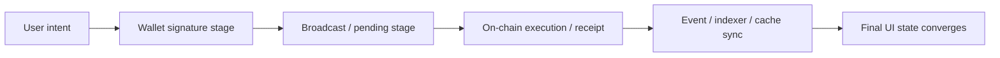

# 链上延迟与最终一致下的前端状态设计

## 先理解什么

很多前端开发一开始做 Web3，会自然地把一次链上交互映射成熟悉的流程：

- 点击按钮
- 发请求
- 等结果
- 更新页面

问题在于，链上交互不是一个单一请求，而是一串阶段化事件：

- 用户是否签名
- 钱包是否广播
- 交易是否进入 mempool
- 是否被打包
- 执行是否成功
- 索引器和前端缓存是否同步

所以如果你还用普通 HTTP 请求那套“loading / success / error”三段式去描述，用户体验通常会很快失真。

### 先把几个词钉牢

**Pending** 指交易已经被签名并广播，但结果还没有稳定进入链上最终状态的阶段。直觉上它像“已经排进队，但还没真正轮到执行”。工程上这意味着前端不能把 pending 当成功，也不能把它当纯 loading，而要把它视作一个需要单独表达的不确定阶段。

**Confirmation** 指交易已经被纳入区块，并开始积累后续区块确认的过程。直觉上它像“事情已经发生，但还需要更多旁证证明它足够稳”。工程上这意味着不同产品对确认数的要求可以不同，UI 也要区分“已打包”和“已足够可信”。

**Finality** 指结果已经稳定到不太可能再被回滚的状态。直觉上它像“系统终于愿意把这件事当成定局”。工程上这解释了为什么链上前端追求的是最终一致，而不是像本地状态那样瞬时同步。

## 为什么重要

链上前端最常见的问题很多都来自状态模型过于粗糙：

- 用户已经签名，但页面还显示“等待提交”
- 交易已广播，页面却提示成功
- 交易已确认，但索引数据没跟上，导致 UI 看起来像失败
- 交易被替换或回滚，页面没有对应解释

这些都不是组件小 bug，而是状态设计没尊重链上异步事实。

## 核心机制

### 1. 链上状态更像阶段机，而不是一次性结果

更成熟的前端会把交易拆成更细阶段，例如：

- idle
- awaiting_signature
- submitted
- pending
- confirmed
- failed
- replaced

这样做的意义不是状态名更复杂，而是每个阶段代表的信息来源不同：

- 钱包返回
- RPC 返回
- 区块确认
- receipt 状态
- 缓存 / 索引回填

### 2. 事件快，状态准，两者都要用

前面已经讲过：

- event 适合快速观察变化
- state 适合最终确认真实结果

前端状态设计里，这一点尤其重要。  
更稳的模式通常是：

1. 用交易 hash、receipt、event 提供快速反馈
2. 用状态查询和数据重新拉取做最终收敛

这样既能快，又不至于把 UI 建在易漂移的假设上。

### 3. 索引延迟和缓存失配是正常现象，不是例外

很多开发者把“链上已经成功，但页面没立刻变”当成异常。  
其实在真实系统里，这很常见，因为：

- indexer 需要消费新区块
- 前端缓存需要失效或重拉
- 多源数据未必同时更新

所以好的 UI 不会隐含承诺“确认后页面立刻全同步”，而会更明确地区分：

- 链上确认
- 数据同步完成

### 4. 重试与替换必须尊重 nonce 和幂等性

链上前端的“重试”不能等价成“再发一次同样请求”。  
因为用户可能：

- 使用同 nonce 替换交易
- 加速原交易
- 取消原路径

这意味着前端必须理解：

- 是同一业务动作的继续
- 还是一笔全新交易

否则就会出现重复弹窗、重复记录和错误成功提示。

### 5. 最终一致比瞬时一致更接近真实世界

链上前端要接受一个事实：  
不是所有页面元素都会在同一时刻一致。

你真正追求的应该是：

- 每个阶段都给用户诚实解释
- 关键结果最终会收敛到真实状态

这比表面上的“立刻同步”更可靠。

## 工程判断

以后你设计链上交互 UI，优先问这五件事：

1. 我的状态阶段是不是足够细？
2. 哪些提示来自钱包，哪些来自链上 receipt？
3. 事件和状态回读各负责什么？
4. 交易被替换、失败、延迟时，用户会看到什么？
5. 页面最终靠什么收敛到真实状态？

只要这五个问题答不清，前端体验大概率会在真实使用里暴露问题。

## 本节小结

链上前端不是在管理“请求是否成功”，而是在管理一条跨钱包、RPC、区块、事件和索引系统的异步阶段链。把状态设计成阶段机，把事件与状态回读配合起来，再接受最终一致而非瞬时同步，你的 dApp 前端才会真正成熟。
