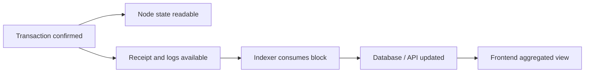

# 为什么你的多数据源会出现分歧

## 先理解什么

很多前端开发第一次碰到链上数据抖动时，会本能地怀疑：

- RPC 挂了
- 钱包有 bug
- 自己调用错了

这些当然都有可能，但更常见的原因其实是：  
你把“读取链上数据”想得过于理所当然了。

在 Web2 里，你请求同一个后端接口，多半默认它会给你某个时刻的一致结果。  
但在链上世界里，读取往往取决于：

- 你打到了哪个节点
- 这个节点同步到哪里
- 它基于哪个区块回答
- 中间有没有重组
- 你读的是链上状态、日志索引还是平台缓存

所以“都是同一条链，结果为什么不一样”这个问题，本身就建立在一个过强的假设上。

## 为什么重要

如果你不理解读取一致性的边界，就会在前端工程里反复踩三类坑：

- 页面一会儿显示余额更新，一会儿又回退
- 事件列表和状态查询互相对不上
- 用户明明已经确认交易，页面却出现“像没成功一样”的短暂错乱

这些问题之所以难查，是因为它们既不像纯前端 bug，也不像纯合约 bug，而是数据来源与确认层级没有设计清楚。

## 核心机制

### 1. RPC 回答的是“某个节点眼里的当前状态”

RPC 并不是一个抽象真理源，它只是某个节点对外暴露的接口。

这意味着：

- 不同服务商背后可能接入不同节点集群
- 节点同步速度未必完全一致
- 某些节点在高负载时会滞后几个区块

所以你问“现在余额是多少”，本质上是在问：

- 这个节点当前认定的链头是什么
- 这个链头下该地址余额是多少

这和“链有一个绝对实时单点真相”不是一回事。

### 2. 读取接口经常默认基于 latest，但 latest 本身就在移动

多数前端调用如果不显式指定 block tag，就会默认读 `latest`。  
问题在于 `latest` 是动态目标。

当你连续发几个读取请求时，它们可能根本不是基于同一个区块：

- 第一个请求基于 block N
- 第二个请求基于 block N+1
- 第三个请求基于 block N+2

于是你就可能在同一屏里看到：

- 某个资产余额已经更新
- 某个列表还是旧数据
- 某个事件索引还没跟上

这并不一定是系统坏了，而是你没有把读取锚定到同一个观察点。

### 3. 事件、状态和索引器经常不在同一个时钟上

链上前端常见的三类读取源：

- 直接 `eth_call` 读状态
- 直接查日志或 receipt
- 查索引器 / 中间层数据库

这三类数据源的同步模型不同：

- 状态读取最贴近节点当前视角
- 日志读取取决于节点日志可用性与区块上下文
- 索引器读取取决于消费、解析、存储和查询层

所以在交易刚确认后出现短时间分歧非常常见：

- receipt 已经成功
- 合约状态已经可读到新值
- 索引器页面列表还停在旧数据

### 4. reorg 会让“刚刚看到的结果”失去稳定性

只看 `latest` 的另一个风险是：  
你看到的结果未必已经足够稳定。

在确认数较低时，区块可能重组。于是你会遇到：

- 某条 event 短暂出现后又消失
- 某笔交易看起来成功，后来又回到 pending 或被替换
- 某个派生列表先更新后回退

这不是“链不可靠”，而是区块链本来就不是瞬时最终确定系统。

### 5. 多数据源读取的关键不是追求绝对统一，而是明确分层

更成熟的设计通常会把读取目标分层：

- 快速反馈层：事件、receipt、局部缓存
- 准确确认层：指定区块高度的状态读取
- 展示聚合层：索引器与链下派生数据

这样你不会要求同一时刻所有层都完全一致，而会明确告诉自己：

- 哪些信息是“刚刚发生”
- 哪些信息是“已经确认”
- 哪些信息是“已经被链下系统整理好”

### 6. 工程上要学会“同块读取”和“多源降级”

真正实用的策略通常是：

- 对同一个页面的一组关键状态，尽量基于同一 block number 读取
- 把链上直读作为最终确认锚点
- 把索引器作为聚合展示层，而不是唯一真相源
- 给用户明确区分“链上已确认”和“数据同步中”

一旦某个来源异常，你还应该能降级：

- 索引器挂了时，保留基本链上可读能力
- 某 RPC 抖动时，切备用 RPC
- 某读路径延迟时，至少保住核心状态正确

## 工程判断

以后你看到链上数据不一致，先问这六件事：

1. 这些读取是不是基于同一个区块高度？
2. 我读的是链上状态、日志，还是索引器结果？
3. 是否存在节点同步滞后或服务商差异？
4. 当前结果是否可能受低确认数或重组影响？
5. 页面是否把“确认成功”和“数据已同步完成”混成了一回事？
6. 某个数据源失效时，我有没有降级路径？

只要这六个问题问清，大多数“玄学读取问题”都会从黑盒变成工程问题。

## 本节小结

RPC 一致性问题的本质，不是某个库偶尔发疯，而是你面对的是多个节点、多个确认层级、多个数据处理时钟。理解这一点以后，你才会真正知道如何设计一个不被“读取抖动”轻易击穿的 Web3 前端。
