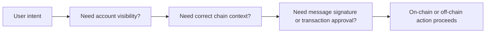

# 钱包与 Provider 的边界到底在哪里

## 先理解什么

很多前端开发刚做 Web3 时，会把下面这些东西天然混在一起：

- 钱包
- provider
- 当前链
- 账户权限
- 签名弹窗

看起来它们确实总是一起出现。  
但如果你想把问题真正定位清楚，就必须把它们拆开：

- 钱包是用户持有密钥和确认动作的界面与能力容器
- provider 是 dApp 与钱包或节点交互的接口层
- 当前链是执行上下文
- 账户权限是用户是否允许你看到或使用某个身份

只有把这几层分开，你的交互设计才不容易变成一锅粥。

## 为什么重要

Web3 前端很多经典问题都来自边界混淆：

- 用户连上钱包了，但页面仍然用错链
- 切完链以后，前端缓存和 signer 还停在旧上下文
- 页面把“连接账户”和“授权交易”混成同一种允许动作
- 用户拒绝一次签名，前端却误以为钱包断开了

这些都不是“小兼容性问题”，而是产品模型没尊重底层边界。

## 核心机制

### 1. provider 不是钱包本身，而是交互桥

对前端来说，provider 更像一个桥：

- 它把请求从 dApp 送到钱包或节点
- 它把账户、链 ID、签名请求和 RPC 能力暴露出来

所以你应该把 provider 理解成：

- 一个能力入口
- 一个上下文来源
- 一个可能变化的外部依赖

而不是把它当成“钱包 = provider = 当前状态真相”。

### 2. “连接钱包”本质上是请求身份可见性

很多产品把“连接钱包”当成一个大而全的动作，仿佛用户一旦点了连接，你就获得了全部能力。  
其实更准确的理解是：

- 用户允许 dApp 看到某些账户
- dApp 因此拥有某个身份上下文

这不等于：

- 用户已经同意交易
- 用户已经同意签名任意消息
- 用户已经切到正确链

连接只是开始，不是总授权。

### 3. 切链不是视觉动作，而是执行上下文迁移

切换链最容易被低估，因为在页面上它看起来像一个下拉框选择。  
但本质上你是在切换：

- 交易发送目标
- RPC 查询上下文
- 合约地址集合
- 余额与资产解释方式

这意味着切链之后，前端很多状态都需要重新确认：

- 当前 signer 是否仍有效
- 当前合约地址是否适配新链
- 页面缓存是否需要失效
- 旧链 pending 状态是否还应继续展示

### 4. 签名、交易授权和账户可见性是三种不同权限

这三者特别容易被用户和开发者一起混淆。

更准确的区分是：

- 账户可见性：你能看到哪个地址
- 消息签名：用户是否愿意为某段消息背书
- 交易发送：用户是否愿意发起一次链上状态变更

它们的风险、语义和用户期待都不同。  
如果页面把这些动作用同样话术描述，用户很容易被误导。

### 5. 钱包状态变化要被当成外部事件而不是内部事实

前端最稳的思路不是“我自己记住钱包状态”，而是：

- 钱包状态是一类外部输入
- 链变化、账户变化、连接断开都可能随时发生
- 你的应用需要响应这些变化，而不是假设它们恒定不变

这也是为什么钱包相关前端更像在处理事件源，而不是只在点击时发请求。

### 6. 工程上要把“用户意图”和“底层权限动作”分开设计

一个成熟的钱包交互流程通常会拆成：

- 用户想做什么
- 为完成这个目标，系统需要哪些前置条件
- 当前缺的是连接、切链、签名还是授权交易

这样做的好处是，页面不会盲目弹各种请求，而是更明确地告诉用户：

- 现在缺哪一步
- 这一步为什么需要
- 做完之后会发生什么

## 工程判断

以后你设计钱包交互时，优先问：

1. 我现在需要的是账户可见性、切链、签名，还是交易授权？
2. provider 在这个流程里只是桥，还是我误把它当成真相源了？
3. 链切换后哪些状态必须重算或失效？
4. 用户是否能清楚理解当前弹窗在请求什么权限？
5. 钱包变化是否被我当成外部事件来处理？

只要这五件事理清，很多钱包相关的体验问题都会明显变少。

## 本节小结

钱包、provider、链上下文和权限动作不是同一个东西。把它们拆开理解，才能设计出更诚实、更稳定的 Web3 前端交互。
