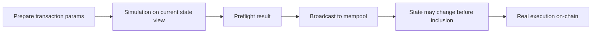

# 交易模拟到底能承诺什么，不能承诺什么

## 先理解什么

很多前端开发第一次接触 simulation 时，会自然形成一个朴素想法：

- 如果模拟通过了，交易应该就能成功
- 如果 `estimateGas` 给出了数字，那这个数字应该比较可靠
- 如果本地先做了 allowance、balance、chainId 等检查，用户发出去就不会出事

这些想法不算完全错，但它们都把“预检查”理解得太强了。

更准确的理解应该是：

- simulation 是基于某一时刻状态的执行预演
- gas estimation 是对可能执行路径的一次试探
- preflight check 是在发送前减少低级错误，而不是替代链上最终结论

你要学会的是“让发送前更稳”，而不是“幻想发送前能知道一切”。

## 为什么重要

很多 dApp 的用户体验问题都发生在这个夹层里：

- 页面显示“预计成功”，真正上链却因为状态变化失败
- 页面模拟时没问题，但真实打包时因为滑点、nonce、余额变化而 revert
- 页面把 gas estimate 当成固定值，结果遇到分支路径后完全不够
- 页面过度相信本地检查，忽略了 mempool 排队和竞争执行的现实

如果你把 simulation 讲得太神，它会变成一种错误承诺。  
如果你完全不做 simulation，它又会让很多本可提前发现的问题留到链上暴露。

真正成熟的做法，是把 simulation 放回它该在的位置。

## 核心机制

### 1. simulation 本质上是“按当前视角执行一次”

无论你用的是 `eth_call`、`callStatic` 还是 `simulateContract`，底层思路都很像：

- 以当前节点看到的链状态为基础
- 用你准备发送的 `to`、`data`、`value`、`from` 等参数
- 在不真正提交状态的前提下执行一次

它回答的问题更接近：

- 在“此刻这个状态视角下”，这段调用会不会 revert
- 如果不 revert，返回值大概是什么
- 某些执行路径下 gas 可能落在什么范围

它没有回答的问题包括：

- 交易什么时候被打包
- 打包前状态是否会被别人改掉
- 你是不是会被抢跑、插队或延迟
- 执行时走到的到底是不是这条路径



### 2. simulation 看的是“状态快照”，真实交易面对的是“动态世界”

这是最关键的区别。

你在按钮点击时看到的状态，可能在几秒内就变了：

- 某个 allowance 被别的交易先用掉
- 某个池子的价格在你打包前已经变化
- 某个 nonce 被同账户另一笔交易占用
- 某个依赖条件被其他人先满足或先破坏

尤其在以下场景里，simulation 与真实执行最容易偏离：

- swap、liquidation、mint 等强依赖价格或库存的操作
- 多人竞争同一状态的交互
- 依赖 `block.timestamp`、`block.number`、TWAP 窗口或 oracle 更新的逻辑
- 用户本地还在并发发送其他交易

所以你不能把 simulation 理解成“未来真相”，而应该理解成“当前状态下的可执行性证明”。

### 3. `estimateGas` 是执行探针，不是合同

`estimateGas` 经常被误当成“真实交易肯定只要这么多 gas”。  
实际上它更像：

- 节点尝试找出一条可执行路径
- 推测一笔交易至少需要多少 gas 才不至于立刻失败

它不保证：

- 真实执行路径完全相同
- 某些分支不会因为状态变化而更贵
- 某些外部调用不会引入更多成本

工程上更稳的做法通常是：

- 用 `estimateGas` 作为基线
- 在前端或发送层再乘一个合理 buffer
- 对高波动路径保留失败重试或更强提示

### 4. preflight check 更适合筛掉“确定性错误”

发送前最值得做的检查，不是试图预测所有未来，而是尽可能清掉那些一眼就知道会失败的问题，例如：

- 当前链不对
- 合约地址为空或版本不匹配
- 本地输入不合法
- 余额不足以支付 `value`
- allowance 明显不足
- 用户地址为空或钱包未连接

这些检查的价值很大，因为它们能在不浪费用户 gas 的前提下尽早暴露问题。

相反，以下问题更适合被描述成“风险提示”而不是“成功保证”：

- 价格可能变化
- 交易可能排队过久
- 执行可能受竞争影响
- 真实 gas 可能高于估算

### 5. 成熟的发送流程通常会分层，而不是一个大按钮全包

一个更稳的交易发送前流程，大致会分成：

1. 本地输入校验  
2. 钱包与链上下文检查  
3. 合约级 simulation / estimate  
4. 用户风险提示  
5. 广播后状态跟踪  
6. receipt 与最终结果确认

如果你把这些全都塞进一句“预计成功”，其实是在隐藏不确定性。

下面这个前端片段体现的就是“预检查帮助决策，但不替代最终链上结果”：

```ts
const simulation = await publicClient.simulateContract({
  address: vaultAddress,
  abi: vaultAbi,
  functionName: "deposit",
  args: [amount],
  account
});

const gas = await publicClient.estimateContractGas({
  ...simulation.request
});

await walletClient.writeContract({
  ...simulation.request,
  gas: (gas * 12n) / 10n
});
```

这里的重点不是 API 名字，而是顺序：

- 先验证当前状态下能否执行
- 再估算 gas
- 最后仍然承认真实执行发生在稍后的链上世界里

### 6. 真正可靠的是“前后都诚实”

好的 dApp 不会只在发送前做很多事情，它还会在发送后诚实面对现实：

- 广播成功不等于执行成功
- 执行成功不等于最终性完成
- receipt 出来以后，前端状态也要重新对齐链上结果

很多产品只重视“发送前挡错误”，却不重视“发送后同步结果”，这会让用户误以为点击确认以后事情就结束了。实际上，交易从广播到确认再到前端状态更新，才是完整闭环。

## 工程判断

以后你设计 preflight 流程时，优先问这几个问题：

1. 我现在检查的是确定性前置条件，还是把未来不确定性伪装成确定结果？
2. 这个 simulation 基于什么状态视角，它在多大程度上可能过时？
3. 当前操作是否容易被价格、库存、nonce 或并发交易影响？
4. 我有没有把 `estimateGas` 当成“固定真值”？
5. 页面文案是不是在暗示“预计成功 = 一定成功”？

只要这几件事想清楚，你的交易前交互就会稳很多。

## 本节小结

simulation、gas estimation 和 preflight check 都很重要，但它们的价值在于降低已知错误、提前暴露明显风险，而不是替代真实链上执行。一个成熟的 Web3 前端，既要善用预检查，也要尊重区块链世界的延迟、竞争和不确定性。
