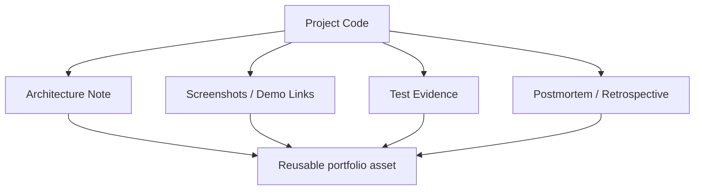

# 如何把项目经历变成长期资产

## 先理解什么

很多开发者在学习过程中会做出不少东西：

- 一个 ERC20 demo
- 一个 NFT mint 页
- 一个 staking 项目
- 一个 DEX 练手实现

但做完之后，项目往往停在仓库里。  
代码有了，截图有了，记忆却会迅速流失。过几个月再回看，只记得“我好像做过”，却说不清：

- 为什么这样设计
- 难点在哪里
- 做过哪些取舍
- 哪些问题还没解决

这说明项目还没有变成资产。

## 为什么重要

把项目资产化的重要性至少有三层。

第一，它能逼你从“写完能跑”走向“我能解释、验证、复盘”。  
第二，它能直接服务面试、简历、沟通和个人品牌。  
第三，它能让你以后继续做更复杂项目时，拥有一套可复用的方法，而不是每次重新开始。

一个真正有价值的学习项目，最终不该只留下代码，还应该留下结构化认知。

## 核心机制

### 1. 复盘的目标不是记录过程，而是提炼能力证据

很多人写复盘会写成流水账：

- 今天搭了脚手架
- 明天接了钱包
- 后天修了 bug

这种记录对当下有帮助，但对长期价值不够。  
更好的复盘应该围绕这些问题展开：

- 这个项目要解决什么问题
- 我为什么用这个方案
- 最难的边界是什么
- 我如何验证它真的可用
- 如果重做一次，我会改什么

这类回答更能体现你的工程判断。

### 2. 一个完整作品至少应该包含五类材料

建议把每个重点项目沉淀成以下内容：

- 项目简介：一句话说清它是什么
- 结构图：前端、合约、索引、数据流怎么连接
- 关键难点：真正难的设计点或排障点
- 验证证据：测试、截图、交易链接、部署地址
- 复盘总结：做对了什么、做错了什么、下一步怎么迭代

### 3. 面试与作品集喜欢的是“清楚的取舍”，不是“功能堆满”

很多候选人会误以为项目越大越有竞争力。  
其实更能打动人的，往往是你能清楚说出：

- 为什么这个版本只做这些功能
- 为什么这里选择 Foundry 而不是 Hardhat
- 为什么这个合约先用最小权限模型
- 为什么这个前端状态按 pending / confirmed / failed 拆分

这种解释能力会让项目从“练手作品”升级为“工程证明”。

### 4. 把源码阅读、踩坑笔记和项目本身串起来

最好不要让项目和学习笔记彼此分离。  
更理想的做法是：

- 项目里链接相关源码阅读笔记
- 复盘里记录你参考了哪些协议设计
- 面试题整理里引用项目里的真实决策

这样项目就不是孤岛，而会成为你整个学习系统的中心节点。

### 5. 资产化的核心是可复用

你做一个项目，不只是为了那一次展示。  
它还应该未来可以被复用为：

- 简历中的代表作
- 面试回答案例
- 博客或技术分享素材
- 新项目的模板仓库
- 后续升级版本的基座

当你开始这样看项目时，你的输出质量会自然提高。

## 工程判断

以后每做完一个项目，至少问自己五件事：

1. 这个项目能不能被一句话准确介绍？
2. 我能不能画出它的结构图？
3. 我能不能说清最难的两个问题？
4. 我有没有留下足够验证证据？
5. 如果三个月后面试提到它，我是否还能完整讲出来？

如果答案有几个是否定的，就说明这个项目还没真正沉淀完成。

## 本节小结

项目真正的价值，不在于“做过”，而在于“做完之后沉淀成了能持续放大价值的资产”。代码、结构图、验证证据和复盘笔记一起存在时，项目才会真正开始替你说话。
