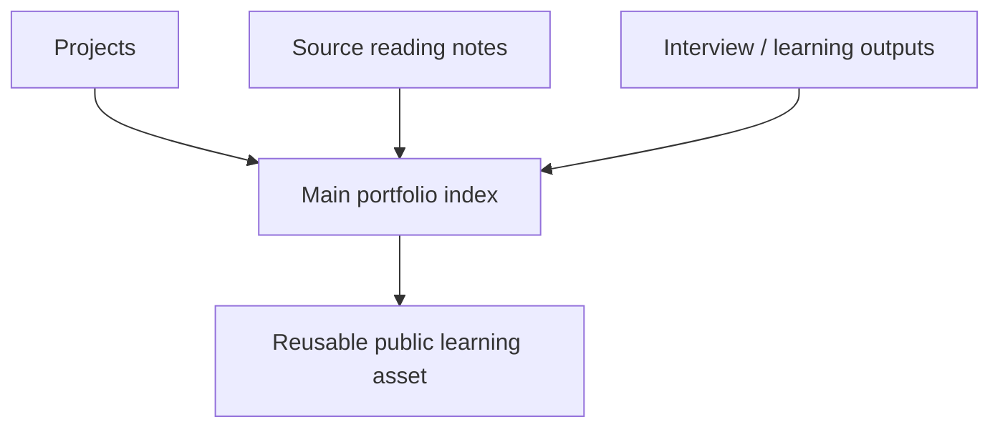

# 如何搭建可持续的公开学习资产

## 先理解什么

很多工程师会把公开输出理解成“发几篇文章”或者“整理一个 README”。  
这些当然有用，但如果没有结构，很快会重新变成零散碎片：

- 项目在一个仓库
- 源码笔记在另一个仓库
- 面试题记在本地文档
- 学习计划藏在备忘录

最后的结果是：你确实做了很多事，但别人和未来的你都很难看见这些积累之间的关系。

## 为什么重要

一个好的作品集或源码笔记仓库，价值不只是展示，更是组织你自己知识结构的外部骨架。

它能帮助你：

- 快速回忆做过什么
- 把不同项目和知识点连起来
- 给面试、分享、合作提供稳定入口
- 把学习从“消耗内容”变成“沉淀资产”

因此它不是附属品，而是长期学习系统的一部分。

## 核心机制

### 1. 好仓库首先要有清晰索引

很多人公开仓库的最大问题，不是内容不够，而是没有主索引。  
别人进来后不知道：

- 先看什么
- 哪些是代表作
- 哪些是源码阅读
- 哪些是练习项目

所以第一步通常不是继续堆内容，而是先设计入口页。

### 2. 公开学习资产最好按“项目、源码、训练、资料”分层

一个实用的组织方式通常包括：

- 项目作品
- 协议源码阅读笔记
- 面试题与输出训练
- 学习路线与资料索引

这样做的好处，是每一类内容都有自己的位置，同时又能在主索引中互相引用。

### 3. 证据链比口号更有说服力

成熟作品集不是只写“我学过什么”，而是尽量给出证据：

- 代码仓库
- demo 截图
- 测试结果
- 部署地址
- 交易链接
- 结构图和复盘

这些材料会让你的输出更像工程资产，而不是自我描述。

### 4. 源码阅读仓库最好可追踪、可跳转、可复用

源码笔记如果只是本地碎片，很难放大价值。  
更好的方式是把它做成：

- 主题化目录
- 每篇有固定模板
- 能反向链接到项目和面试题

这样一来，你今天读 Uniswap V2 的笔记，未来可以直接变成：

- 面试案例
- 博客素材
- 项目设计参考

### 5. 公共资产最怕“只开头，不维护”

所以结构设计要尽量轻，但长期可持续。  
你要给自己一个稳定节奏，比如：

- 每做完一个项目就补一份复盘
- 每读完一个协议就补一篇结构笔记
- 每周更新一次索引页

## 工程判断

以后整理学习资产时，优先检查：

1. 有没有主索引？
2. 代表作是否一眼可见？
3. 每个项目有没有证据链？
4. 源码笔记和项目有没有互相链接？
5. 结构是否能支持半年后继续追加？

这些问题比“页面漂不漂亮”更重要。

## 本节小结

好的作品集与源码笔记仓库，不只是展示层，而是你长期学习系统的公开骨架。索引、分层、证据链和可持续更新节奏，决定了这些输出能不能真正累积成长期资产。
