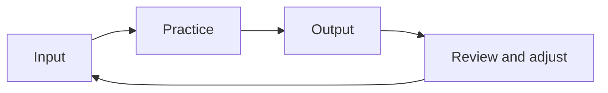

# 如何让学习系统持续复利

## 先理解什么

很多人学技术时最痛苦的不是努力不够，而是明明努力了一阵子，却没有累积感。  
原因常常不是内容太难，而是系统没有形成复利：

- 今天学的内容没有进入项目
- 项目没有沉淀成笔记
- 笔记没有反向进入面试题和公开输出
- 下一轮学习又从零散输入开始

这样即使每周都很忙，也很容易一直停留在“做了很多，但难以积累”的状态。

### 先把几个词钉牢

**学习循环（Learning Loop）** 是输入、练习、输出、复盘再回到输入的持续循环。直觉上它像一个不断自我增强的齿轮组。工程上这意味着成长效率的关键，不在某次猛学，而在循环是否持续运转。

**复习周期（Review Cycle）** 是知识和项目在多长节奏下被重新回看与巩固的安排。直觉上它像给记忆和理解安排定期保养。工程上这意味着没有 review cycle 的学习，很容易堆出短期输入、长期遗忘。

**Compounding** 是前期积累在后续阶段持续放大效率和收益的复利效应。直觉上它像前面搭好的台阶让后面每一步都更省力。工程上这意味着你做对的长期系统设计，会让同样时间产出越来越大。

## 为什么重要

长期学习系统的重要性，在于它决定你三个月后、半年后、两年后到底会变成什么样。

短期爆发当然能带来阶段性进展，但真正拉开差距的往往是：

- 是否持续输出
- 是否反复回收旧知识
- 是否把一次劳动变成多次可复用资产

也就是说，学习系统不是效率技巧，而是成长速度的底层结构。

## 核心机制

### 1. 输入、实践、输出、复盘必须形成环

很多学习停滞，是因为只停留在输入层。  
更有效的长期系统通常至少有四个固定环节：

- 输入：读书、看文档、读源码
- 实践：写项目、跑实验、复现案例
- 输出：笔记、复盘、分享、面试题
- 复盘：总结弱点、调整节奏、安排下一轮

少了任何一环，系统都很难真正复利。

### 2. 一次学习最好服务多个结果

复利的关键，不是做更多事，而是让一次投入服务多个出口。  
例如你读一段协议源码，最好同时能变成：

- 一篇源码笔记
- 一个项目设计参考
- 一道面试题素材
- 一次复盘条目

这样学习不会在“看完”那一刻结束。

### 3. 节奏要稳过强度

很多人计划失败，不是目标不对，而是节奏不可持续。  
如果系统完全建立在：

- 每天都高强度
- 一次学很久
- 没做就强烈挫败

它通常很快就会断。

更成熟的系统会优先保证：

- 每周固定几次稳定投入
- 小步但不断线
- 有明确补位机制

### 4. 公开输出会放大学习约束力

当你把项目、笔记、复盘和路线公开出来时，会自然带来几个好处：

- 更容易形成完成度
- 更容易回顾旧材料
- 更容易得到反馈
- 更容易看见自己的长期积累

所以公开输出不是营销动作，而常常是学习系统的稳定器。

### 5. 长期系统需要定期重构，而不是一成不变

随着你能力提升，系统本身也要更新。  
例如：

- 初期重输入和基础项目
- 中期重源码与协议理解
- 后期重系统设计与输出密度

所以长期学习系统不是固定模板，而是一个会进化的框架。

## 工程判断

以后你审查自己的学习系统，优先问：

1. 输入有没有稳定进入项目与实验？
2. 项目有没有沉淀成输出资产？
3. 输出有没有反过来暴露新弱点？
4. 节奏是否可持续，而不是只靠热情？
5. 我有没有在定期重构自己的学习结构？

这五个问题通常比“今天学了几个小时”更说明未来成长质量。

## 本节小结

真正有效的长期学习系统，不是靠短期爆发堆积内容，而是让输入、实践、输出和复盘不断循环，让每一次投入都产生可复用资产。这样你的学习才会开始复利，而不是反复从零散状态重新起步。
