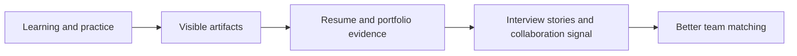

# 怎样把学习过程转成团队愿意相信的信号

## 先理解什么

很多开发者在学习阶段会默认一件事：

- 我只要真的学会了，别人总会看出来

现实往往不是这样。  
团队在招聘或协作时，看不到你的脑内进步，它只能看见你留下的外部证据：

- 你做过什么
- 你怎么解释它
- 你能不能和别人协作
- 你在复杂问题前的判断方式是什么

所以职业表达不是“包装能力”，而是把能力变成可验证信号。

### 先把几个词钉牢

**协作信号（Collaboration Signal）** 是让团队判断你是否好合作、可依赖的外显行为证据。直觉上它像别人从你的沟通和交付里读出的职业气味。工程上这意味着协作能力不只写在简历里，而是体现在 issue、PR、文档和反馈方式里。

**简历叙事（Resume Narrative）** 是把经历组织成清晰能力主线和发展轨迹的表达方式。直觉上它像不是把碎片经历堆上去，而是讲清你为什么一路走到这里。工程上这意味着简历最强的部分往往不是信息量，而是叙事是否自洽。

**Trust** 是别人基于你长期行为和产出建立起来的可信预期。直觉上它像职业关系里的长期信用额度。工程上这意味着很多机会不是被一句自我介绍争取来的，而是被长期可验证的信任积累出来的。

## 为什么重要

如果没有把学习成果变成外部信号，你就会遇到很典型的问题：

- 项目做了不少，但简历写不出重点
- 看过源码，但讲不清楚真正学到了什么
- 面试里总在堆概念，而没有证据链
- 团队很难判断你是“会一点点”还是“真的能合作做事”

这不是因为你没努力，而是因为信号没有被组织好。

## 核心机制

### 1. 团队最相信的是“可追溯的真实产物”

相比泛泛而谈的自我评价，团队更容易相信这些材料：

- 真实项目仓库
- 有复盘的实践记录
- 有结构的源码阅读笔记
- 清楚说明问题、方案和取舍的文档
- 能看出你怎样判断和迭代的 commit 历史

这些材料之所以有价值，是因为它们能被别人追踪、阅读和验证。

### 2. 简历的核心不是“写得多”，而是“证据密度高”

一个好的 Web3 学习型简历，不应该只是列：

- 学过 Solidity
- 学过 Foundry
- 学过 DeFi

而应该尽量变成：

- 用什么项目实践过
- 遇到过什么具体问题
- 如何验证和改进
- 输出了什么可见成果

这会让“我懂这个”从口头判断变成证据判断。

### 3. 协作信号比单人作品更能拉开差距

很多团队在意的不只是你会不会写代码，还会看：

- 你能不能把问题讲清楚
- 你会不会记录边界与假设
- 你能不能让别人接手你的工作
- 你是否会做复盘与同步

所以如果你能展示：

- issue / PR 讨论
- 技术文档
- 结构化复盘
- 对别人代码或协议的阅读反馈

这些信号往往会比一个“看起来很大但讲不清”的作品更强。

### 4. 求职路径本质上是“先进入正确密度的环境”

很多人把求职理解成单一目标：

- 找一个更好的 offer

但更现实的视角是：

- 找到能继续放大学习斜率的协作环境

这意味着你要看：

- 团队做的协议复杂度
- 是否真有工程与安全纪律
- 你能不能在里面接触到更好的 review 和系统
- 是否有机会继续做结构化成长

这会让求职不只是比薪资，而是比环境质量。

### 5. 面试准备要围绕“故事线 + 证据链”

很多人面试失败，不是因为完全不会，而是回答方式像散点：

- 知识点有一些
- 项目也说了一点
- 但没有主线

更好的方式是围绕几条固定故事线准备：

- 一个你真正深入做过的项目
- 一个你认真读过的协议
- 一个你遇到过并解决过的工程问题
- 一个你最清楚的安全或 Gas 取舍案例

这样你输出的不是零碎答案，而是稳定证据链。

### 6. 长期看，职业信号来自持续可见输出

真正最稳的求职策略，不是临时冲刺写简历，而是平时持续留下：

- 代码
- 笔记
- 复盘
- 项目里程碑
- 协议阅读成果

## 工程判断

以后你准备求职或进入合作时，先问：

1. 我现在最强的三个可验证产物是什么？
2. 我的简历是在堆名词，还是在呈现证据？
3. 我有没有展示协作信号，而不只是个人练习？
4. 面试时我能不能讲出几条完整故事线？
5. 我在寻找的是短期 offer，还是长期成长密度更高的环境？

把这些问题想清，你的职业路径会更稳。

## 本节小结

学习成果只有被组织成真实、可追溯、可讲清的外部信号，才会变成团队愿意相信的能力。简历、作品集、面试和协作，本质上都是在传递这种信号密度。
