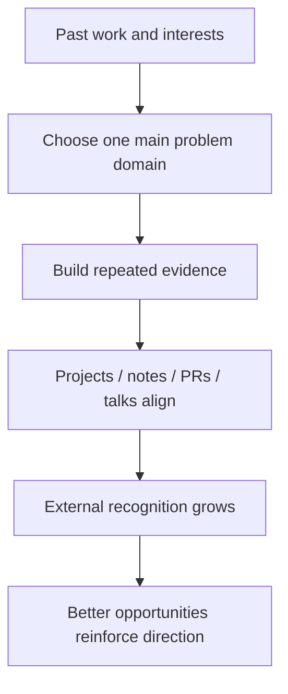

# 怎样选择自己准备被什么长期记住

## 先理解什么

很多开发者在成长初期都会经历一个阶段：

- 学很多
- 做很多
- 看上去很努力
- 但别人很难一句话概括你到底擅长什么

这并不代表你不够好。  
只是说明你还处在“积累广度”阶段，没有把广度逐渐压成识别度。

专业化的意义，不是限制你，而是让外部世界更容易稳定地把机会和问题交给你。

## 为什么重要

如果长期没有清晰定位，你会很容易遇到这些问题：

- 简历和作品很多，但没有主线
- 面试里回答得都能沾边，却没有一项特别让人记住
- 机会到来时，别人不知道为什么该先想到你
- 你自己也很难决定下一步该深挖什么

长期成长不是“会的越多越好”这么简单。  
它还包括：

- 让你的能力在外部世界里形成稳定标签

## 核心机制

### 1. 专业化不是缩窄到只剩一个工具，而是选择一个主问题域

很多人一听“专精”就害怕：

- 那我是不是以后只能做这一件事？

更成熟的理解是：

- 专业化不是锁死工具
- 而是选择一个你愿意长期解决的问题域

例如：

- Web3 前端交互与产品体验
- 智能合约架构与协议设计
- 安全审查与风险建模
- 基础设施、数据与开发工具
- DeFi 机制研究与协议阅读

问题域比“某个框架”更稳定，也更适合长期积累。

### 2. 最好的定位，通常来自“兴趣、能力、市场反馈”的交集

如果只看兴趣，你可能很快乐但难形成机会。  
如果只看市场，你可能很快耗尽热情。  
如果只看现有能力，你又可能只是停在舒适区。

更好的定位通常来自三者交集：

- 你愿意长期做
- 你已经有一定优势
- 外部世界确实需要

这也是为什么真正的专业化，不是拍脑袋选赛道，而是观察自己过去做得最顺、别人最认可、行业最常需要的那类问题。

### 3. 别人记住你的，不是你的宣言，而是你反复交付的证据

专业定位不是靠一句“我以后想做安全”就成立。  
真正建立识别度的，是反复出现的证据：

- 相关项目
- 相关源码笔记
- 相关 issue / PR / review
- 相关文章与公开输出
- 相关协作记录

你可以把它理解成：

- 自我定位是你说的话
- 外部定位是你留下的证据

后者永远更重要。

### 4. 广度仍然重要，但它应该服务于主线

真正成熟的工程师通常不是单线程存在。  
一个好的专业化路径更像：

- 有一个明确主线
- 有若干辅助能力围绕主线增强

例如你主线是 Web3 前端体验，那么辅助能力可能包括：

- 钱包与签名底层理解
- 合约阅读能力
- 一定的安全意识
- 对 gas、mempool、MEV 的现实认知

这会让你不是“只会一层”，而是“有主线的 T 型结构”。

### 5. 未来 6 到 12 个月的重点，是让定位可被反复看见

一条很实用的策略是，不急着追求“终身定义”，而是先做一个 6 到 12 个月可执行定位：

1. 选一个主问题域  
2. 选三个能证明它的项目或输出  
3. 让你的仓库、笔记、简历、公开发言都围绕它组织  
4. 每个月至少产出一次和主线强相关的高质量证据

这样专业化就会从抽象愿望变成可观察轨迹。

### 6. 不要把“保持开放”误当成“永远不做选择”

很多人迟迟不敢定位，是担心选错。  
但长期完全不选，往往代价更大：

- 你的积累彼此分散
- 别人无法形成稳定印象
- 你也难以判断下一步投入回报

更现实的心态应该是：

- 先选择一个阶段性主线
- 用真实产出验证它
- 如果未来方向变化，再做迁移

定位不是一次性终局，而是阶段性聚焦。

## 工程判断

以后你为自己做长期规划时，优先问：

1. 我最愿意持续解决的 Web3 问题域是什么？
2. 我过去最有优势、最有反馈的产出集中在哪？
3. 我的仓库、笔记、项目和公开输出，是否在讲同一条主线？
4. 如果别人只看我最近半年，会如何概括我？
5. 接下来三项投入，哪项最能强化我的长期识别度？

把这些问题想清楚，你的成长就会更有方向感。

## 本节小结

专业化不是把自己变窄，而是让你的能力开始围绕一个主问题域稳定累积证据。对 Web3 开发者来说，真正长期有效的定位，不是喊口号，而是让作品、代码、笔记和协作记录不断证明“你为什么值得被持续记住”。
