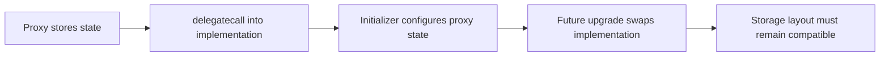

# Proxy、初始化与存储纪律

## 先理解什么

对普通合约来说，部署之后代码就固定了。  
这对安全是好事，但对长期产品来说也会带来现实压力：

- 业务逻辑要迭代
- 漏洞可能要修复
- 参数与模块可能要调整

于是可升级架构出现了。  
它的核心思路不是“真的把旧代码改掉”，而是让用户始终通过一个稳定入口合约交互，而实际执行逻辑可以指向新的实现合约。

## 为什么重要

升级机制重要，不只是因为很多大协议在用，更因为它会彻底改变你写 Solidity 的方式。

一旦走到可升级架构，你就不能再只考虑：

- 函数逻辑对不对
- 权限有没有守好

还必须考虑：

- 初始化是不是只执行一次
- 未来变量扩展会不会破坏旧存储
- 升级权限会不会被滥用
- 新实现与旧状态是否兼容

也就是说，升级并不是“多一个功能”，而是给系统引入新的结构性风险面。

## 核心机制

### 1. Proxy 保存状态，Implementation 提供逻辑

最关键的第一步，是把 proxy 思维建立起来。

大多数升级模式中：

- proxy 是用户交互入口
- proxy 保存状态
- implementation 保存逻辑代码

当用户调用 proxy 时，proxy 会通过 `delegatecall` 把执行转发给 implementation，但状态读写仍落在 proxy 的存储上。

这就是为什么升级实现代码后，旧状态还能延续。

### 2. constructor 不再可靠，initializer 变得关键

因为真正对外长期存在的是 proxy，而 implementation 只是被委托执行的逻辑体，所以 implementation 上的 constructor 往往不是你真正想要的初始化入口。

这也是为什么可升级体系常见：

- `initialize()`
- `reinitializer()`
- `initializer` modifier

它们的目标，是保证初始化逻辑在 proxy 的上下文里执行，并且只能被按规则调用。

### 3. 存储布局是升级场景下最脆弱的边界之一

普通合约里，变量顺序的重要性很多人感知不强。  
升级场景里，这件事会变得非常危险。

因为 proxy 上已经存了旧数据，新的 implementation 如果改变了存储布局，例如：

- 调整变量顺序
- 删除中间变量
- 插入不兼容字段

就可能导致旧数据被按错误槽位解释。

这不是“小 bug”，而是直接破坏系统状态。

### 4. UUPS 与 Transparent Proxy 是工程上常见的两条路

你不需要一开始就把所有代理模式吃透，但至少要知道：

- Transparent Proxy 常把升级入口更多放在代理层
- UUPS 通常把升级逻辑更多放在实现合约层

两种模式都能工作，但都会把权限控制、初始化纪律和升级验证变成核心任务。

### 5. 升级系统的重点不是“能升级”，而是“升级不破坏系统”

成熟工程不会只问：

- 能不能升级成功

更会问：

- 升级后状态是否兼容
- 初始化是否可能被重复调用
- 升级权限是否安全
- 回滚与验证路径是否充分

## 工程判断

以后看到任何可升级合约，先做四个判断：

1. 状态到底存在哪里？
2. 初始化如何保证只执行一次？
3. 新旧实现如何保证存储兼容？
4. 谁有升级权，如何约束？

这四个问题答不清，可升级系统就还没有真正站稳。

## 本节小结

升级架构并不是让合约“随便改”，而是通过 proxy 与 implementation 分离，让状态延续、逻辑可替换。与此同时，initializer、存储布局和升级权限会成为新的核心纪律。理解这层之后，你才真正能读懂现代协议里大量出现的 upgradeable 写法。
