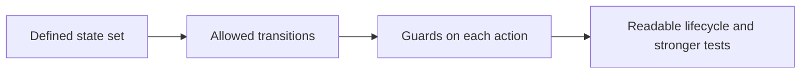

# 如何用状态机建模合约生命周期

## 先理解什么

很多开发者写合约时，会按照“先把功能函数列出来”的方式推进：

- create
- deposit
- withdraw
- close

这样当然能开始写代码，但很容易忽略一个更重要的问题：  
这些动作在什么阶段可以发生，哪些顺序是允许的，哪些顺序是危险的？

如果这个问题没有先想清楚，函数本身就算能跑，系统也可能很快陷入边界混乱。

### 先把几个词钉牢

**状态机（State Machine）** 是把合约理解成一组状态和允许转换关系的系统模型。直觉上它像先画出“系统会经过哪些阶段”的地图，再往地图上放动作。工程上这意味着你先想状态，再写函数，很多边界问题会在编码前暴露出来。

**状态转换（Transition）** 是某个动作让系统从一个合法阶段进入另一个合法阶段的过程。直觉上它像流程图里每一条有条件的箭头，而不是单个函数自己独立存在。工程上这意味着你不只要让动作能执行，还要保证它只在正确阶段执行。

**Invariant** 是系统在所有合法执行路径下都应该始终成立的条件。直觉上它像你设计这台机器时绝不能丢的那条底线。工程上这会直接影响测试、审查和权限设计，因为很多 bug 本质上就是把不变量悄悄破坏了。

## 为什么重要

很多真实 bug，本质上不是某个语句写错，而是状态迁移没被约束好：

- 在未初始化阶段调用主流程
- 在结束后还能继续修改关键状态
- 本该一次性的动作被多次执行
- 某些权限只该在特定阶段生效，却长期暴露

这就是为什么状态机思维对合约设计尤其重要。链上状态是长期存在、公开可调用、不可随意回滚演进的，生命周期越清楚，系统越稳。

## 核心机制

### 1. 把“功能列表”改写成“状态 + 转换”

设计合约时，不要先问“我要几个函数”，而先问：

- 系统有哪些主要状态
- 用户或管理员能触发哪些状态转换
- 哪些转换应该被禁止

例如一个简单众筹合约，可能比“我要有 donate、claim、refund”更值得先想的是：

- Funding
- Successful
- Failed
- Refunded

一旦状态清楚，函数职责就会更清楚。

### 2. 合法路径和非法路径都要被显式思考

很多开发者只设计 happy path：  
开始 -> 进行中 -> 成功结束。

但系统真正复杂的地方往往在：

- 超时
- 失败
- 提前终止
- 重复执行

这些都属于状态机设计的一部分。  
成熟设计不只是让“正常流程能跑”，还要让非法路径无法进入。

### 3. 状态机能帮助你收紧权限和边界

一旦有了阶段视角，你就会更自然地问：

- 这个管理员函数是不是只该在启动前可用
- 这个用户动作是不是只该在开放期可用
- 这个清算动作是不是只该在风险触发后可用

也就是说，权限不再只是“谁能调”，而是“谁在什么阶段能调什么”。

### 4. 状态越显式，系统越容易读和测

很多复杂合约之所以难读，不是因为业务太难，而是阶段隐藏在很多布尔值和条件分支里。  
如果你能更明确地表达状态和迁移：

- 阅读者更容易抓主线
- 测试更容易按阶段覆盖
- 审查更容易找出非法转换

### 5. 状态机不是一定要有 `enum`，而是要有生命周期意识

有些人一听状态机就以为一定要写 `enum Stage`。  
这当然常见，但更本质的是：

- 生命周期是否清楚
- 转换规则是否明确
- 非法路径是否被限制

有时是 `enum`，有时是几个清晰约束字段。关键不在形式，而在设计纪律。

## 工程判断

以后你写或读一个合约，先做五个判断：

1. 这个系统有哪些主要阶段？
2. 每个阶段允许哪些动作？
3. 哪些动作必须一次性或不可逆？
4. 哪些失败路径会改变状态？
5. 有没有隐藏状态没有被显式表达？

这五问会让你从“写函数”升级到“设计系统”。

## 本节小结

状态机思维的价值，在于把合约从函数集合重新提升为生命周期系统。明确状态、转换、阶段性权限和非法路径，你的合约会更稳、更好测，也更容易被别人读懂。
