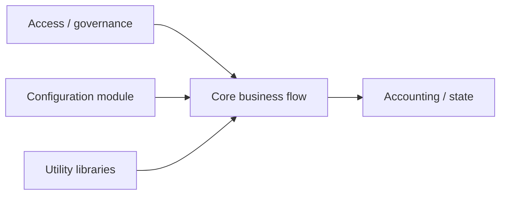

# 如何拆分合约职责而不是把功能堆在一起

## 先理解什么

很多人写 Solidity，最开始的自然路径是：

- 先有一个主合约
- 新需求来了就在这个合约里继续加函数
- 权限、状态、事件、业务判断都往里塞

在小练习里，这样未必马上出问题。  
但一旦项目开始变大，代码会很快进入一种熟悉的状态：

- 合约文件越来越长
- 测试越来越难写
- 某个状态修改会影响很多地方
- 升级和安全审查都变得吃力

这时你会发现，真正卡住你的不是语法，而是结构。

### 先把几个词钉牢

**继承（Inheritance）** 是在已有合约能力基础上做特化扩展的结构方式。直觉上它像沿着一棵家谱继续长分支，子合约会继承父合约的状态和行为。工程上这意味着继承适合稳定边界的延伸，但滥用会让执行路径、状态来源和 override 关系变得难以追踪。

**组合（Composition）** 是让多个职责模块通过协作关系组成系统的方式。直觉上它像把不同零件装配成一台机器，而不是让一个零件长成所有零件。工程上这通常更利于拆权限、拆测试和拆风险面，但也要求你把模块间接口设计得更清楚。

**Interface / Library** 分别回答“模块之间怎么说话”和“哪些稳定逻辑值得复用”这两类问题。直觉上 interface 像合同，library 像工具箱。工程上把这两者分清，能避免你一边想定义边界，一边又把所有复用都塞进不合适的结构里。

## 为什么重要

Solidity 里的结构问题比普通后端更敏感，因为它同时影响：

- 可读性
- 测试难度
- 升级风险
- 权限边界
- Gas 成本
- 安全审查成本

一个职责混乱的合约，不只是让人看着累，它更容易把不同风险面绑在一起，导致任何改动都像在拆炸弹。

## 核心机制

### 1. 合约拆分的第一原则是职责，不是语法能力

很多人会先问：

- 这个逻辑能不能用继承
- 要不要抽成库
- 要不要单独一个合约

这些问题都太靠后了。更应该先问的是：

- 这段状态属于谁维护？
- 这段逻辑的变化频率和其他逻辑一样吗？
- 这部分权限是否和其他模块共用？
- 出问题时，我希望审计者单独检查它吗？

先按职责和风险面切，再决定技术手段。

### 2. 继承适合表达“是一个特化版本”，不适合当万能复用工具

继承最容易被滥用，因为它看起来很省事。  
但继承带来的问题也很明显：

- 状态和行为耦合更紧
- 线性化顺序更复杂
- override 链条变长后不易读
- 升级或调试时更难追踪真实执行路径

所以继承更适合这些场景：

- 标准实现的稳定扩展
- 明确的权限或基础能力复用
- 结构上真的是“某类型合约的一个具体版本”

而不是“哪里想复用一点就继承一下”。

### 3. 组合更适合表达协作关系

当一个系统里存在多个职责模块时，组合通常更自然：

- 一个模块管配置
- 一个模块管资产会计
- 一个模块管结算
- 一个模块管权限或治理

这样做的优势在于：

- 每个模块职责更清楚
- 测试可以分层
- 审查可以分块
- 以后替换某个模块成本更低

但组合不是免费午餐，它会引入：

- 更多接口设计工作
- 更多跨模块状态同步思考
- 更多权限与调用边界设计

所以真正好的组合，不是把系统拆碎，而是把协作关系讲清楚。

### 4. 库和接口是两种不同层面的抽象

很多初学者会把库和接口都理解成“抽出去复用”。  
其实它们解决的是不同问题：

- `interface` 解决的是“别人怎么和你说话”
- `library` 解决的是“有一段稳定逻辑可以复用”

如果你想描述模块间边界，优先想接口。  
如果你想抽出纯计算、工具函数或稳定算法，优先想库。

### 5. 最常见的坏味道，是把不同变化节奏的逻辑绑在一起

结构失控通常不是因为业务复杂，而是因为：

- 经常改的逻辑和很稳定的逻辑写在一起
- 管理员操作和用户主流程混在一起
- 配置更新和资金流转共用一套入口
- 观察性事件和核心状态修改纠缠在一起

这会让每次改动都影响更大范围。  
更稳的做法是把不同变化节奏、不同权限面、不同风险级别的逻辑拆开。

### 6. 读合约结构时，先画职责图比先看函数更有效

以后你看到一个稍大点的合约，不妨先画四类框：

- 谁管资产
- 谁管权限
- 谁管配置
- 谁管业务流程

只要这张职责图画不出来，说明结构本身还不够清楚。

## 工程判断

以后写或读 Solidity 结构时，先问：

1. 这段状态和逻辑到底归谁负责？
2. 这里是“特化关系”还是“协作关系”？
3. 我用继承，是因为语义合理，还是因为偷懒？
4. 哪些模块变化频率和权限等级不同，应该拆开？
5. 这份结构是否让测试、升级和审计更轻松？

结构的好坏，不取决于你用了多少设计模式，而取决于边界有没有更清楚。

## 本节小结

Solidity 模块化的关键，不是把代码机械拆分，而是让职责、权限、状态和变化节奏彼此对齐。继承、库、接口、组合都只是表达手段，真正需要设计的是边界。
