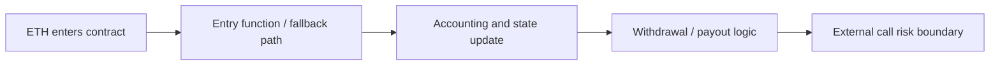

# ETH 是怎样进入和离开合约的

## 先理解什么

很多 Solidity 初学者会把“ETH 转进合约”想得非常直接：

- 合约地址就像一个账户
- 给它转 ETH 就好了

这当然对，但只说对了一半。  
你真正需要理解的是：

- ETH 是在什么调用上下文里进入的
- 进入时有没有附带 calldata
- 代码会进入哪个入口
- 这次转账是否会触发其他逻辑

同样，ETH 离开合约时也不是“记个减法再发出去”这么简单，它经常伴随着外部调用和安全边界。

## 为什么重要

资金流相关错误之所以危险，是因为它们往往同时影响：

- 余额正确性
- 可用性
- 外部调用风险
- 重入面
- 用户体验和可解释性

一个“能收钱也能转钱”的合约，不代表它已经把资金流设计清楚了。

## 核心机制

### 1. ETH 进入合约，取决于这次调用带着什么上下文

ETH 进入合约的常见方式可能包括：

- 调普通 payable 函数
- 直接向合约地址转账且不带 calldata
- 带未知 calldata 调用触发兜底入口

这意味着“收到 ETH”不是单一场景，而是多个入口路径。  
不同路径下，代码进入的位置和语义都可能不同。

### 2. `receive` 和 `fallback` 解决的是两类不同兜底场景

这两个入口经常被记混。  
更稳的理解方式是：

- `receive` 更偏向“单纯收到 ETH 且没有 calldata 的兜底入口”
- `fallback` 更偏向“找不到匹配函数或处理更泛化入口的兜底入口”

它们不是“任选一个都行”的语法点，而是在表达：

- 你是否希望明确区分纯收款场景
- 你是否允许更宽泛的未知调用路径

### 3. ETH 离开合约时，真正危险的是“你在和外部世界说话”

从合约转出 ETH 时，很多人注意力只放在余额够不够。  
但更关键的是：

- 这会触发外部调用
- 外部地址可能是合约
- 对方逻辑可能回调你

也就是说，发送 ETH 不是单纯内部状态变化，而是把控制权短暂交给了外部世界。

### 4. 资金流逻辑要和业务状态更新顺序一起设计

如果你把提现、退款、分发收益之类逻辑写得太随意，就很容易出现：

- 状态先改还是后改不清楚
- 某一步失败后系统处于半完成状态
- 外部调用触发回调后状态不一致

所以 ETH 流转设计从来都不只是“转账 API 选哪个”，而是业务状态顺序设计问题。

### 5. 合约是否应该“被动收款”，本身就是设计选择

很多项目默认合约地址可以随便收 ETH。  
但在工程上你应该问：

- 我是否真的希望任何人任意向这里打 ETH？
- 如果用户误转进来，我怎么解释和处理？
- 收到意外资金是否会破坏会计逻辑？

有时候更稳的设计反而是：

- 只允许显式入口收款
- 对非预期路径做明确处理
- 不把“地址可收款”误当作“业务上允许收款”

### 6. 读资金流时，要同时看入口、会计、出口三件事

以后看一个涉及 ETH 的合约，不要只盯着 `payable` 或转账语句。  
更好的顺序通常是：

- 资金从哪里进
- 进来后怎么记账
- 谁在什么条件下可以取走
- 取走时是否有外部调用风险

## 工程判断

以后你设计或审查 ETH 流时，先问：

1. 这笔 ETH 是从哪个入口进来的？
2. 是否区分了纯收款和未知调用兜底？
3. 资金进入后是如何记账的？
4. 资金离开时会不会把控制权交给外部？
5. 是否存在误转、重复提现或顺序错误风险？

只要这五个问题能清楚回答，资金流设计就会稳很多。

## 本节小结

ETH 流转不是几个 `payable` 关键字那么简单。`receive`、`fallback`、资金会计和外部调用边界必须一起设计，合约的资金入口和出口才会真正可解释、可维护、也更安全。
