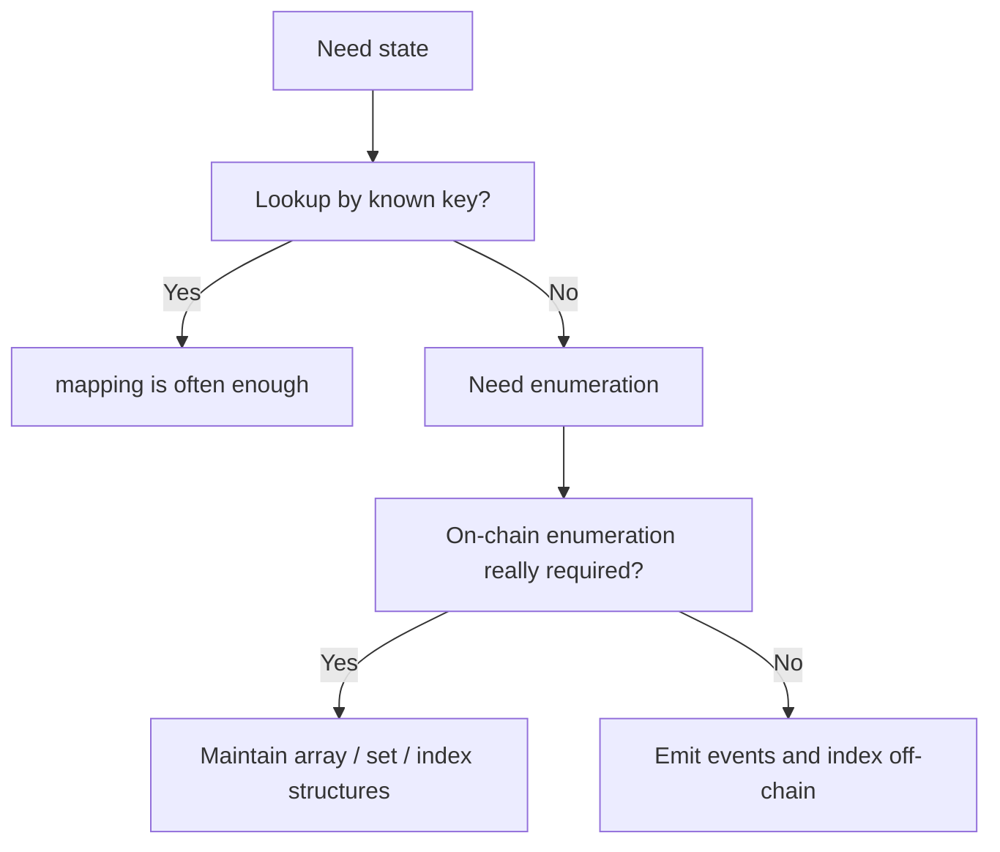

# 为什么链上状态很难被完整列出来

## 先理解什么

很多刚学 Solidity 的开发者都有过类似想法：

- 我有一个 `mapping(address => Position)`，那我应该也能拿到所有地址
- 我把用户余额存在合约里，那我应该也能像数据库一样 `select *`
- 我只要有状态，就总能在链上把它完整遍历出来

但 Solidity 的现实是：

- 很多状态适合按 key 查
- 不适合按“全表扫描”读
- 你想要枚举，往往要为它额外付设计成本

这不是语言“少了个 API”，而是链上执行模型天然不鼓励大范围遍历。

## 为什么重要

如果你不理解这件事，就很容易写出下面这些设计问题：

- 核心状态全放在 `mapping` 里，后来又想做排行榜、批量发放、全量遍历
- 为了“列出所有用户”，在写路径里硬塞数组索引，导致 gas 暴涨
- 把 event 当成唯一数据真相，结果链上逻辑和链下展示慢慢分离
- 用不必要的 Enumerable 结构换来高维护成本，却没有真正需要链上枚举

很多 Solidity 新手的问题，不是语法不会，而是没有先问：

- 这份状态未来是按 key 读取，还是按集合读取？
- 读取发生在链上，还是链下？
- 我愿不愿意为可枚举性长期支付写入成本？

## 核心机制

### 1. `mapping` 天生适合“已知 key 查询”

`mapping` 之所以好用，是因为它天然适合以下问题：

- 某地址当前余额是多少
- 某 tokenId 属于谁
- 某提案是否已投票

也就是说，它非常擅长回答：

- “这个 key 对应什么值？”

它不擅长回答：

- “现在到底有哪些 key？”

因为合约存储层并不会为你自动维护一个“所有 key 的列表”。

### 2. 状态存储不是关系型数据库

在 Web2 里你会默认：

- 有表
- 有记录集合
- 可以扫描、排序、分页

在链上你更应该默认：

- 有槽位
- 有按规则寻址的键值关系
- 遍历和聚合都是有成本的

这意味着“我想把所有数据列出来”本身就是一个需要被设计的问题，而不是默认能力。

### 3. 想枚举，就要显式维护索引

如果你的业务确实需要链上可枚举性，常见办法通常有三类。

第一类：`array + mapping`

- `mapping` 负责按 key 快速读取
- `array` 负责记录 key 或实体顺序

```solidity
mapping(address => uint256) public balances;
address[] public users;
mapping(address => bool) internal seen;

function deposit() external payable {
    if (!seen[msg.sender]) {
        seen[msg.sender] = true;
        users.push(msg.sender);
    }

    balances[msg.sender] += msg.value;
}
```

这种结构的代价很明确：

- 每次写入都可能更贵
- 删除、去重、分页都要额外设计

第二类：链上集合结构

- 例如自己维护双向链表、可删除数组、索引映射
- 或借助类似 `EnumerableSet` 的工具

这类方式适合规模较小、确实要在合约内枚举的状态。  
但它通常意味着更复杂的写逻辑和更多 gas。

第三类：事件 + 链下索引

- 链上保留最关键的主状态
- 通过 event 把变化抛给链下系统
- 在前端、indexer 或数据库里做查询、分页和聚合

这通常是大多数产品更现实的做法。

### 4. “可枚举性”本质上是在用写成本换读能力

这是本章最重要的工程判断。

如果你想让系统能列出所有用户、所有订单、所有提案、所有仓位，那你往往需要：

- 额外存一份索引
- 维护新增与删除逻辑
- 支付更多 gas
- 承担更复杂的一致性风险

所以问题不该是“能不能枚举”，而该是：

- 这个枚举需求是链上必须，还是链下即可？
- 这个需求值不值得长期写入成本？

### 5. 很多时候，链上主状态与链下查询模型应该分开

成熟协议常见的设计思路是：

- 链上只保留执行与结算真正需要的状态
- 展示层、统计层、运营层需要的列表与报表交给链下

这是因为它们服务的是两类不同问题：

- 链上主状态要保证正确性和可验证性
- 链下查询模型要保证可读性、聚合能力和产品体验

把这两件事强行塞在同一层，通常会让系统两边都不讨好。

### 6. 设计数据结构时，先问读取模式

在你写变量之前，先把下面几件事想清楚：

1. 这份数据主要按什么 key 查？
2. 需不需要列出全部实体？
3. 枚举发生在链上，还是页面/API 层？
4. 删除和更新要不要保持顺序？
5. 这份索引会不会在未来成为 gas 包袱？

如果这些问题不先想清楚，后面往往会进入“补索引地狱”。



## 工程判断

以后你设计 Solidity 数据结构时，优先问：

1. 这份数据到底是给执行逻辑用，还是给展示与统计用？
2. 我真的需要链上枚举，还是只需要链下列出来？
3. 为了可枚举性增加的写路径成本，是否值得？
4. 如果要删除、排序、分页，我的索引结构还能不能长期维护？
5. event、mapping、array 之间谁是主状态，谁是辅助视图？

想清楚这些，很多“后期结构改造”都能提前避免。

## 本节小结

链上状态设计最容易踩的坑之一，就是把“能按 key 查到”误当成“能像数据库一样列出来”。理解 `mapping`、数组、辅助索引和链下查询模型之间的关系，才是真正开始会设计 Solidity 数据结构。
