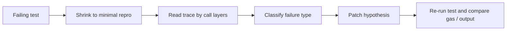

# 以 Trace 为中心的调试方式

## 先理解什么

很多人写合约测试时，出了错的第一反应是到处加 `console.log`。  
这在某些情况下有帮助，但如果把它当成主要调试方式，效率很快就会碰到上限。

Foundry 真正强大的地方，是它能把一次调用路径、内部合约调用、回滚点和 gas 消耗结构比较清楚地展开给你看。也就是说，你不是在“猜哪里错了”，而是在读一次执行轨迹。

## 为什么重要

调试效率直接决定你能不能把反馈回路压短。  
如果每次失败都要靠试错改很多地方，再重新运行一整套测试，你会很难建立稳定的工程节奏。

而 trace 的价值在于：

- 帮你定位错误发生在哪层调用
- 帮你看见回滚前最后成功的动作
- 帮你区分逻辑问题和环境问题
- 帮你把“合约黑盒”拆成可解释执行链

## 核心机制

### 1. 先缩小失败样本，再读 trace

成熟调试第一步不是立刻看很长的输出，而是先让失败最小化。  
比如：

- 只跑单个测试
- 只保留最小输入
- 去掉无关前置步骤

一旦样本变小，trace 的信噪比会高很多。

### 2. trace 回答的是“执行到了哪、为什么停下”

当你用更高 verbose 等级运行 Foundry 测试时，最关键的不是每一行格式，而是抓住几个核心问题：

- 哪个函数先被调用
- 进入了哪些内部调用
- 哪一层发生 revert
- revert 前最后一个状态相关动作是什么

如果你带着这四个问题看 trace，信息就不会显得杂乱。

### 3. 很多错误都能被快速归类

读多了之后，你会发现失败大致会落进几类：

- 断言预期不对
- 权限或 caller 不对
- 初始化或前置状态不完整
- 外部调用返回异常
- 金额、精度、时间窗口判断不对

一旦能先归类，再看具体执行路径，调试速度会明显提升。

### 4. Gas report 不是“优化命令”，而是反馈工具

很多人只在临近上线时才看 gas report。  
其实更好的用法，是把它当成日常反馈：

- 某次重构是否让成本突然上升
- 某个循环改动是否带来明显增长
- 某个缓存状态是否真的有效

这样你不会把 gas 优化变成最后一刻才想起的额外负担。

### 5. 调试的核心不是输出更多，而是提出更小的假设

最容易浪费时间的方式，是一次怀疑十个地方。  
更高效的方式是：

1. 先基于 trace 提出一个最可能的错误点
2. 做最小修改验证
3. 如果假设不成立，再换下一条

这会让调试过程变得更像验证，而不是碰运气。

## 工程判断

以后遇到失败测试，建议固定走这条顺序：

1. 缩小失败范围
2. 看 trace 定位层级
3. 判断错误类别
4. 改最小假设
5. 再看 gas 和输出是否符合预期

只要流程稳定下来，你对复杂协议的调试耐心也会提升很多。

## 本节小结

Foundry 调试的真正核心，不是背多少命令，而是养成 trace-first 的思路：先最小化复现，再用执行轨迹定位问题，再用 gas report 和断言结果验证修复。这样你面对失败时就不会慌，而会越来越像在做系统诊断。
