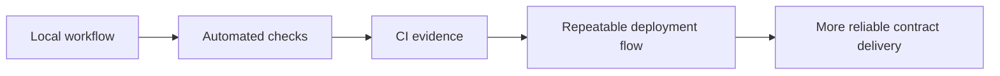

# 如何构建可靠的合约交付流水线

## 先理解什么

很多人做合约项目时，会把工程完成标准理解成：

- 合约写完了
- 测试过了
- 部署成功了

这当然是必要条件，但放到协作环境里远远不够。因为真正会不断制造返工的，常常是这些问题：

- 别人的环境跑不过
- 格式和依赖不一致
- 测试只在本地跑过一次
- 发布时没有固定检查顺序

所以一条可靠流水线的价值，不在于“更正规”，而在于减少偶然性。

## 为什么重要

合约工程比普通应用更需要稳定交付，因为错误代价更高：

- 部署后难以回滚
- 主网实验成本高
- 环境和参数差错影响大

如果没有自动化守门，项目就会越来越依赖“某个人经验很好”，而不是依赖系统本身可靠。

## 核心机制

### 1. 本地开发自动化和发布自动化不是一回事

本地自动化更关注开发反馈速度，例如：

- 快速测试
- 格式化
- 常用脚本别名

发布自动化更关注交付一致性，例如：

- 固定测试集
- 构建与验证顺序
- 环境变量检查
- 部署前后确认步骤

把这两层分开，你的工程会更清楚。

### 2. CI 的第一价值是把“我本地没问题”变成可重复证据

一条最小但有价值的 CI 流水线，通常至少会做：

- 安装依赖
- 运行测试
- 运行格式或 lint 检查
- 输出失败位置

这样团队看到的不是口头保证，而是可重复执行的结果。

### 3. 发布流程要尽量模板化

很多部署事故，并不是技术太难，而是步骤太随意。  
更成熟的方式是把这些固定下来：

- 部署前检查项
- 脚本参数
- 网络配置
- 验证动作
- 部署记录与回填

这样就算过一周或换一个人执行，流程也不会完全靠记忆。

### 4. 自动化重点是降低人为变异，不是堆工具

CI 并不是越复杂越好。  
真正重要的是先把最容易出错的环节稳定下来，例如：

- 固定测试入口
- 固定格式输出
- 固定部署脚本
- 固定验证顺序

过早上很多花哨工具，反而会让维护成本上升。

### 5. 好流水线会反过来改善代码结构

一旦项目开始依赖可重复验证，你会更自然地追求：

- 可测试模块
- 更清晰的环境边界
- 更少的手工发布步骤
- 更明确的失败输出

## 工程判断

以后审查一个合约项目的工程成熟度，先看：

1. 是否有稳定测试入口？
2. 是否有自动化守门而不是只靠本地经验？
3. 部署与验证步骤是否模板化？
4. 环境和参数边界是否清楚？
5. 失败输出是否能快速定位问题？

这几项通常比“仓库看起来专业不专业”更说明问题。

## 本节小结

真正可靠的合约交付，不只是本地能跑通，而是测试、检查、部署和验证都能被重复执行、被别人复现、被系统守门。把 Foundry 工作流推进到这一步，你才真正有了更接近团队工程的基础。
