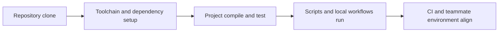

# 如何让 Foundry 项目在不同机器上仍然可复现

## 先理解什么

很多人做个人项目时，对环境的默认想法是：

- 我本地能跑就行

问题在于，一旦项目变成协作对象，这个标准就不够了。  
你需要让别人也能：

- 拉代码
- 装依赖
- 跑测试
- 得到和你足够一致的结果

否则项目就会处在一种脆弱状态：

- 所有知识都依赖原作者
- 任何环境漂移都会引入不可解释问题
- 发布和验证成本持续上升

## 为什么重要

环境不可复现的后果往往不是立即爆炸，而是持续消耗团队：

- 同样测试在不同机器结果不同
- 依赖升级后旧脚本突然失效
- CI 能过，本地不能过，或者反过来
- 新同事接手需要花很久才能跑起来

这些问题表面看像工具问题，本质上是工程纪律问题。

## 核心机制

### 1. 可复现环境的核心是“把隐含前提显式化”

任何一个 Foundry 项目能跑起来，背后都依赖很多前提：

- Foundry 工具链版本
- Solidity 编译器版本
- 第三方依赖版本
- remappings
- 环境变量约定
- 目录结构和脚本调用方式

如果这些前提只存在于作者脑子里，项目就天然不可复现。

### 2. 工具链版本漂移是最常见的隐形来源

很多“昨天还好好的，今天怎么坏了”问题，其实和业务逻辑无关，而是：

- Foundry 更新了
- 编译器版本变了
- 默认行为变了
- 某个依赖锁定方式不同了

所以真正稳的项目会明确记录：

- 当前推荐或固定的工具链版本
- 编译器版本与配置
- 关键脚本运行方式

### 3. 依赖管理不是“能 import 成功就算完”

依赖一旦进入项目，就不仅是代码复用，还会影响：

- 编译结果
- 测试行为
- 脚本兼容性
- 安全风险

所以更成熟的依赖策略会问：

- 这个依赖版本是否可追踪
- 升级路径是否清楚
- 我们真的需要它吗
- 它和其他依赖是否存在隐性冲突

### 4. 新成员能不能快速拉起项目，是环境质量的最好试金石

你可以用一个很实际的问题检验项目：

- 一个有基础的开发者，第一次拿到这个仓库，能否在合理时间内跑通测试和脚本？

如果答案是否定的，往往说明：

- 文档缺失
- 前提隐藏太多
- 依赖和脚本组织不清

### 5. 可复现不只是“编译过”，而是“关键结果足够稳定”

更强的可复现性目标应该包括：

- 测试通过
- 关键脚本可运行
- Gas / 输出 / 产物差异在可解释范围内
- CI 与本地路径尽量靠近

也就是说，你追求的不是某一次运气好，而是重复执行时结果稳定。

### 6. Foundry 工程越成熟，越应该把环境当成产品的一部分

把环境当成产品来设计，意味着你会认真对待：

- 安装入口
- 版本说明
- 初始化步骤
- 常见失败排查
- 关键命令入口

## 工程判断

以后你评估一个 Foundry 项目时，先问：

1. 工具链和依赖版本是否被显式记录？
2. 新人第一次拉起项目时最容易卡在哪里？
3. 本地与 CI 的执行路径是否尽量一致？
4. 项目是否依赖太多作者个人记忆？
5. 如果半年后重回这个仓库，我还能稳定复现结果吗？

真正稳的项目，应该能经得起时间和人手变化。

## 本节小结

Foundry 项目的可复现性不是附加品质，而是协作和长期维护的基础。只有把工具链、依赖、约定和运行路径显式化，项目才不至于变成“只能在某个人电脑上成立”的脆弱系统。
