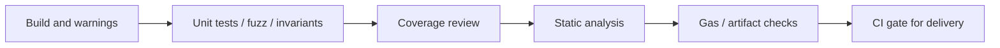

# 测试之外，合约工具链还应该看到什么

## 先理解什么

很多人学 Foundry 学到一半，会形成一个非常自然但不够完整的判断：

- 我写了单元测试
- 也跑了 fuzz
- 终端是绿的
- 所以应该没什么大问题了

这条路径当然比“完全不测”强很多。  
但在真实合约工程里，问题往往不是“有没有测试”，而是：

- 测试究竟覆盖了什么心智模型
- 哪些结构性风险根本不在测试视角里
- 你的 CI 到底是在验证质量，还是只是在验证一组样例没挂

所以这章真正要做的，是把“测试”从单点动作升级成一套工具组合。

## 为什么重要

合约项目里常见的风险盲区包括：

- 某些危险模式写进去了，但测试刚好没碰到
- coverage 很高，但关键权限分支没被认真断言
- 某些外部调用风险、重入风险、未检查返回值等结构问题更适合静态分析发现
- 项目依赖升级或配置变化后，测试虽然通过，但产物和安全边界已经漂移

如果你只相信一种工具，你看到的只是系统的一个投影。

## 核心机制

### 1. 单元测试回答的是“已知行为是否符合预期”

单元测试最擅长的是：

- 给定输入
- 断言输出或状态变化
- 验证你已经想清楚的行为

它的价值非常高，但它天然依赖你的已知假设。  
也就是说，测试能很好地保护“你已经想到的事情”，却不一定能发现“你根本没想到的问题”。

### 2. fuzz 和 invariant 让你摆脱部分样例依赖

fuzz 会把输入空间放大。  
invariant 会把验证逻辑从“某一步应该怎样”提升到“无论怎么跑，某个性质都不能破”。

它们非常适合发现：

- 边界值问题
- 状态机意外路径
- 资金守恒类问题
- 权限不变量被绕开的情况

但它们也不是万能的，因为：

- 不变量本身要靠你定义
- 环境建模错误时，结果也会失真

### 3. coverage 看到的是“代码走到没走到”，不是“风险想到没想到”

覆盖率工具很有用，因为它能提醒你：

- 哪些分支从没执行过
- 哪些文件几乎没被测试触碰

但它不能直接告诉你：

- 断言是不是有意义
- 执行到了是不是就等于验证到了
- 高风险路径是不是被认真建模

所以对 coverage 更成熟的理解应该是：

- 它是发现盲区的热力图
- 不是质量本身

### 4. 静态分析更擅长发现“结构性味道”

静态分析工具会从代码结构层面提示你：

- 潜在重入点
- 危险的低级调用
- 权限检查缺失
- 影子变量、未使用返回值、死代码
- 某些已知不推荐模式

这类问题之所以适合静态分析，是因为它们往往不依赖某个特定测试样例，而依赖结构形态本身。

对 Foundry 项目来说，静态分析不是替代测试，而是补上另一类视角。

### 5. 真实交付更像“多层工具交叉验证”

一条更成熟的合约质量流水线，通常会同时看：

- `forge fmt` 或代码规范一致性
- `forge build` 编译与 warning
- `forge test` 单元测试和 fuzz
- `forge coverage` 了解未触达区域
- 静态分析工具检查结构风险
- gas report 或快照观察异常变化

示意上更像这样：



一个简单的 CI 思路可以是：

```bash
forge fmt --check
forge build
forge test
forge coverage
slither .
```

重点不在于“命令长什么样”，而在于你是否承认：

- 合约风险不是单一维度
- 不同工具各自负责不同盲点

### 6. 工具链应该服务于“发现风险”，而不是“堆工具截图”

很多团队也会掉进另一个坑：

- 装了很多工具
- 报告跑了一大堆
- 但没人知道哪些警告真的重要

所以你的目标不是“把工具堆满”，而是把它们组织成清晰流程：

1. 哪些告警必须阻断合并  
2. 哪些告警要人工审查  
3. 哪些指标只作为趋势观察  
4. 哪些变化会触发更深入 review

这时工具链才真正变成工程系统，而不是仪式感装饰。

## 工程判断

以后你看一个 Foundry 项目是否成熟时，优先问：

1. 它是否只有测试，没有其他质量防线？
2. coverage 指标背后，关键风险路径是否真的被验证？
3. 静态分析告警有没有被分级处理？
4. 构建、测试、覆盖率和分析结果是否进入 CI？
5. 团队是否知道每种工具分别在保护什么？

把这些问题想清楚，你就会从“会跑测试的人”成长为“会建立交付系统的人”。

## 本节小结

Foundry 的强大，不只是因为它能写测试，而是因为它可以成为一整套合约工程工具链的中心。测试、coverage、静态分析和 CI 不是互相替代关系，而是多层视角共同收缩风险面的方式。
