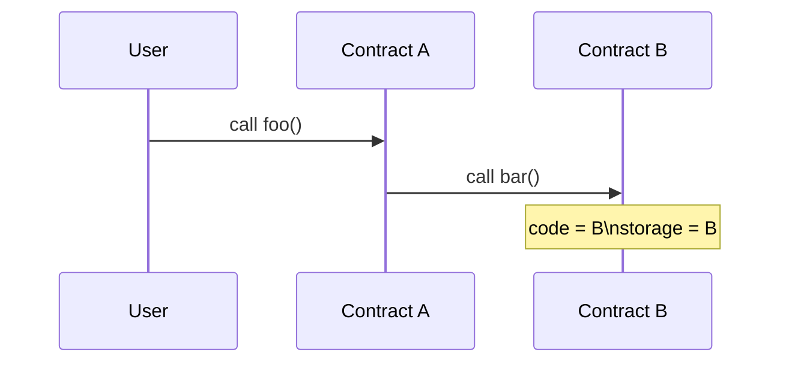

# 调用上下文怎样改变语义

## 先理解什么

Solidity 代码看起来像一层连续逻辑，但 EVM 真正执行时，总是在一个具体调用上下文里推进。你后面理解低级调用、回滚、代理和重入时，最关键的不是“哪行代码写了什么”，而是“这行代码在谁的上下文里执行”。

一个调用上下文通常至少包含：

- 当前合约地址
- `msg.sender`
- `msg.value`
- 当前可见的 storage
- 当前调用带入的 calldata

### 先把几个词钉牢

**msg.sender** `msg.sender` 是当前这层调用在 EVM 看来真正的直接调用者。直觉上它像“这一步是谁把请求递给我的”。工程上这意味着跨合约调用和 delegatecall 会改变你对调用来源的判断，权限逻辑不能只凭表面调用链想当然。

**调用上下文（Call Context）** 调用上下文是当前执行所继承的发送者、金额和状态视角组合。直觉上它像同一段代码在不同房间里表演时所处的舞台环境。工程上这意味着很多安全和权限问题，根源并不在函数体，而在你误判了它当前运行在哪个上下文里。

**Delegatecall** Delegatecall 是在当前合约状态上下文里执行另一份代码的低级调用方式。直觉上它像借别人的剧本，在自己的舞台和道具上演出。工程上这意味着代码来源和状态归属被拆开了，也是代理模式和一类高风险漏洞的关键基础。

## 为什么重要

很多 Web3 工程问题，表面像逻辑 bug，底层却是上下文误判。例如：

- 为什么代理模式里逻辑代码执行了，但改的是代理合约的 storage
- 为什么 `delegatecall` 这么危险
- 为什么外部调用前后的状态假设会失效
- 为什么 trace 能帮你还原问题发生在哪一跳

如果你不把上下文当作核心概念，这些现象会非常难学稳。

## 核心机制

### 1. 普通 call 会切换到对方的上下文

当合约 A 普通调用合约 B 时，执行会进入 B 的代码和 B 的存储语义。  
你可以粗略理解为：“去对方的地盘执行对方的逻辑”。



### 2. Delegatecall 会借代码，但保留自己的上下文

`delegatecall` 的关键点在于：代码来自对方，但上下文留在自己这里。

```solidity
(bool ok, bytes memory data) = implementation.delegatecall(msg.data);
```

这意味着：

- 执行的是 implementation 的代码
- 但使用的是当前合约的 storage
- `msg.sender` 也沿用当前语义

这正是代理升级模式强大且危险的根源。

### 3. Opcode 不需要全背，但要知道它们在做什么类别的事

对应用和合约工程师来说，最有用的不是背出每个 opcode，而是知道它们大致属于哪些类别：

- 读写状态
- 操作内存
- 控制流程
- 调用其他合约
- 记录日志
- 返回或回滚

这样你看 trace 或 gas 报告时，就知道当前在消耗哪类资源、跨了哪类边界。

### 4. Trace 是把上下文跳转可视化的工具

当你查看 trace 时，真正有用的信息往往不是每条底层指令细节，而是：

- 调用链路怎么走的
- 哪一跳发生了 revert
- 哪一跳进入了外部合约
- 哪一跳切换到了代理或被代理实现

所以理解调用上下文以后，trace 才会从“很底层的一串输出”变成可读材料。

## 常见误区

### 误区一：觉得 `msg.sender` 永远是用户

很多时候不是。只要发生合约间调用，当前上下文里的 `msg.sender` 就可能已经变成上一个合约。

### 误区二：把 `delegatecall` 当普通调用看

这是很多升级、代理和安全问题的起点。它不是“另一种 call”，而是上下文保留机制完全不同的一类调用。

### 误区三：觉得 opcode 只和底层研究员有关

你当然不需要日常手写它们，但只要你要理解 gas、trace、代理和低级调用，它们就已经和工程实践有关了。

## 工程判断

以后只要你遇到外部调用、代理或 trace，优先问：

1. 当前执行在哪个地址语义里？
2. 当前用的是谁的 storage？
3. 当前 `msg.sender` 到底是谁？
4. 控制权是不是已经交给了外部？

这组问题会直接提升你对复杂协议和安全问题的理解速度。

## 本节小结

EVM 调用不是只看“谁调用了谁”，而是要看“代码在哪执行、上下文归谁、状态改到哪”。把这层补上以后，很多低级调用和代理行为就不再神秘。
