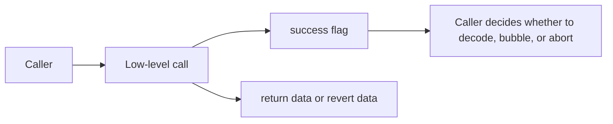

# Call、返回值与回滚语义

## 先理解什么

在 Solidity 里，很多高层写法都会帮你隐藏细节。  
例如普通接口调用：

```solidity
token.transfer(to, amount);
```

你经常会把它理解成“调用成功或失败”。  
但到了低级调用层，这种简化直觉就不够用了，因为系统会直接把一些更原始的信息暴露给你：

- 调用是否成功
- 返回了什么字节
- 是否回滚
- 回滚时带了什么错误数据

### 先把几个词钉牢

**低级调用（Low-level Call）** 低级调用是绕过高层接口语义，直接处理调用结果和返回数据的调用方式。直觉上它像不走客服流程，直接和底层线路打交道。工程上这意味着你获得更多灵活性，但也必须自己处理成功标记、返回数据和失败传播。

**Return Data** Return data 是调用成功后从被调用方返回给调用方的编码结果。直觉上它像对方在通话结束前递回来的答复内容。工程上这意味着低级调用场景下，你需要自己决定如何解析它，而不是期待 Solidity 总替你做完。

**Revert Data** Revert data 是执行失败时向外层返回的错误编码信息。直觉上它像失败现场留下的结构化诊断报告，而不是一句笼统的“出错了”。工程上这意味着你可以借它定位 custom error、失败路径和跨合约调用里真正的报错来源。

## 为什么重要

低级调用重要，是因为很多复杂系统最终都会碰到它：

- 代理转发
- 通用执行器
- 与未知接口合约交互
- 安全敏感路径中的外部调用

如果你对返回数据和回滚语义理解不稳，就很容易写出：

- 忽略失败结果的调用
- 没有处理错误冒泡的代理
- 错误假设外部返回格式的解码逻辑

## 核心机制

### 1. 低级调用首先暴露的是“原始结果”，不是业务语义

像 `call` 这种方式，通常直接给你一组更原始的输出：

- `success`
- `returnData`

它不会替你解释“业务成功了没有”，只会告诉你底层调用有没有按 EVM 规则返回成功。

这意味着你不能偷懒地把 `success == true` 直接等价成“业务一定满足预期”。

### 2. `call`、`delegatecall`、`staticcall` 的上下文不同

它们虽然都属于低级调用，但工程语义差别很大。

- `call`：进入对方合约自己的上下文
- `delegatecall`：在当前合约状态上下文里执行对方逻辑
- `staticcall`：限制为只读语义

这就是为什么：

- 代理高度依赖 `delegatecall`
- 查询路径常见 `staticcall`
- 一般外部交互更多通过 `call` 或高层接口调用

### 3. revert data 让错误不仅仅是“失败了”

如果调用回滚，EVM 不只是告诉你失败，还可能携带回滚数据。  
这些数据可能来自：

- `require` 的错误字符串
- 自定义 error
- 更底层的 panic

这也是为什么成熟系统会重视错误冒泡与解码，而不是简单写一句：

```solidity
require(success, "failed");
```

因为这种写法会把原始错误信息压扁，损失很多定位价值。

### 4. 返回值与回滚值都属于协议边界的一部分

一旦你开始做通用调用、代理或适配层，就必须意识到：

- 返回值格式是否可信
- 返回值长度是否符合预期
- 失败时是否能完整冒泡错误

这些问题都属于边界处理，而边界处理往往最容易出事故。



### 5. 工程上最怕“既没检查 success，也没检查返回格式”

低级调用的很多事故，并不来自特别复杂的 EVM 细节，而来自最基本的边界忽略：

- 没判断 `success`
- 盲解码返回值
- 失败时吞掉原始错误
- 把外部合约当成一定遵循预期接口

一旦你把低级调用看成“不可信边界”，代码审查视角就会稳很多。

## 工程判断

以后只要看到低级调用，先做四个检查：

1. 这是 `call`、`delegatecall` 还是 `staticcall`？
2. 调用结果有没有检查 `success`？
3. 返回数据有没有按预期长度和格式处理？
4. 失败时原始错误有没有被合理冒泡或保留？

这四步会帮你迅速发现很多潜在风险。

## 本节小结

低级调用把高层语法帮你隐藏的很多信息重新暴露了出来：调用上下文、原始返回值、回滚数据和错误冒泡。理解这些，不只是为了读懂 EVM，而是为了真正能写稳代理、适配层和复杂外部调用路径。
