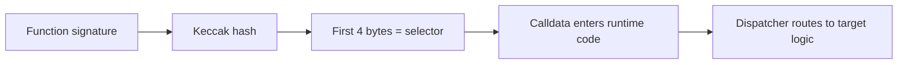

# 从函数签名到运行时代码入口

## 先理解什么

很多开发者知道 ABI，也知道调用函数时要传 selector 和编码参数。  
但如果继续追问：

- selector 怎么来的
- 为什么 4 个字节就能区分函数
- 部署字节码和运行时代码有什么区别
- 运行时到底怎么根据 selector 跳到目标逻辑

很多人就会开始模糊。  
这一章的目标，就是把这些问题串起来。

### 先把几个词钉牢

**Selector** Selector 是函数签名哈希前 4 字节构成的调用分发标识。直觉上它像这次调用附带的门牌号，告诉合约应该走哪条入口。工程上这意味着很多前端、ABI 和低级调试问题，最后都能落到 selector 是否正确。

**ABI 编码（ABI Encoding）** ABI 编码是把函数参数和返回值转换成 EVM 可处理字节格式的规则。直觉上它像把人类可读结构翻译成机器严格要求的包裹格式。工程上这意味着参数对不上、解码失败或 selector 冲突时，你要回到 ABI 编码层找原因。

**分发器（Dispatcher）** 分发器是运行时字节码里依据 selector 决定进入哪个函数入口的分发逻辑。直觉上它像前台接待员，先看门牌再把来访请求带去对应房间。工程上这意味着理解 dispatcher，有助于你看懂函数选择、fallback 和低级调用之间的关系。

## 为什么重要

这层理解的重要性不只是“更底层”，还非常实际：

- 读代理和 fallback 时会更清楚
- 理解函数冲突和选择器碰撞时更有感觉
- 看字节码或反编译输出时不至于完全迷失

更重要的是，你会第一次真正看到：  
Solidity 高层函数调用，最后如何被压缩成运行时代码里的分发入口。

## 核心机制

### 1. 函数选择器来自函数签名哈希

一个函数选择器通常来自：

- 函数名
- 参数类型列表

组成的签名字符串，再经过哈希取前 4 个字节。

所以：

- 不同参数类型会得到不同 selector
- 返回值不参与 selector 计算

这也是为什么重载函数在 ABI 层仍然可以被区分。

### 2. 部署字节码和运行时代码不是同一回事

很多人第一次看编译产物时会疑惑：为什么合约代码这么长？  
因为编译器输出里通常至少有两层需要区分：

- creation / deployment bytecode
- runtime bytecode

部署字节码负责在创建时初始化并返回真正要长期驻留链上的运行时代码。  
运行时代码才是之后每次调用面对的主体。

### 3. 调用进入合约后，会先经历分发

当一个外部调用进入合约时，运行时代码通常要先判断：

- calldata 前 4 个字节是什么
- 对应哪个函数入口
- 如果都不匹配，走 fallback / receive 还是回滚

这就是 selector dispatch 的基本含义。  
从这个角度看，合约并不是天然“知道你想调哪个函数”，而是在运行时按规则分流。

### 4. ABI 是高层协议，selector dispatch 是底层入口

ABI 让前端和合约之间有共同接口语言。  
但真正进入 EVM 时，这些接口最后会落到：

- selector
- 参数编码
- 分发逻辑

也就是说，ABI 是描述约定，dispatch 是执行入口。

### 5. 这层理解能帮你更自然地看 fallback、proxy 和反编译结果

一旦理解了 selector dispatch，再看这些场景就会更通：

- proxy 为什么常常直接转发 calldata
- fallback 为什么能接住未知 selector
- 反编译输出为什么老在做 selector 比较

你看到的就不再是“神秘低级代码”，而是一套非常明确的入口分发机制。

## 工程判断

以后你读到底层调用或编译产物时，先问：

1. 这里是部署阶段代码还是运行时代码？
2. 外部调用靠什么进入目标函数？
3. fallback 在这里扮演什么角色？
4. selector 与 ABI 描述之间是什么关系？

只要这四件事想清楚，很多底层材料就不再那么难啃。

## 本节小结

函数选择器把高层函数签名压缩成运行时入口索引，部署字节码负责把运行时代码送上链，运行时代码再通过 selector dispatch 找到目标逻辑。理解这条链路后，你会对 ABI、fallback、proxy 和反编译结果都有更扎实的底层直觉。
