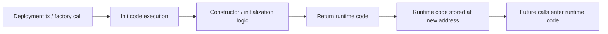

# CREATE、init code 与 runtime code 到底怎样协作

## 先理解什么

很多开发者对部署的直觉是：

- 编译合约
- 拿到 bytecode
- 发交易
- 链上出现地址

这当然没错，但过于简化了最关键的一层：  
部署不是“把代码存上链”，而是让 EVM 执行一段创建代码，再把它返回的结果当成未来的运行时代码保存下来。

也就是说，部署本身就是一次特殊执行流程。

## 为什么重要

如果你不理解这条创建路径，就很难真正搞懂这些常见现象：

- 为什么 constructor 参数会改变部署 bytecode
- 为什么 init code 很大，但链上最终 runtime code 更小
- 为什么部署失败和普通函数 revert 有相似处又不完全一样
- 为什么 factory 能预测地址
- 为什么 proxy 与 implementation 的部署语义要分开看

这些问题在工程上都非常常见，但底层都指向同一个主题：合约创建。

## 核心机制

### 1. 部署交易的目标不是“调用某地址”，而是“请求创建新地址”

普通交易通常是：

- 发给某个已有地址
- 触发该地址的 runtime code 执行

合约创建交易则不同：

- 它不以已有合约为目标执行 runtime code
- 它把一段创建用 bytecode 交给 EVM
- EVM 执行后产出一个新地址与一份 runtime code

所以创建流程本身就是特殊路径。

### 2. init code 是部署期代码，runtime code 是部署后代码

编译器生成的创建相关 bytecode 通常可以拆成两层语义：

- init code：只在部署时执行一次
- runtime code：部署完成后永久挂在地址上，供未来调用

init code 负责做的事情包括：

- 处理 constructor 参数
- 初始化某些状态
- 组织并返回最终 runtime code

runtime code 才是用户之后通过函数调用真正进入的那份代码。

### 3. constructor 的本质是部署期状态准备

constructor 看起来像一个“特殊函数”，但更准确地说，它属于 init code 阶段。

也就是说：

- constructor 不存在于未来运行时 ABI 入口里
- 它只在部署时参与执行
- 它产生的影响主要体现在初始状态和最终 runtime 产物

这也是为什么 constructor 参数会影响部署 bytecode 和部署交易数据，却不会变成后续可再次调用的函数。

### 4. 新地址不是随机出现的，而是由创建上下文推导出来的

合约地址之所以可预测，是因为它不是链随便发给你的，而是由创建规则决定的。

在普通 CREATE 路径里，地址通常和这些因素有关：

- 创建者地址
- 创建者 nonce

在 CREATE2 路径里，还会把 salt 和 init code 哈希纳入地址推导。

所以“预测地址”本质上不是魔法，而是你提前知道创建输入。

### 5. 部署失败本质上也是一次执行失败

既然部署是一次 EVM 执行，那么它当然也会失败。  
常见原因包括：

- constructor 中 revert
- 初始化逻辑耗尽 gas
- 依赖地址不正确
- 参数不符合预期

失败后不会留下一个“半部署合约”，因为 runtime code 并没有被成功产出并写入最终地址状态。

### 6. factory 和代理体系之所以复杂，是因为它们在“创建谁、返回谁、以后调用谁”

你以后看到 factory、minimal proxy、upgradeable proxy 时，经常会觉得绕。  
但只要抓住三个问题就不容易迷路：

- 谁在发起创建？
- 创建阶段执行的是谁的 init code？
- 以后用户调用的 runtime code 又挂在哪个地址？

## 工程判断

以后遇到部署相关问题，先问：

1. 我现在看到的是 init code 还是 runtime code？
2. constructor 实际在部署链路里做了什么？
3. 新地址是怎样从创建上下文推导出来的？
4. 部署失败发生在创建执行的哪一段？
5. 如果这是 factory 或 proxy，真正被调用的 runtime code 挂在哪里？

只要这五个问题想清楚，合约创建相关的大部分迷雾都会散掉。

## 本节小结

合约部署不是简单“上传代码”，而是一次由 init code 驱动的 EVM 创建过程。constructor、地址推导、runtime code 和部署失败都属于这条创建路径的一部分。理解这一层之后，很多高级部署模式都会顺着变得清楚。
