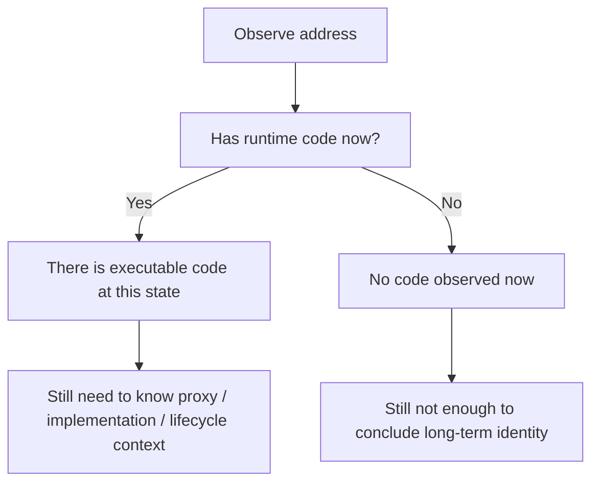

# 合约代码到底能告诉你什么，不能告诉你什么

## 先理解什么

很多 Solidity 或 EVM 初学者看到下面这种判断时，会觉得很自然：

```solidity
if (msg.sender.code.length > 0) {
    revert("contract not allowed");
}
```

这个写法之所以流行，是因为它利用了一个看似直接的事实：

- 某个地址如果有 runtime code，看起来就像合约
- 没有 code，看起来就像 EOA

但工程现实比这个二元判断复杂得多。  
地址、代码、部署时机和调用语义之间，远没有这么简单。

### 先把几个词钉牢

**EXTCODEHASH** `EXTCODEHASH` 是读取某地址代码哈希、用来判断其代码身份特征的操作。直觉上它像先看对方程序指纹，再判断它大概是谁。工程上这意味着它能帮你做代码存在性和版本类判断，但不能替代更完整的信任验证。

**代码内省（Introspection）** 代码内省是通过读取代码大小、哈希或接口特征来观察合约身份的做法。直觉上它像站在门外先观察房子的外形，而不是直接知道屋内所有规则。工程上这意味着内省能提供有用信号，但不能让你跳过真正的信任边界判断。

**信任边界（Trust Boundary）** 信任边界是系统开始不能再默认对方行为、数据或代码可信的边界位置。直觉上它像你从自己房间跨出门口的那一刻，外面的规则就不再完全由你控制。工程上这意味着代码哈希、接口探测和地址类型判断都只能提供参考，真正安全的设计仍然要从信任边界出发。

## 为什么重要

如果你对代码自省理解不够准确，就很容易：

- 误以为“禁止合约调用”是可靠的防机器人方案
- 在构造器阶段被绕过 `isContract` 限制
- 对代理模式、工厂合约和 `CREATE2` 的行为做出错误推断
- 继续把 `SELFDESTRUCT` 当成一种可靠的“删除系统”方式

这些问题会同时影响：

- 安全设计
- 权限模型
- 协议兼容性
- 底层调试能力

## 核心机制

### 1. 地址上的“代码”说的是 runtime code

EVM 里你平时查询到的，通常是某地址当前持有的 runtime code。  
它不是：

- 源代码
- 部署时的 init code
- 作者意图

它更准确地回答：

- 这个地址在当前状态下，执行调用时会跑什么字节码

所以代码自省可以帮助你理解执行对象，但不能直接替代更高层语义判断。

### 2. “当前没代码”不等于“它永远是 EOA”

这是最常被忽略的一层。

一个地址当前没有 runtime code，可能意味着很多不同情况：

- 它是普通外部账户
- 它是未来可能通过 `CREATE2` 部署代码的地址
- 它是某个正在构造中的合约在外部视角下的瞬时状态
- 它是一个系统曾经交互过、但当前无代码的地址

也就是说，“无代码”只是当前观察结果，不是稳定身份标签。

### 3. 构造器阶段会让很多 `isContract` 假设失效

一个经典误区是：

- 既然合约部署后有代码，那我就可以靠 `code.length` 阻止合约参与

问题在于，合约在构造执行期间，runtime code 还没真正落在地址上。  
这意味着某些基于“是否已有代码”的限制，可以在构造阶段被绕过。

因此，`isContract` 一类逻辑通常不适合作为安全边界本身。  
它最多只能作为非常有限的辅助信号。

### 4. 代理与实现分离，让“看到的代码”不一定是“真正业务逻辑”

在代理模式里，你看到某个地址上确实有代码。  
但它可能只是：

- 一个转发壳
- 一个权限入口
- 一个 dispatch 层

真正业务逻辑可能在另一个实现合约中。  
所以“读代码”时你还要问：

- 这是用户直接交互的地址吗
- 这是代理、实现，还是工厂
- 状态与逻辑是否在同一地址上

单独看某个地址的 code，常常只能得到局部真相。

### 5. `SELFDESTRUCT` 已经不再是传统意义上的“彻底删除”

历史上很多人把 `SELFDESTRUCT` 理解成：

- 合约自毁
- 代码和存储都消失
- 地址彻底清空

但在现代 Ethereum 主网语义下，这种理解已经不再可靠。  
在 EIP-6780 之后，`SELFDESTRUCT` 不再适合作为“长期合约删除机制”来理解。对已经存在的长期合约来说，你不能再把它当成一种稳定的状态清除工具。

这会直接影响两类误解：

- 误以为某些旧型自毁模式仍然适合系统设计
- 误以为“将来可以自毁重来”是一种可靠升级或清理策略

### 6. 更成熟的代码自省用法，是把它当成“执行线索”，不是“身份真相”

代码自省真正擅长的事情包括：

- 调试当前地址是否已有 runtime code
- 对比不同实现地址的 code hash 或 code size
- 帮助理解代理、工厂和部署流程
- 做某些低层兼容性判断

它不擅长直接承担：

- 人机分类
- 反机器人边界
- 反 MEV 边界
- 强安全身份识别

下面这个例子更适合作为底层观察，而不是终局判断：

```solidity
function hasRuntimeCode(address target) internal view returns (bool) {
    return target.code.length > 0;
}
```

这个函数能回答的是：

- “此刻这个地址上有没有 runtime code”

它不能回答的是：

- “这个调用者本质上是不是人”
- “这个地址未来会不会有代码”
- “这个系统是不是安全可依赖”



## 工程判断

以后你看到代码自省相关逻辑时，优先问：

1. 这个判断是在观察当前执行对象，还是在偷换成身份判断？
2. 它是否会被构造阶段、代理模式或未来部署路径影响？
3. 如果代码存在，它看到的是代理层还是实现层？
4. 有没有地方还在把 `SELFDESTRUCT` 当成传统删除工具？
5. 这段逻辑是真正的安全边界，还是只是一个弱提示？

只要这些问题问清楚，你就不会轻易被“看上去很聪明”的 code check 迷惑。

## 本节小结

EVM 的代码自省能力非常有用，但它给你的主要是执行层线索，而不是完整身份真相。理解 runtime code、构造阶段、代理结构和现代 `SELFDESTRUCT` 语义，才能正确使用这组底层能力。
