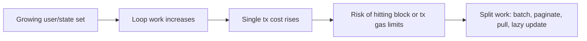

# 成本增长、循环与批处理取舍

## 先理解什么

很多 Solidity 初学者在优化 gas 时，会把注意力放在单条语句上，比如：

- `++i` 还是 `i++`
- `memory` 还是 `storage`
- `immutable` 能省多少

这些都不是没用，但如果忽略了复杂度结构，就很容易出现一种情况：  
局部写得很精致，整体却根本不适合上链。

### 先把几个词钉牢

**Batching** 是把多次相似操作合并成一次批量执行的方式。直觉上它像集中处理一批任务，而不是每件事都单独跑一趟。工程上这意味着 batching 能减少固定开销，但也可能把复杂度和失败半径一起放大。

**循环复杂度（Loop Complexity）** 是循环随数据规模增长而带来的成本变化关系。直觉上它像任务量每多一份，时间和成本是不是只多一点，还是会迅速爆炸。工程上这意味着链上循环不仅要看当前数据规模，还要看未来会不会把函数推到 gas 上限附近。

**上界（Upper Bound）** 是某条执行路径在最坏情况下可能达到的成本上限。直觉上它像系统在最糟场景下到底会吃掉多少资源的封顶估计。工程上这意味着你做链上设计时，必须先想最坏情况，而不是只看小样本时的成本。

## 为什么重要

链上最危险的成本问题，很多都不是“贵一点”，而是“随着规模增长越来越不可执行”。

例如：

- 遍历所有用户
- 一次性处理超长数组
- 在一个函数里完成过多分发
- 让管理员对全量仓位做线性更新

这些问题在测试数据少时看不出来，但一旦真实用户规模扩大，就可能直接让某些功能无法调用。

## 核心机制

### 1. Gas 不只关心单次成本，也关心增长方式

判断一个函数时，不能只问：

- 这次调用花了多少 gas

还要问：

- 用户数量翻 10 倍后会怎样
- 数组长度翻 100 倍后会怎样
- 一个区块 gas limit 下还能执行多少工作

这就是为什么复杂度思维比单点技巧更重要。

### 2. 无界循环往往是最常见的结构性风险

所谓无界循环，不一定指永远停不下来，而是它的迭代次数由外部增长数据决定，并且没有明确上限。

例如：

- 遍历所有 staker
- 给所有持有人发奖励
- 遍历所有订单统一结算

这些设计在链上通常很危险，因为系统一旦成功，数据量就会自然增长，而增长反过来会让功能越来越难执行。

### 3. 批处理不是万能解药，但常常比全量处理更现实

面对必须处理大规模数据的需求，更常见的链上做法是：

- 分页
- 分批提交
- 让用户各自领取
- 让更新懒执行到使用时

这些设计的共同点，是把一次重型操作拆散，让单笔交易保持在可执行范围内。

### 4. Pull 模式常常比 Push 模式更可持续

很多初学者会想：

- 合约主动给所有人发奖励
- 管理员一次性帮所有人同步状态

这更像 Web2 后台任务思维。  
链上更常见的是 pull 模式：

- 用户自己领取奖励
- 用户在交互时顺带更新自己的账
- 清算者自己来执行可获利操作

这种模式不是偷懒，而是在尊重链上执行资源有限这件事。

### 5. 复杂度问题最好在设计阶段解决

如果系统已经上线、数据已经很大，再回头改复杂度结构，代价通常很高。  
所以更成熟的做法是在设计期就问：

- 这个操作会不会随着系统成功而越来越重
- 它能不能被拆成多笔交易
- 能不能把全局更新改成局部按需更新

这类问题越早问，越能避免后期系统性返工。

## 工程判断

以后你看到任何循环或批处理逻辑，先做五个检查：

1. 循环次数由什么决定？
2. 它有没有自然上限？
3. 数据量增长后，单笔交易还能承受吗？
4. 能不能改成分页、批次或 pull 模式？
5. 这是“偶尔管理员操作”，还是“用户常用主路径”？

这五个问题会帮你比单纯看一眼 gas report 更早发现风险。

## 本节小结

真正危险的 gas 问题，常常来自复杂度而不是语法细节。无界循环、全量批处理和 push 型全局更新，都可能让系统随着规模增长变得不可执行。学会从增长方式而不是单次成本看问题，你才真正开始理解链上性能设计。
