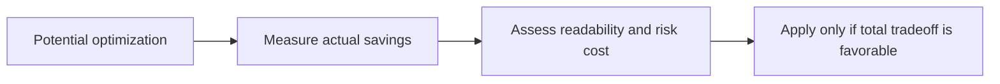

# 什么时候不该优化，以及为什么

## 先理解什么

很多人一开始学 Gas 优化，会有一种非常强的驱动力：  
既然链上每次执行都要花钱，那是不是每一行都该压榨到极致？

这个直觉很容易理解，但长期看并不成熟。  
因为代码不是只执行一次，它还要：

- 被你自己半年后重读
- 被同事接手
- 被审计
- 被扩展
- 被调试

所以“省了多少 gas”从来不是唯一成本，甚至很多时候不是主要成本。

## 为什么重要

如果没有取舍意识，Gas 优化很容易变成几个坏结果：

- 写出难读的代码
- 把简单逻辑拆成很绕的技巧
- 为了微小收益引入新风险
- 让审计和维护成本升高

最后你省下的也许只是极少量 gas，却把工程复杂度和出错概率一起抬高了。

## 核心机制

### 1. 高价值优化和低价值优化不是一回事

高价值优化通常有这些特征：

- 出现在高频主路径
- 节省明显
- 不显著损害可读性
- 不引入新风险

低价值优化则常常是：

- 只省很少
- 出现在低频路径
- 写法明显更难懂
- 给未来扩展制造障碍

成熟工程师真正要练的，是区分这两类，而不是无差别优化。

### 2. 可维护性本身就是长期成本模型的一部分

很多人把维护成本看成“抽象的团队问题”。  
在真实协议里，它是很具体的：

- 别人读不懂，审计更难
- 未来改动更容易碰坏边界
- 出错时更难定位

这些成本虽然不直接显示在 gas report 里，但会真实地变成时间、风险和返工。

### 3. 安全与清晰通常比小幅 gas 节省更重要

如果一个优化写法让：

- 边界更难看懂
- 状态变化更隐蔽
- 断言更绕

那它很可能不值得。  
尤其在资金敏感系统里，安全性和可审计性几乎总比微小 gas 节省更优先。

### 4. 先把结构设计对，再优化热点

很多高质量优化并不来自技巧，而来自：

- 更好的状态设计
- 更好的复杂度控制
- 更清晰的批处理策略

也就是说，先把架构和数据路径设计对，再优化真正的热点，比一开始就抠局部语句更划算。

### 5. 优化应该是基于证据，而不是基于身份认同

有些人会把“会不会写特别极致的省 gas 代码”当成技术身份。  
更好的做法是：

- 有数据再动手
- 知道优化对象是不是热点
- 明白收益有没有覆盖复杂度代价

## 工程判断

以后面对任何优化点，建议先问：

1. 这段代码是不是高频路径？
2. 真实节省有多大？
3. 可读性和维护成本上升多少？
4. 是否引入新的安全或审计负担？
5. 有没有更结构性的优化方式？

如果前两个答案不够强，后面代价又明显上升，那通常就不值得。

## 本节小结

Gas 优化不是比赛谁写得最极致，而是比赛谁做的取舍更成熟。真正值得做的优化，应该基于热点、基于证据、基于整体成本模型；而不是为了省一点点 gas，把代码变成长期难以维护的负担。
