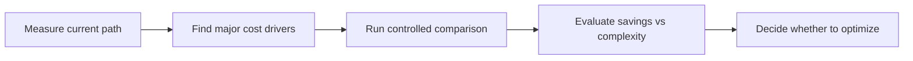

# 先测量，再决定该不该优化

## 先理解什么

很多 Gas 优化的讨论，一开始就走偏了。  
常见场景是：

- 看到某段代码“不优雅”
- 觉得某种写法“应该更省”
- 听说某个技巧“大家都在用”

然后就直接改。

问题在于，Gas 优化不是语法审美，而是资源成本决策。  
如果没有测量，你根本不知道自己在优化什么。

## 为什么重要

不做测量的优化最常见的问题有三类：

- 改了很多代码，只省了几乎可以忽略的成本
- 优化了冷路径，却忽略了真正高频热点
- 为了节省一点 Gas，牺牲了可读性、测试性和安全边界

这类“伪优化”在合约团队里非常常见，因为大家都知道 Gas 重要，却不一定知道如何判断“值不值得”。

## 核心机制

### 1. 测量的目标不是找最小数字，而是找到主要成本来源

Gas 分析的第一目标，不是把每一行都压到极限，而是识别：

- 哪些操作是主要成本项
- 哪些函数最值得关注
- 哪些输入规模会让成本快速放大

也就是说，你先要建立“热点图”，再考虑“微调”。

### 2. 对照实验比孤立数字更有意义

单独看到一个函数消耗 `65,000 gas`，信息量其实有限。  
更有价值的是对照：

- 改动前 vs 改动后
- 小输入 vs 大输入
- 冷路径 vs 热路径
- 单次调用 vs 批量调用

没有对照，你很难判断数字到底算不算值得优化。

### 3. 微优化很容易淹没在系统级成本里

有些技巧确实能省 Gas，但节省空间可能很小：

- 少几次局部变量复制
- 少一点循环内开销
- 某个分支顺序更顺

如果你的真实成本大头来自：

- `SSTORE`
- 外部调用
- 大规模循环
- 复杂状态更新

那你把注意力全放在微优化上，收益通常很有限。

### 4. 要在业务路径里看成本，而不是只看单函数

真正的费用发生在用户路径上。  
用户不关心你单个内部函数看起来多优雅，他们承担的是整条调用链的成本。

所以测量时要优先看：

- 用户最常调用的入口
- 最容易规模化增长的路径
- 资产流转和状态写入最重的地方

而不是只盯着某个局部函数的漂亮数字。

### 5. 基准测试最有价值的地方，是帮你做可重复判断

Gas 优化争论常常反复出现。  
如果你有一套稳定的基准：

- 同样输入集
- 同样测试路径
- 同样报告方式

那么每次改动都能更快回答：

- 这次真的更省了吗
- 节省幅度有多大
- 值不值得接受复杂度代价

### 6. 最终目标是“带上下文的优化决策”

好的 Gas 判断不是：

- 这写法更省，所以必须改

而是：

- 这条高频路径节省明显，值得接受少量复杂度
- 这条低频管理路径节省有限，不值得牺牲可读性
- 这段代码安全边界敏感，宁愿更清楚，不追求极限压缩

## 工程判断

以后你准备做 Gas 优化前，先问：

1. 我现在测到的主要成本项到底是什么？
2. 这条路径是高频用户路径还是低频管理路径？
3. 我有没有做改前改后的对照实验？
4. 节省的幅度是否值得增加结构复杂度？
5. 会不会因为优化牺牲审计性、可读性或安全边界？

Gas 优化真正难的，不是“会不会技巧”，而是“会不会判断”。

## 本节小结

优化之前先测量，测量之后看热点，对照之后再决策。只有这样，Gas 才不会变成空泛口号，而会成为一套有证据、有边界的工程判断方法。
