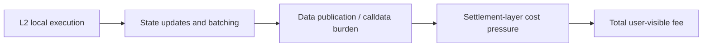

# 为什么 Rollup 上的收费逻辑和主网不一样

## 先理解什么

很多开发者第一次接触 L2 时，会形成一个很简化的印象：

- L2 就是比 L1 便宜

这当然常常成立，但这句话太粗了。  
真正重要的问题是：

- 便宜的是哪一部分
- 贵的又是哪一部分
- 哪些成本仍然来自 Ethereum 主网

只要这三点没拆开，你对费用的理解就还不够工程化。

## 为什么重要

如果你继续用“单一 EVM 执行成本”去看 L2，就会很容易误判：

- 以为所有优化方向都和 L1 一样
- 以为只要减少 opcode 就一定最有效
- 忽略了数据发布与 calldata 成本
- 看不清为什么某些批处理或压缩策略那么重要

这会直接影响你对协议设计和前端交互成本的判断。

## 核心机制

### 1. L1 费用更像“本地执行成本 + 链资源竞争”

在主网环境里，你通常更熟悉：

- 执行步骤成本
- 存储写入成本
- 区块空间竞争

这套模型依然重要，但到了 L2，你还要再多看一层：

- 最终要把什么数据带回或发布到更高层结算环境

### 2. Rollup 并不是脱离 Ethereum 的孤立世界

Rollup 之所以成立，一个核心点就在于：

- 它把执行放在自己的环境里
- 但把某些关键数据与安全锚点仍然落回 Ethereum

这意味着费用里往往同时包含：

- L2 本地执行成本
- 向上层发布或证明相关的数据成本

所以“更便宜”并不是因为完全不付主网相关代价，而是成本结构被重新组织了。

### 3. Calldata 成本经常成为关键，因为数据发布本身很贵

很多 L2 设计里，真正重的部分不是某个小函数多跑了几个 opcode，  
而是：

- 你最终要带多少数据
- 这些数据怎样被编码
- 是否能被压缩或聚合

这也是为什么你会经常看到：

- 批量处理
- 数据压缩
- 更紧凑的参数表示

这些方向的重要性显著上升。

### 4. L2 上的“便宜”常常来自把昂贵资源换成另一类资源

更准确地说，L2 不是把所有东西都变便宜了，而是在做资源重组：

- 少直接占用 L1 执行空间
- 多在本地环境完成执行
- 再把必要结果或数据带回上层

于是你优化时就要问：

- 我是在优化本地执行成本
- 还是在优化最终发布到上层的数据量

这两者不一定是同一个问题。

### 5. 工程上要开始把“数据结构”和“费用结构”绑在一起看

以前在 L1 上你可能更多从：

- storage 写入
- 循环复杂度
- 外部调用

看成本。

在现代 L2 环境里，你还要更敏感地看：

- 参数大小
- 批量编码方式
- 数据是否可合并
- 是否在重复发布同类信息

### 6. 成本理解一旦扩展到 L2，就更接近真实协议设计问题

因为这时你不再只关心：

- 代码怎么省 gas

而会开始关心：

- 这个协议怎样表达数据更经济
- 这个前端动作是否在放大数据发布成本
- 哪些用户路径最容易在大规模下变贵

## 工程判断

以后你看 L2 成本问题时，先问：

1. 当前主要成本来自本地执行，还是数据发布？
2. 这条路径是不是在重复发送过多数据？
3. 批处理、压缩或参数重组有没有更高收益？
4. 我还在用 L1 单一思路看问题吗？
5. 哪些交互在用户量起来后会被 calldata 成本放大？

只要这五个问题问清楚，你对 L2 费用的理解就会更接近真实世界。

## 本节小结

Rollup 的费用模型之所以不同，不是因为它只是“更便宜的 EVM”，而是因为它把执行和结算、数据发布重新组织了。理解这一点后，你的 Gas 判断会从单链视角自然过渡到现代多层链环境。
