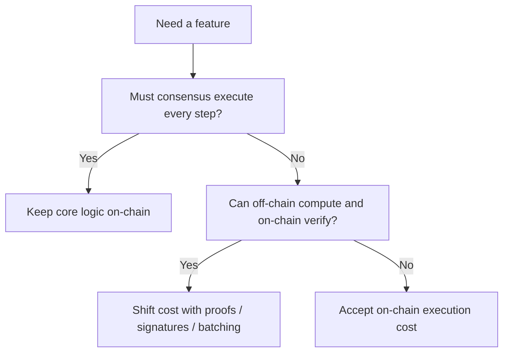

# 怎样判断哪些事情根本不该在链上做

## 先理解什么

学 Gas 优化学到一定阶段，很多人会自然把注意力放在：

- 少写一次 storage
- 少拷贝一次 memory
- 减少循环次数
- 优化数据类型

这些都很重要。  
但真正的大收益，常常来自更上层的问题：

- 这段计算有没有必要每次都在链上完整执行？
- 这份列表有没有必要完整存链上？
- 这份结果能不能先在链下算好，再把可验证结论带上链？

也就是说，最高价值的优化经常不是“把链上做快一点”，而是“决定某件事根本不该由链上完整承担”。

## 为什么重要

如果你不从架构层做判断，就很容易：

- 为了做排行榜、批量结算、复杂搜索，把合约写成昂贵循环机器
- 为了少量链上便利，长期背负巨额存储成本
- 过早把所有业务数据都压到链上，后续无法扩展
- 只看见 Gas 降低，却没看见信任假设已经改变

成本转移是一种非常强大的能力，但它同时也是边界重构。  
你不能只看“便宜了没”，还要看“代价被转移到哪里去了”。

## 核心机制

### 1. 先区分“必须共识”的东西和“只是方便计算”的东西

不是所有业务逻辑都需要全网共识执行。

真正适合留在链上的，通常是：

- 资产所有权
- 余额与结算结果
- 权限变更
- 惩罚、奖励与最终约束

更适合链下完成的，常常是：

- 排序
- 搜索
- 聚合统计
- 大规模候选筛选
- 批量结果预处理

一个很好的自问方式是：

- 如果这部分结果被不同节点独立算出不一样，会不会破坏资产正确性？

如果不会，它就更可能是链下候选。

### 2. 链下计算常见不是“搬走全部逻辑”，而是“链下准备，链上验证”

成熟系统很少粗暴地把核心逻辑完全移出链外。  
更常见的方式是：

- 链下做重计算
- 链上只验证一个更小、更便宜的证明或约束

常见手段包括：

- Merkle proof
- 签名授权
- 批量聚合后提交摘要
- optimistic claim + challenge
- 更高级的零知识证明

这背后的核心思想都是：

- 把“重新执行全部过程”变成“验证一个简化结论”

### 3. 成本转移一定伴随新假设

这是整章最重要的风险意识。

比如你用 Merkle root 发空投，看起来很省：

- 链上不用存所有名单
- 用户自己提供 proof

但你同时引入了：

- 谁来生成名单
- 名单生成规则是否可信
- root 更新机制是否透明
- proof 工具和数据分发是否可靠

再比如你用签名授权做白名单或报价，也会引入：

- 签名者是否可信
- nonce 是否防重放
- 有效期与上下文是否明确

所以成本转移从来不是“白捡便宜”，而是“用另一种假设换费用”。

### 4. 不是所有便宜都值得

有些设计虽然更省 Gas，但会让系统：

- 更难理解
- 更难审计
- 更难恢复
- 更依赖中心化服务

这种时候你需要问：

- 省下来的成本，对用户真的有感吗？
- 增加的复杂性，会不会在安全和运维上全吐回去？

Gas 优化如果脱离系统整体，最终可能只是把问题从账单上搬到了认知负担和信任成本上。

### 5. 成熟的架构会把“可验证最小核心”留在链上

你可以把链上看成最终裁判层。  
那么最值得留在链上的，往往是：

- 最小但关键的状态
- 可验证的输入输出边界
- 足以约束作弊的规则

而把这些之外的大量工作交给：

- 前端
- 后端
- indexer
- keeper
- solver

只要你仍然保留足够强的链上验证锚点，系统就能在成本和可信度之间找到更现实平衡。

一个简化示例如下：

```solidity
function claim(bytes32[] calldata proof, uint256 amount) external {
    bytes32 leaf = keccak256(abi.encode(msg.sender, amount));
    require(MerkleProof.verify(proof, merkleRoot, leaf), "invalid proof");
    _mint(msg.sender, amount);
}
```

这里链下承担了：

- 名单整理
- 数额计算
- proof 生成

链上只承担：

- 结果验证
- 最终结算

### 6. 判断链下化之前，先做一张“成本与信任转移表”

一个非常实用的方法，是在设计前写下：

| 问题 | 链上方案 | 链下准备 + 链上验证方案 |
| --- | --- | --- |
| 费用 | 高还是低 | 高还是低 |
| 复杂度 | 高还是低 | 高还是低 |
| 信任假设 | 少还是多 | 少还是多 |
| 审计难度 | 高还是低 | 高还是低 |
| 用户体验 | 简单还是复杂 | 简单还是复杂 |

只要这张表一写出来，很多“该不该搬出去”的判断就会更清楚。



## 工程判断

以后你遇到昂贵逻辑时，优先问：

1. 这部分到底是在做共识结算，还是只是在做方便计算？
2. 能不能改成链下准备、链上验证？
3. 成本下降的同时，增加了哪些信任假设？
4. 新方案是否让审计、运维和恢复更困难？
5. 用户真正感知到的是更便宜，还是更复杂？

只要这五个问题认真回答，很多高质量优化就会自然出现。

## 本节小结

Gas 优化的最高阶形式，往往不是在链上继续打磨细节，而是决定哪些事情应该留在链上，哪些应该搬到链下并通过可验证边界重新连接。真正成熟的工程判断，是同时看费用、复杂度和信任转移。
