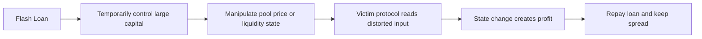

# 价格依赖、闪电贷与交易排序风险

## 先理解什么

很多 Web3 开发者第一次看到这类攻击时，感受是“这也太复杂了”。攻击路径里常常同时出现：

- AMM
- Oracle
- Flash Loan
- 清算
- 套利
- 多笔交易排序

如果你把它们当成一串陌生名词，很容易被吓住。更稳定的理解方式是：协议把某个外部价格当成了可信输入，而攻击者可以在极短时间里改变这个输入，或者利用交易排序优势在别人之前、之后插队，于是系统按错误前提做出了真实状态变化。

## 为什么重要

这类风险重要，不是因为它“高级”，而是因为它常常绕过开发者最熟悉的那些安全检查。

你可以没有重入。  
你可以权限写得很严。  
你甚至可以测试覆盖率很高。  

但只要你的协议逻辑默认了一个容易被操纵的价格，或者默认了某个时间窗口内的状态一定稳定，系统依旧可能被抽干。

## 核心机制

### 1. Oracle 是安全边界，不只是数据源

很多人把预言机理解成“给合约喂价格的工具”。工程上更准确的说法应该是：预言机是系统把外部世界压缩进链上状态的安全边界。

你需要问的不是“有没有价格”，而是：

- 价格从哪里来
- 更新频率怎样
- 单区块内是否可操纵
- 价格是否依赖某个薄流动性的池子
- 使用的是现货、均价还是多源聚合值

如果这些问题没有想清楚，协议就是在把核心决策交给一个不稳定输入。

### 2. Flash Loan 放大的不是魔法，而是攻击者资本能力

闪电贷经常被误解成漏洞本身。其实它更像一个放大器。  
它让攻击者可以在一笔交易里临时拥有巨额资金，只要交易结束前还回去即可。

这意味着很多原本“需要很多本金，所以现实里不容易发生”的价格操纵和清算攻击，突然变成了低门槛可执行行为。

典型路径是：

1. 借入大额资金
2. 推动某个池子价格偏移
3. 触发协议用这个失真价格执行借贷、兑换或清算
4. 套利获利并还贷

### 3. MEV 说明链上不是“先来后到”的理想世界

很多前端开发默认一件事：用户点击提交之后，只要交易发出，系统就会按这个顺序执行。  
真实世界并不是这样。

交易会进入 mempool，被搜索者、打包者和验证者观察。只要某笔交易带着明确可见的利润机会，别人就可能：

- 抢跑
- 跟跑
- 夹击
- 重排

所以你设计的协议逻辑如果要求“交易发出去之后的一小段时间里，环境必须保持不变”，那本质上已经把自己暴露在 MEV 环境里了。

### 4. 单点现货价格依赖往往是高危设计

假设某协议清算时直接读取某个 AMM 池子的当前 spot price。  
如果这个池子流动性有限，攻击者就可以通过一次大额 swap 把价格短暂推偏，再让受害协议读取这个错误价格。即便价格只偏移一个区块，也足够造成：

- 错误清算
- 错误铸造
- 错误兑换
- 错误抵押率判断

这就是为什么很多协议更偏向：

- TWAP
- 多源预言机
- Chainlink 等外部聚合价格
- 延迟执行和额外校验

### 5. 安全设计的核心是提高操纵成本，而不是幻想“永不被碰”

真正成熟的协议设计不会假设市场永远诚实。  
它会问：

- 如果有人想操纵，最便宜的方法是什么
- 需要多少资金
- 能不能在一个区块里完成
- 是否存在套利者帮忙纠正
- 即便价格失真，系统是否有额外保险丝

例如：

- 使用时间平均价格降低瞬时操纵影响
- 对关键价格变化设置边界检查
- 对清算参数设置更保守的缓冲区
- 拆分敏感操作，避免单笔交易内完成全部获利路径

## 工程判断

以后你看到任何“基于价格做决策”的合约，都先做一轮五问：

1. 这个价格是谁提供的？
2. 攻击者是否能在单区块内影响它？
3. 协议是否把瞬时价格直接拿来做高价值决策？
4. 即便价格失真，是否还有第二道防线？
5. 攻击收益与操纵成本相比，哪边更大？

只要这五个问题答不清，这个系统大概率就还没有安全到可以放心上线。

## 本节小结

Oracle、Flash Loan 和 MEV 不是彼此孤立的高级话题，而是一条完整风险链。预言机决定系统相信什么，闪电贷决定攻击者能瞬间动用多少资本，MEV 决定交易排序并不由你控制。理解这三者的关系，你才真正开始进入 DeFi 安全世界。
