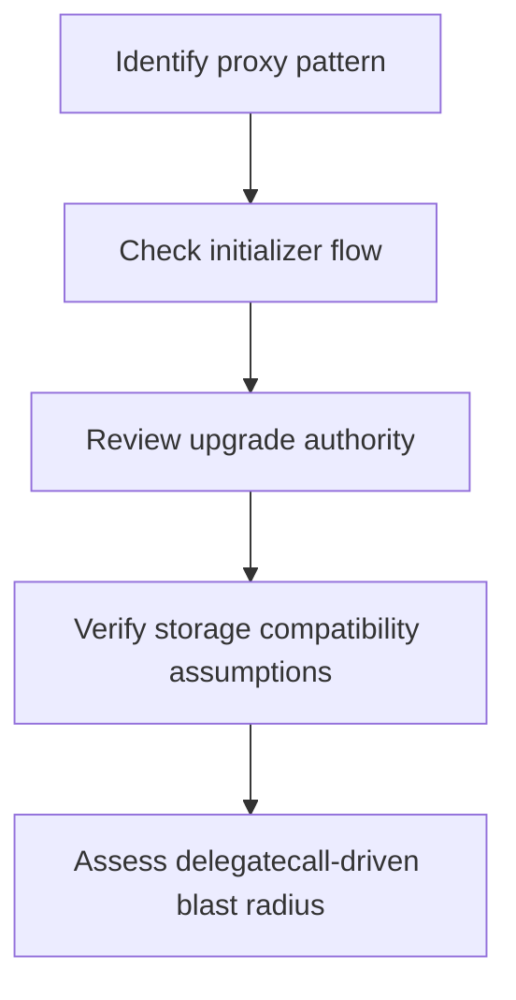

# 如何审查 Proxy、升级权与初始化路径

## 先理解什么

很多人第一次读升级系统时，会把注意力放在“这个 proxy 用的是哪种模式”。  
这当然重要，但安全审查的关键并不止于模式名本身。

真正该关注的是：

- 谁在控制升级
- 状态是否可能被错误初始化
- 旧数据会不会被新实现错读
- 委托执行边界是否被放大成攻击面

也就是说，升级系统不是单个漏洞点，而是一条完整风险链。

### 先把几个词钉牢

**升级管理员（Upgrade Admin）** 是拥有替换实现或控制升级流程权限的角色。直觉上它像掌握系统总开关的人。工程上这意味着升级权限本身就是一条高危路径，不能被当成普通后台配置。

**Initializer** 是在代理上下文里执行一次性初始化逻辑的入口函数。直觉上它像代理系统真正的开机安装脚本。工程上这意味着 initializer 如果能被重复调用，风险往往不是小 bug，而是整个系统被接管。

**Storage Collision** 是不同实现或不同逻辑错误共享同一存储槽位而相互污染的风险。直觉上它像两个人以为自己在不同抽屉放东西，结果其实写进了同一个格子。工程上这意味着升级和 delegatecall 场景里，存储布局纪律不是可选项。

## 为什么重要

升级系统一旦出问题，后果往往很重，因为它通常掌握着：

- 用户长期交互入口
- 大量历史状态
- 关键权限路径

如果代理系统被接管、初始化被劫持或升级到恶意实现，受影响的不会只是某个小功能，而可能是整个协议。

## 核心机制

### 1. 未初始化与重复初始化是代理系统的高危入口

如果初始化函数没有被及时正确执行，或者初始化保护失效，攻击者可能直接获得：

- owner 权限
- 升级权限
- 管理员角色

很多人以为部署完成后再初始化只是工程顺序问题，实际上这一步经常是安全边界本身。

### 2. 升级权限是“系统总开关”

谁能升级 implementation，谁就可能控制未来整个逻辑。  
所以安全审查里必须问：

- 升级权归谁
- 是单签、多签、timelock 还是治理
- 升级动作是否可审计、可延迟、可撤销

如果这层太弱，其他业务安全很多时候都站不住。

### 3. `delegatecall` 让外部逻辑在当前状态上运行

代理系统之所以能工作，本质上依赖 `delegatecall`。  
但这也意味着：

- 实现合约的代码能操作代理的存储
- 存储布局错误会直接污染历史状态
- 恶意升级会把全部状态暴露在错误逻辑下

所以代理安全不是单看 proxy 文件，而是看“谁的逻辑会在谁的状态上运行”。

### 4. 存储布局兼容既是工程问题，也是安全问题

很多团队把存储兼容理解成“升级会不会坏掉”。  
安全视角要更进一步：  
一旦变量槽位错位，权限变量、余额数据、配置参数都有可能被错误解释。

这会带来：

- 权限绕过
- 资金错算
- 状态污染

所以升级前的存储检查绝不是可有可无的细节。

### 5. 审查顺序最好固定下来

一个实用的代理审查顺序通常是：

1. 识别代理模式
2. 找初始化入口和保护
3. 找升级权限边界
4. 看存储布局约束
5. 看实现合约里是否有危险 `delegatecall` / self upgrade 路径

## 工程判断

以后只要碰到升级系统，优先问这五件事：

1. 如果现在没人初始化，会发生什么？
2. 如果错误的人初始化，会发生什么？
3. 谁可以升级，限制够不够？
4. 新实现是否完全兼容旧状态？
5. 一次恶意升级的破坏半径有多大？

这五问会迅速帮你把风险拉到台面上。

## 本节小结

升级系统的安全重点，不在于“用了什么热门模式”，而在于初始化、升级权限、`delegatecall` 和存储兼容这些边界是否被严密控制。代理系统一旦出问题，往往是系统级事故，因此审查时一定要把它当成高优先级主线。
