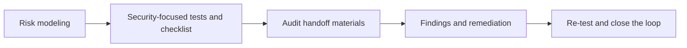

# 如何把风险说明清楚并交给测试与审计流程

## 先理解什么

很多团队谈安全时，会默认一个危险前提：  
“代码写完后找审计看看。”

这句话的问题不在于找审计不对，而在于它把安全想成了一个末端动作，而不是贯穿开发过程的结构化协作。

真实世界里，安全交付通常至少涉及：

- 开发者自查
- 测试覆盖
- 攻击假设
- 风险清单
- 审计前置材料

如果这些东西都没有组织好，审计往往会花大量时间帮团队重新建立上下文。

## 为什么重要

高质量安全协作的重要性在于，它能把很多问题更早暴露出来：

- 逻辑边界没写清
- 风险假设没有成文
- 测试只覆盖 happy path
- 权限与升级路径没人系统梳理

越早把这些问题文档化和结构化，越不容易把审计浪费在“先帮你理解系统”上。

## 核心机制

### 1. 安全测试不是“多写几个测试”，而是围绕风险建样本

很多人听到安全测试，第一反应是“那我多补一些 test”。  
更成熟的理解是：

- 我系统最怕什么
- 哪些攻击路径值得被单独建测试
- 哪些边界必须证明无法越过

这样写出来的测试才是真正带着防御目的的，而不是数量上的安慰。

### 2. 自查清单能帮团队在审计前暴露低级问题

一份好的安全自查材料通常至少会覆盖：

- 权限边界
- 升级与初始化
- 外部调用
- 价格依赖
- 重入与状态更新顺序

这类清单的价值，不在于形式，而在于逼你系统扫过一次高风险面。

### 3. 审计协作需要“风险上下文”，不只是源码

把仓库扔给审计团队，并不等于把系统交代清楚。  
高质量 handoff 更像是提供一份风险地图：

- 核心模块是什么
- 资金主线在哪里
- 哪些地方最敏感
- 哪些设计是刻意取舍
- 哪些边界你最担心

这会显著提高审计效率，也更容易发现真正高价值问题。

### 4. 风险说明越清楚，审计意见越容易落地

很多团队收到审计意见后很痛苦，不是因为问题太多，而是因为：

- 原本自己也没抽象出系统边界
- 不知道某个风险影响哪条主线
- 无法判断修复优先级

如果前面已经有结构化风险说明，修复和复审通常会顺很多。

### 5. 安全交付是一个闭环，不是一个事件

更成熟的流程通常长这样：

1. 先做最小风险建模
2. 按风险写测试和自查清单
3. 准备审计 handoff 材料
4. 接收审计意见
5. 修复、复测、复核

## 工程判断

以后你准备把一个合约系统送进更正式的安全流程时，先问：

1. 我能不能说清资金主线和权限主线？
2. 我的测试是不是覆盖了关键攻击假设？
3. 我有没有系统性的自查清单？
4. 审计团队拿到材料后，能不能快速理解高风险点？
5. 收到意见后，我有没有修复与复测闭环？

这五问通常能快速判断一个团队的安全成熟度。

## 本节小结

真正有价值的安全交付，不是把代码最后丢给审计，而是先把风险模型、测试、自查清单和系统上下文组织好，再与审计协作形成闭环。这样安全才会成为工程能力，而不是上线前的临时补救。
