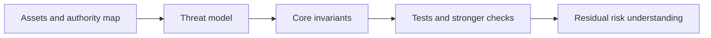

# 怎样证明比测试能直接看到的更多东西

## 先理解什么

很多开发者学安全时，会自然依赖两种方式：

- 写测试
- 看历史漏洞案例

这两种方式都很重要。  
但它们也有明显边界：

- 测试永远只覆盖了你想到的路径
- 案例永远只能提醒你过去发生过什么

而真正危险的系统，往往会在“你没想到的路径”里出问题。  
这时就需要更高一层的问题：

- 这个系统有哪些性质必须永远成立？
- 攻击者最想破坏什么？
- 我是否在验证这些核心性质，而不只是验证几个示例流程？

## 为什么重要

如果没有不变量和威胁建模意识，你很容易出现两种错觉：

- 测试很多，所以系统应该安全
- 已知漏洞我都看过，所以风险应该覆盖了

现实里，很多高危问题恰恰发生在：

- 正常功能都能跑通
- 常见漏洞名词也都知道
- 但系统核心性质没有被明确表达和检验

## 核心机制

### 1. 不变量是在回答“无论发生什么，这件事都不能被打破”

比起问：

- 某个函数会不会成功执行

更高层的问题是：

- 任意路径下，总资产会不会凭空多出来
- 非授权人是否永远不能拿到某种权限
- 某个会计关系是否始终守恒

这些就是不变量思维。  
它让你从“示例行为”切换到“系统性质”。

### 2. 威胁建模是在回答“攻击者最想从哪里进来”

很多安全分析只盯着代码局部。  
但威胁建模会逼你先问：

- 攻击者目标是什么
- 攻击者有哪些能力
- 最有价值的资产和控制点在哪里
- 最可能被利用的外部依赖是什么

这样你看的就不再只是函数，而是攻击路径。

### 3. 测试擅长验证实例路径，不变量更擅长约束系统边界

你可以把二者这样理解：

- 测试更像在验证“这条具体路能不能走”
- 不变量更像在验证“无论走哪条路，都不能撞破这堵墙”

所以更成熟的安全体系通常不是二选一，而是：

- 用测试验证具体行为
- 用不变量约束系统核心性质

### 4. 有些性质值得被更强地表达，而不是靠肉眼反复看

当系统复杂度上来以后，光靠 review 和记忆会越来越吃力。  
这时你会希望把某些关键性质表达得更正式一些，例如：

- 权限边界
- 会计守恒
- 关键状态转移条件
- 某类极端输入下的不可能事件

这里的重点不是立刻成为形式化方法专家，而是先学会判断：

- 哪些东西值得被强表达

### 5. 形式化思维的真正价值，是减少“我觉得应该没事”的空间

很多链上事故背后都有一句危险的话：

- 我觉得这里应该没问题

而形式化思维在做的，就是把“觉得”换成：

- 我明确写出了系统必须满足什么
- 我明确知道攻击者会试什么
- 我明确验证了哪些性质，哪些还没验证

这会让你的安全判断更诚实，也更可协作。

### 6. 工程上可以从最小不变量和最小威胁模型开始

你不需要一开始就做很重的方法。  
一个实用起点通常是：

- 列三到五个最关键不变量
- 列最强攻击者能力假设
- 列最脆弱外部依赖
- 列哪些性质目前只靠人工假设在维持

## 工程判断

以后你评估系统安全时，先问：

1. 这个系统最关键的三条不变量是什么？
2. 攻击者最想破坏哪条性质？
3. 当前测试验证的是流程，还是核心性质？
4. 哪些安全假设仍然只是口头存在？
5. 哪些边界值得被更强地形式化表达？

这些问题会显著提升你的安全分析层级。

## 本节小结

不变量、威胁建模和形式化思维的意义，在于让安全从“列问题”和“跑样例”进一步上升到“表达系统必须成立什么、攻击者会怎样试图打破它”。这是从会写测试走向会做系统安全判断的重要一步。
