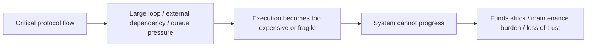

# 当没有东西被偷走，但系统就是停了

## 先理解什么

很多人学习智能合约安全时，脑中默认的攻击画面是：

- 重入把钱提空
- 预言机操纵把仓位打爆
- 权限泄漏导致管理员被夺权

这些当然重要。  
但真实系统里还有另一类非常致命的问题：

- 没人直接偷走资产
- 状态表面也没错
- 但系统关键流程再也走不下去

这就是 DoS、griefing 和 liveness 风险的核心。

### 先把几个词钉牢

**拒绝服务（Denial of Service）** 是指不一定偷走资产，但能让系统关键功能无法继续工作的攻击。直觉上它像没有砸烂机器，却把机器卡到谁都用不了。工程上这意味着安全不只看资产损失，还要看系统活不活得下去。

**Griefing** 是指攻击者主要通过增加别人成本或阻碍流程来制造损害的行为。直觉上它像对方未必赚钱，但就是能让你持续难受。工程上这意味着很多协议要防的不是直接盗窃，而是被恶意拖慢、卡死或放大成本。

**Liveness** 是系统在合理条件下能够持续推进关键流程的能力。直觉上它像机器不只要安全，还要能一直转得动。工程上这意味着链上协议一旦失去 liveness，用户体验和系统可信度都会快速坍塌。

## 为什么重要

如果系统不能继续推进，它就可能导致：

- 用户无法提款
- 清算无法执行
- 治理无法结算
- 奖励无法领取
- 管理员必须用极端手段手工修复

这些问题即使不立刻表现为“资金被盗”，也会很快演化成：

- 用户资金被困
- 协议信用受损
- 运维成本暴涨
- 后续更大安全事件

所以“能不能继续运行”本身就是安全。

## 核心机制

### 1. 安全不只有 safety，还有 liveness

你可以把这两个概念区分为：

- safety：系统不会做出不该做的坏事
- liveness：系统最终能继续做该做的事

举例来说：

- “别人不能把你的钱提走”是 safety
- “你在满足条件后最终能把钱提出来”是 liveness

很多项目只重视第一种，却忽略第二种。

### 2. 大循环和全量遍历是最常见的停摆来源之一

一个经典问题是：

- 某函数要遍历越来越大的数组
- 每次执行都越来越贵
- 最终高到根本无法在块 gas 限制内完成

这时系统会出现一种非常糟糕的状态：

- 逻辑上应该还能继续
- 实际上再也没人执行得动

这类问题常见于：

- 批量分发
- 一次性结算
- 全量清理
- 遍历全部参与者的奖励更新

### 3. 外部调用失败也会把主流程拖死

另一个常见问题是把系统前进建立在外部对象的“配合”上。

例如：

- 批量付款时，有一个接收方 fallback 故意 revert
- 主流程要求所有子调用都成功
- 结果整个结算被永久卡住

这类问题的核心在于：

- 一个局部失败，不该天然变成全局停摆

因此安全设计里经常会强调：

- push 改 pull
- 批量改分步
- 允许跳过失败项
- 为恢复留管理或治理通道

### 4. griefing 的本质是“让别人为你的恶意付成本”

griefing 不一定直接让攻击者赚钱。  
它更像是：

- 用少量代价让系统或其他参与者承担更大代价

常见形式包括：

- 故意制造大量无效任务让 keeper 白跑
- 通过最小操作把对手拖进高 gas 路径
- 占用队列、订单簿、提案列表等有限资源
- 让某些必须执行的操作变得极其昂贵

这类攻击之所以危险，是因为很多团队只盯着“攻击者赚了多少”，却没盯着“系统被拖成什么样”。

### 5. 可恢复性是 liveness 设计的一部分

成熟系统在设计关键流程时，通常会额外考虑：

- 如果某一步失败，能不能重试
- 如果某个对象坏掉，能不能跳过
- 如果某个队列膨胀，能不能分页处理
- 如果 keeper 不工作，是否有人能接手
- 是否存在 emergency path，但又不会变成中心化滥权

很多协议的韧性，恰恰体现在这些“不顺利时怎么办”的设计里。

### 6. pull over push 是很多 DoS 场景下更稳的默认值

下面这个思路就是典型例子。

不要：

- 合约一次性给所有人主动发钱

更稳的是：

- 合约记录每个人可领额度
- 用户自己来领取

```solidity
mapping(address => uint256) public claimable;

function claim() external {
    uint256 amount = claimable[msg.sender];
    claimable[msg.sender] = 0;
    payable(msg.sender).transfer(amount);
}
```

这样做的好处是：

- 单个失败不会卡住所有人
- gas 成本被分散
- 恢复路径更简单

当然它也会带来用户体验与未领取资金管理的新问题，但在很多场景里，这是更健康的 liveness 选择。



## 工程判断

以后你做安全 review 时，除了“会不会被偷”，还要问：

1. 这条关键流程会不会因为规模增长而跑不动？
2. 某个外部调用失败，会不会把全局流程一起拖死？
3. 攻击者是否能用较小代价让别人付出巨大执行成本？
4. 这个系统出问题后，是否存在清晰可恢复路径？
5. 哪些本该分步完成的事情，被我粗暴做成了一次性全量操作？

把这些问题加入 review 清单，你的安全视角会更完整。

## 本节小结

很多最麻烦的合约风险不是“钱立刻没了”，而是系统逐渐失去前进能力。DoS、griefing 和 liveness 问题提醒我们：安全不仅是防止错误发生，更是保证系统在压力、恶意和规模增长下仍然能继续运转。
