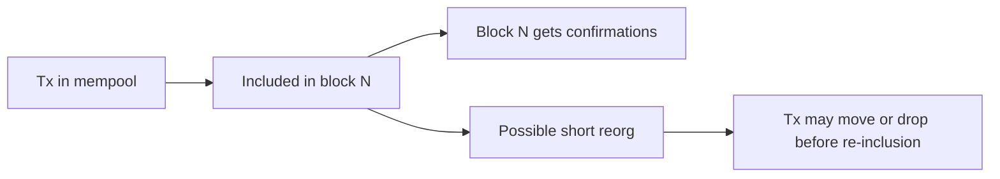

# Mempool、重组与确认语义

## 先理解什么

一笔交易从广播到“你愿意把它当成稳定事实”，中间不是只有一个 on/off 开关。中间至少还有三个层次：

- 是否进入 mempool
- 是否进入某个区块
- 是否经过足够确认，接近最终性

如果你把这三者混在一起，就很容易在产品设计和问题排查上犯错。

## 为什么重要

对应用工程师来说，这些概念并不是纯底层兴趣。它们直接决定：

- 用户什么时候看到“已提交”
- 什么时候看到“已确认”
- 什么时候你敢把它当成稳定结果去做后续业务
- 为什么有时一笔交易明明“出现过”，后来又像消失了一样

这些都和 mempool 竞争、重组和最终性语义有关。

## 核心机制

### 1. Mempool 是竞争场，不是先进先出收件箱

交易广播之后进入 mempool，但 mempool 不是严格 FIFO 队列。  
这里会同时受到：

- 手续费竞争
- 账户 nonce 约束
- 节点传播差异
- 替换交易

的影响。

所以 “先发出去” 和 “先被打包” 不是一回事。

### 2. 进区块不等于绝对稳定

当交易进入某个区块时，它已经比 pending 稳很多，但仍然不代表“再也不会变”。因为链可能发生短时重组。

### 3. 重组意味着最近的链历史可能被替换

所谓 reorg，可以先简单理解为：节点最终认可的链头发生了变化，导致你刚才看到的某些区块不再是主链的一部分。

对应用来说，它意味着：

- 你刚看到的交易确认状态可能变化
- 依赖“刚上一个块就算完成”的业务可能要重新处理
- 通知系统和前端展示需要更稳妥的确认语义

### 4. 最终性是“我愿意把它当成事实”的门槛

最终性在产品层最实用的意义，不是严格协议定义，而是：从这个时刻起，你认为结果足够稳定，可以继续做后续动作。

这就是为什么很多系统会引入：

- 1 次确认
- 多次确认
- 最终确认

这种多层状态，而不是只显示一个 “success”。

## 常见误区

### 误区一：交易有哈希就算稳定

有哈希只说明它进入了流程，不说明它被接纳成稳定链历史。

### 误区二：进了一个区块就完全结束

大多数时候已经很接近，但对重要业务来说，仍然需要考虑确认数和重组风险。

### 误区三：最终性只是底层节点才关心的事

任何需要通知、记账、结算或后续自动动作的应用，都在直接消费最终性语义。

## 工程判断

以后设计交易状态时，至少可以考虑分层：

1. 已广播
2. 已上链
3. 已确认
4. 已达到业务可接受的最终确认

只要你有这层分级，很多链上产品体验会更稳。

## 本节小结

mempool 决定交易如何竞争进入链，重组提醒你“最近的历史仍可能变化”，最终性则决定你何时把结果当成业务事实。理解这三者，产品和工程判断都会成熟很多。
