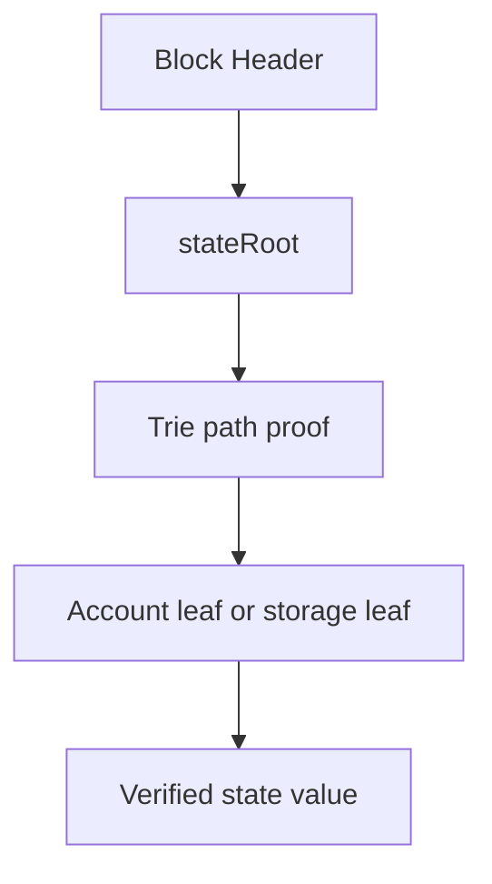

# 如何建立对 State Root 的直觉

## 先理解什么

如果你把 Ethereum 想成一个巨大的数据库，那么马上会遇到两个问题：

1. 现在全局状态到底长什么样？
2. 我怎么向别人证明某个状态确实属于这个全局快照？

“把所有账户和存储直接拼起来再哈希一次”听起来简单，但现实里并不够好用，因为链需要持续更新、局部查询和局部证明。于是 Ethereum 选择了 trie 这类更适合动态结构承诺的方案。

### 先把几个词钉牢

**Trie** 是用于组织账户和状态承诺结构的树形数据结构。直觉上它像一棵既能定位内容、又能生成整体验证指纹的目录树。工程上这意味着以太坊不是简单把状态摊成一张表，而是把它放进可证明的数据结构里。

**Proof** 是证明某条状态或数据确实属于某个根承诺的可验证路径。直觉上它像拿着从树叶一路回到树根的证据链。工程上这意味着不用复制整份状态，也能验证单个值是否真实存在。

**State Root** 是某个区块执行完成后全局账户状态的根哈希承诺。直觉上它像把整张世界状态表压缩后的总指纹。工程上这意味着轻客户端、状态证明和跨系统验证，最终都要围绕 state root 建立可信关系。

## 为什么重要

理解 `stateRoot` 的重要性在于，它让很多看似分散的底层现象开始连起来：

- 为什么区块头里放的是 root，而不是完整状态
- 为什么节点可以给你 proof，而不是整个数据库
- 为什么跨链、桥接、轻客户端都离不开“证明某个状态包含在某个 root 下”

如果这一层看懂了，你对“链上状态是真实可验证的”会有更扎实的直觉。

## 核心机制

### 1. State Root 是全局状态快照的摘要

每个区块执行完成后，状态会变化。  
区块头中的 `stateRoot` 可以看成“执行完这个区块后，全网共同认可的状态快照摘要”。

它不是某个余额值，也不是某个合约存储槽，而是整个状态树的根哈希。只要底层任意一处状态发生改变，最终 root 也会变化。

### 2. 为什么需要树结构，而不是一整个大 JSON

如果你只是保存一个大对象：

```text
{
  accountA: {...},
  accountB: {...},
  contractC: {...}
}
```

每次改一个字段，都很难高效地给别人证明“只有这条路径相关”。  
树结构的价值在于：

- 可以沿着路径逐层定位
- 可以只提交必要分支来做 proof
- 某个叶子变化时，只需要重新计算沿路径向上的哈希

这让状态承诺既全局一致，又局部可验证。

### 3. 账户状态和合约存储是两层视角

从工程角度看，可以先记住两层：

- 外层：账户 trie，组织各个账户的状态
- 内层：某个合约账户内部还有自己的 storage 结构

一个合约账户本身会有：

- nonce
- balance
- code hash
- storage root

这意味着账户状态里还会继续指向该合约自己的存储根。  
所以当你说“读取某个 storage slot”，并不是孤零零查一个值，而是在多层状态结构里沿路径定位。

### 4. Proof 的意义是“我不用相信你，我验证路径就行”

假设某节点告诉你：  
“这个地址在某个区块下余额是 10 ETH。”

你当然可以选择相信它，但更底层、更可靠的方式是：  
让它提供一条从 root 到目标状态的证明路径。你只要用区块头里的 root 和这条路径重算，就能验证结果是否一致。



这就是为什么 light client、bridge、跨链消息验证都如此重视 proof。它们不是在“问节点要答案”，而是在“问节点拿可验证证据”。

### 5. 对普通开发者来说，最重要的是建立层次感

你不一定要手写 trie 实现，但你至少应该有这几个稳定判断：

- 区块头里的 root 是状态承诺
- 账户状态不是平铺数组，而是可证明结构的一部分
- 合约存储也被纳入可承诺路径
- proof 的价值在于局部验证，而不是传完整数据库

有了这层次感，你以后读到：

- `eth_getProof`
- storage proof
- state sync
- bridge verification

就不会觉得它们是完全陌生的话题。

## 工程判断

从开发者视角，读 trie 最重要的不是纠结定义，而是问三件事：

1. 这个结构在承诺什么？
2. 它怎样支持局部证明？
3. 它如何把“一个 slot 的值”连接回“整个区块的状态摘要”？

如果这三件事都说清了，你已经拥有足够扎实的底层理解，可以支撑更深入学习。

## 本节小结

`stateRoot` 是全局状态的承诺，trie 是把全局一致性和局部可验证性结合起来的结构。理解它，不是为了炫底层术语，而是为了真正知道链是如何把“很多离散状态”组织成“一个可被共同验证的世界状态”的。
