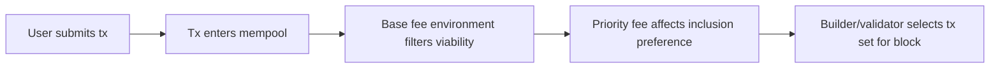

# 交易包含的费用经济学

## 先理解什么

很多开发者初学 gas 时，会把它理解成“手续费数字”。  
但到了交易包含层，gas 更像一套资源与激励系统：

- gas limit 限制单笔执行可消耗资源
- 区块有整体容量约束
- base fee 会随网络拥堵动态调整
- priority fee 影响打包意愿

也就是说，交易被不被包含，不只是“你愿不愿意付钱”，而是“你的报价和网络当下激励结构匹不匹配”。

## 为什么重要

这层理解非常重要，因为很多真实问题都在这里：

- 为什么估算明明成功，交易还是长时间 pending
- 为什么提高 priority fee 能加快包含
- 为什么同一 nonce 的交易可以被替换
- 为什么某些时段 base fee 会明显抬升

如果这些现象只停留在钱包 UI 直觉上，你就很难给用户稳定解释。

## 核心机制

### 1. gas limit 是资源上限，不是最终花费

单笔交易的 gas limit 可以理解为“这次执行最多允许吃掉多少 gas”。  
它决定的是执行资源边界，而不是实际结算金额。

如果 limit 太低，交易可能中途耗尽 gas。  
如果 limit 足够高，最终还是按实际 `gasUsed` 结算。

### 2. EIP-1559 把费用报价拆成了几层

现代以太坊里最重要的几个字段是：

- `baseFeePerGas`
- `maxPriorityFeePerGas`
- `maxFeePerGas`

其中 base fee 由区块环境动态决定，priority fee 体现打包激励，而 max fee 是用户愿意承受的总上限。

这意味着交易不是简单地“我出一个价格”，而是在一套动态规则中提交一个可接受区间。

### 3. base fee 的动态变化与区块拥堵有关

base fee 的存在，是为了让费用对拥堵有更自动的反馈机制。  
当区块持续偏满时，base fee 会逐步上升；压力下降时，又会逐步回落。

这能减少旧式纯竞价模型带来的剧烈不稳定，但并不意味着所有体验问题都会消失。  
因为 priority fee、MEV 和时序竞争仍然存在。

### 4. 同 nonce 交易可替换，是因为账户顺序约束还在

账户 nonce 决定顺序，所以同一账户同一 nonce 的两笔交易，本质上是在竞争“谁代表这个位置”。

这就是为什么钱包会出现：

- speed up
- cancel
- replacement transaction

它们并不是魔法，而是在同一 nonce 位置上提交更有竞争力的新报价。

### 5. 打包者关心的是收益与约束的组合

从打包者视角，交易包含不是随机善意行为，而是收益决策：

- 这笔交易能带来多少有效费用
- 是否能放进当前区块容量
- 是否与其他交易打包组合更有利

一旦你能从这个角度看问题，“为什么我这笔交易还没进块”就会变得更可解释。

## 工程判断

以后分析 pending 或包含问题时，建议固定检查：

1. 当前 base fee 大概处在什么水平？
2. 这笔交易的 max fee 是否足够覆盖？
3. priority fee 是否有竞争力？
4. 是否存在同 nonce 替换或卡住问题？
5. 交易本身 gas limit 是否合理？

这五步通常能解释大部分链上“为什么还没上去”的问题。

## 本节小结

Gas 字段真正重要的地方，不在于它们是几个数字，而在于它们共同决定了交易如何参与区块容量竞争。gas limit 管资源边界，base fee 反映拥堵环境，priority fee 影响打包激励，nonce 替换决定同一账户顺序竞争。理解这套经济学，你才能真正读懂交易包含过程。
