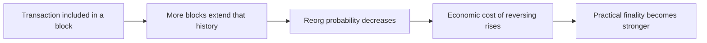

# 为什么最终性既是概率问题也是经济问题

## 先理解什么

很多用户第一次理解链上确认时，会把它想成一种二元开关：

- 没确认
- 已确认

但真实世界并不是这么简单。  
一个区块出现，不等于永远不可逆；一笔交易进块，也不等于从此没有任何不确定性。

因此“最终性”更像一个逐步增强的可信度概念，而不是瞬间绝对完成的状态。

## 为什么重要

这层理解很重要，因为很多产品决策都建立在它上面：

- 为什么有的钱包显示 1 confirmation、3 confirmations、12 confirmations
- 为什么跨链和大额交易要等待更长时间
- 为什么链上应用常要区分“已打包”和“已最终确认”

如果你把最终性讲得过于绝对，就很容易误导产品和用户。

## 核心机制

### 1. 区块被提议与状态被长期接受不是同一强度

当一个区块被打出来时，它已经进入公共链视野。  
但此时它代表的是“目前这条链头上的候选现实”，还不是无条件不可逆的终局现实。

只要存在：

- 网络延迟
- 临时分叉
- 重组可能

系统就需要时间与共识流程来进一步增强接受度。

### 2. 概率性来自分叉与重组可能

为什么确认数会重要？  
因为随着后续区块继续叠上去，原区块被替换掉的可能性会下降。

这是一种概率意义上的稳固：  
不是逻辑上绝对不可能，而是越来越不值得、越来越难、越来越不现实。

### 3. 经济性来自攻击代价与验证者激励

最终性不仅和网络拓扑、协议规则有关，也和经济激励有关。  
因为如果有人想逆转或破坏某些状态接受结果，通常需要付出很高代价，并冒着被惩罚的风险。

所以“最终性”也可以理解成：  
系统让推翻当前接受结果变得非常昂贵、不划算。

### 4. 验证者不是“随便记账”，而是在维护可接受历史

更成熟地看验证者，他们在做的不只是把交易塞进块里，而是在参与维护：

- 哪条链历史被继续延续
- 哪些区块应当被接受
- 哪些状态最终成为公共现实

这也是为什么共识层和执行层不能完全分开理解。

### 5. 产品里的“确认数”是底层最终性概念的近似表达

很多前端和钱包不会把全部共识细节暴露给用户，而是用更可理解的表达：

- 1 次确认
- 5 次确认
- 12 次确认

这实际上是在把底层概率与经济最终性，转换成一个更适合用户理解的安全阈值提示。

## 工程判断

以后你需要解释确认与最终性时，优先把这几层区分开：

1. 已广播
2. 已进块
3. 已有若干确认
4. 达到足够强的最终接受度

只要这四层分开，很多链上产品提示就会更准确。

## 本节小结

最终性不是一个瞬间绝对完成的开关，而是随着链历史延续、重组概率下降、攻击经济代价上升而逐步增强的可信结果。理解这一点后，你才能更稳地看待确认数、产品提示和链上“已完成”的真正含义。
