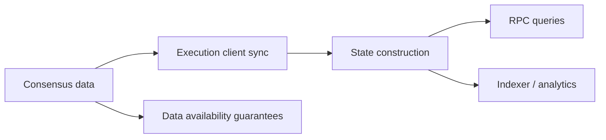

# 你的节点到底在同步什么、保存什么、回答什么

## 先理解什么

很多应用开发者提到节点时，脑海里的形象都很模糊：

- 一个 RPC 地址
- 一个“查链上数据”的服务
- 一个“广播交易”的入口

这些都没错，但都太抽象。  
节点真正做的事情远比“给你一个接口”复杂。

它要参与：

- 同步区块和状态
- 验证协议规则
- 保存一定范围的数据
- 对外提供查询和广播能力

所以你能查到什么、查多快、查多远，本质上都取决于节点实际承担了什么职责。

## 为什么重要

如果你不理解客户端和同步模式，很多现象会很像玄学：

- 为什么有些 RPC 查不到旧状态
- 为什么某些日志范围查询特别慢
- 为什么节点“已经跟上最新块”但某些请求仍然异常
- 为什么归档查询、证明查询和普通余额查询的要求完全不同

这些差异背后并不是服务商心情不好，而是数据保留与同步模型不同。

## 核心机制

### 1. 现代 Ethereum 节点并不是一个单体黑盒

在今天的 Ethereum 架构里，至少要区分：

- 执行层客户端
- 共识层客户端

执行层负责更贴近我们开发者熟悉的部分：

- 交易执行
- 状态转移
- EVM 结果
- 对外 RPC 能力

共识层负责：

- 区块提议与证明流程
- 链头选择
- 最终性相关信息

所以“一个节点”其实经常是多组件协作出来的结果。

### 2. 同步不是只下载区块，还包括构建可查询状态

很多人以为同步就是：

- 把区块按顺序下载完

但对执行层来说，真正昂贵的还包括：

- 执行交易
- 构建状态
- 维护索引
- 按某种策略保留历史数据

也就是说，节点不仅在“拿到数据”，还在“把数据变成可用视图”。

### 3. 不是所有节点都保留同样深度的历史

这也是为什么不同节点回答能力差很多。  
常见差异包括：

- 只关注当前可用状态
- 保存有限历史
- 保存更完整的历史状态与查询能力

于是就会出现：

- 当前余额查询很容易
- 很早以前某个块的状态查询就不一定容易
- 大范围日志扫描会更重

这不是接口语法问题，而是数据是否还在。

### 4. 归档能力之所以昂贵，是因为它保留了更多时间维度

普通应用多数时候关心：

- 现在是什么状态

而更深的分析、审计或协议研究则常常关心：

- 某个过去区块时的状态是什么
- 某个变量沿时间怎样变化

这就要求节点不仅知道当前，还保留更多历史可追溯能力。  
这种能力自然更贵，也更重。

### 5. 数据可用性的核心不是“数据存在过”，而是“别人能拿到并验证”

很多人第一次听数据可用性，会以为这是存储优化问题。  
其实更核心的问题是：

- 区块生产者声称有一批数据
- 网络中的其他参与者是否真的能获得这些数据
- 他们是否能在足够时间内用这些数据重建、验证或挑战状态

如果数据只被“声称存在”，却没有真正可获得，那系统安全性就会出问题。

### 6. 从工程角度看，节点和数据可用性决定了你的上层工具边界

你以后使用：

- RPC
- 索引器
- 区块浏览器
- analytics 平台

本质上都是建立在底层节点数据获取和保留能力之上的。  
如果这一层没想清楚，你就很容易误把“平台行为”当成“链的本质”。

## 工程判断

以后你遇到节点相关问题，先问：

1. 我依赖的是执行层还是共识层信息？
2. 当前查询需要的是最新状态，还是历史状态？
3. 这个节点是否保留了我需要的时间维度数据？
4. 我看到的问题是同步问题、保留问题，还是查询能力问题？
5. 上层工具结果是否受到底层数据可用性和保留策略影响？

理解这些问题后，“节点为什么这样”会比以前清晰很多。

## 本节小结

节点不是一个神秘 RPC 盒子，而是一套同步、执行、存储和查询系统。数据可用性则保证这些系统不是只“声称有数据”，而是让网络其他参与者真能拿到并验证。把这层想清楚，你对 Ethereum 基础设施的理解会明显上一个台阶。
