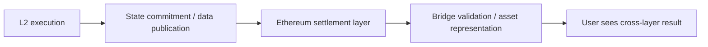

# Layer 2 是怎样复用 Ethereum 安全的

## 先理解什么

很多人第一次接触 L2，会自然地产生一个问题：

- 既然它有自己的交易、自己的执行环境、自己的 block，那它和一条独立链到底差在哪？

这个问题问得很好。  
关键差别通常不在“表面运行形态”，而在：

- 最终谁来给状态背书
- 数据在哪里被公开
- 出问题时谁有资格挑战或恢复秩序

也就是说，L2 的关键不是“有没有自己的执行”，而是“它怎样把安全锚回 Ethereum”。

### 先把几个词钉牢

**Rollup** 是把大量执行搬到链下或链外聚合，再把结果结算回以太坊的扩容方案。直觉上它像先在侧台处理好一大批动作，再把结论带回主舞台记账。工程上这意味着你讨论 L2 安全时，必须同时看执行位置、数据可用性和结算路径。

**Bridge** 是在不同链或不同执行域之间转移资产和消息的连接机制。直觉上它像跨两座岛之间的渡口，不只是搬东西，还要证明东西确实从一边来。工程上这意味着桥的安全性和延迟，常常决定跨链体验的上限。

**Settlement** 是把某层执行结果最终落到更高安全层上确认的过程。直觉上它像先记临时账，再把总账回填到主账本。工程上这意味着很多 L2 的可信性，并不来自它自己，而来自它如何 settlement 回以太坊。

## 为什么重要

如果你只把 L2 理解成“更便宜的链”，就很容易忽略：

- 资产为什么能被认为还在更大安全体系里
- 为什么桥是最敏感的跨层点
- 为什么提现、结算和挑战窗口会影响用户体验
- 为什么不同跨层方案的信任前提差很多

这些问题对开发、产品和协议设计都非常关键。

## 核心机制

### 1. Rollup 的核心价值不是自己执行，而是“执行后如何被上层接住”

很多链都能执行交易。  
Rollup 之所以特别，不在于“它也能执行”，而在于它的执行结果：

- 如何被提交到更高层
- 如何被其他参与者验证或挑战
- 如何与更高层的安全和数据可用性机制发生联系

这决定了它不只是“另一条便宜链”，而是多层结构的一部分。

### 2. 结算层是在回答“最终谁说了算”

你可以把结算层粗略理解成：

- 当不同视图冲突时，最终以谁的规则和记录为准

这也是为什么很多 L2 仍然把关键状态承诺或数据放回 Ethereum。  
因为用户真正相信的，不只是“L2 自己说它执行了”，而是：

- 更高层是否也能看见并约束这件事

### 3. 桥最敏感的地方，不是按钮，而是资产与消息的信任转换

在产品表面，桥看起来只是：

- 从一边锁定
- 另一边放出来

但底层真正难的是：

- 谁证明源链动作真的发生了
- 目标链凭什么接受这份证明
- 如果中间信任假设出错，会发生什么

桥之所以高风险，是因为它站在多个系统边界之间。

### 4. 跨层体验里的延迟和复杂性，往往来自安全前提而不是产品不努力

很多用户会抱怨：

- 为什么提现慢
- 为什么桥有等待期
- 为什么不同桥到账逻辑不一样

这些现象背后，往往不是团队“不想做好体验”，而是：

- 安全前提不同
- 挑战窗口不同
- 结算方式不同

所以跨层产品体验经常要在速度、成本和信任假设之间做取舍。

### 5. 看桥和 Rollup 时，要一起看执行、数据和结算三层

最常见的误区，是只看其中一层。  
更稳的理解方式通常要一起看：

- 执行在什么环境发生
- 数据在哪里可获得
- 最终以谁的状态承诺为准

只要少看其中一层，你就容易把“看起来通了”误判成“真的安全”。

### 6. 工程视角下，跨层系统更像一组相互引用的信任边界

你以后看任何 L2 或桥接系统时，都可以先画：

- 用户资产在哪一层被锁定或记账
- 状态承诺往哪里提交
- 异议或挑战由谁处理
- 最终恢复秩序依赖谁

## 工程判断

以后你分析 L2 与桥时，先问：

1. 这个系统到底把什么安全性借给了 Ethereum？
2. 哪些关键数据回到了上层，哪些没有？
3. 桥在替用户做什么信任转换？
4. 延迟和复杂性来自哪里，是效率问题还是安全前提问题？
5. 如果系统出现争议，最终谁来裁决？

把这些问题想清楚，跨层系统就不会再只是“点一下桥过去”的黑盒。

## 本节小结

Rollup 和桥的关键，不是它们让链上体验更快更便宜，而是它们怎样在多层结构里重新组织执行、数据和结算安全。理解这点，才算真正理解现代 Ethereum 生态的运行方式。
