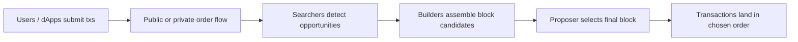

# 到底是谁真正决定了交易顺序

## 先理解什么

很多人刚学区块链时，会把交易排序理解成一个简单链路：

- 用户发交易
- 节点收到交易
- 验证者把交易塞进区块

这条线并没有错，但它忽略了现实世界里最重要的一层：

- 交易顺序本身是有价值的

一旦顺序有价值，就会出现围绕它展开的竞争、协作和市场化角色。  
这也是理解 MEV 和 builder 体系的入口。

### 先把几个词钉牢

**MEV** 是交易排序和区块构造权带来的可提取价值。直觉上它像谁先谁后上台，本身就能变成钱。工程上这意味着很多协议行为不仅受代码约束，还受公开竞争排序环境影响。

**Builder** 是负责从交易池和 bundle 中组合出候选区块内容的角色。直觉上它像实际排演节目单的人，决定谁先上台、谁后上台。工程上这意味着当你研究排序和 MEV 时，真正的决策权经常落在 builder 手里。

**区块构造（Block Construction）** 是从候选交易到最终区块排序和打包的形成过程。直觉上它像把一堆待选节目编排成最终演出单。工程上这意味着“交易为什么是这个顺序”很多时候不是偶然，而是 block construction 的结果。

## 为什么重要

如果你忽略排序价值，就很难解释这些现实：

- 为什么同一时间段内某些交易总是被夹在中间
- 为什么用户看到的公共 mempool 信息并不总能预测最终结果
- 为什么相同操作在不同通道里可能获得完全不同的执行体验
- 为什么某些协议设计会刻意降低顺序敏感性

从工程角度看，理解这件事直接影响：

- slippage 设置
- deadline 设置
- UX 风险提示
- private order flow 选型

## 核心机制

### 1. MEV 不是单一攻击，而是“排序权的可提取价值”

MEV 可以先粗略理解成：

- 围绕交易排序、插入、重排和打包方式产生的额外价值

这类价值来源可能包括：

- 套利
- 清算
- 抢先成交
- 夹层交易
- 批量撮合优化

重点不是“它一定是坏事”，而是：

- 一旦排序能改变收益，排序就不再只是技术细节

### 2. 公共 mempool 只是交易流的一部分

前端开发者最容易默认的是：

- 我把交易发给 RPC
- 它进了公共 mempool
- 所有人看到的应该差不多

但现实里还有很多变化：

- 一些交易会走 private relay 或专门通道
- 一些排序机会会以 bundle 形式提交
- 一些交易不会在公共 mempool 中完整暴露

所以你看到的 pending 视图，很多时候只是局部真相。

### 3. searcher、builder、proposer 形成了一条更复杂的打包链

一个更现实的抽象是：

- searcher 发现排序机会
- builder 组合交易与 bundle，构造更高价值区块候选
- proposer 选择最终接收的区块提案

也就是说，决定最终顺序的，不只是“某个单独打包者随手排一下”，而是一条围绕区块价值展开的供应链。

### 4. 用户体验里的很多“意外”其实来自排序竞争

例如一个 swap 用户可能会觉得：

- 明明刚才报价还行
- 为什么执行出来完全变了

除了普通市场波动，还可能包含：

- 在你交易前有人先动了池子
- 你的订单暴露后被对手围绕
- 你的交易延迟进入更差区块

这也是为什么很多协议会引入：

- slippage 上限
- deadline
- TWAP
- 批量拍卖
- RFQ 或私有路由

这些设计不是“可选美化”，而是在对抗排序带来的现实摩擦。

### 5. 协议设计能决定 MEV 是被放大还是被约束

不是所有协议都同样容易被排序价值放大。  
某些设计天然更敏感：

- 价格曲线陡、流动性薄
- 清算窗口短、竞争激烈
- 一次交互就能改变很多状态

某些设计则更努力地缓和它：

- 用批量结算降低先后顺序价值
- 用更稳的报价机制减少公开暴露
- 用更强约束让抢跑空间变小

所以理解 MEV，不只是理解链外参与者，也是在理解协议自身激励。

### 6. 前端与产品层要诚实暴露“排序风险”

对用户而言，最重要的不是知道所有底层角色名字，而是知道：

- 这笔交易为什么可能与预期不完全一样
- 哪些参数是在帮助对抗排序风险
- 什么情况下应该选择更保守的执行策略

所以一个成熟 dApp 的责任通常包括：

- 合理默认 slippage
- 提示高波动与高竞争场景
- 解释 private route 或 protected route 的含义
- 不把报价界面伪装成完全确定的结果

## 工程判断

以后你看交易排序问题时，优先问：

1. 这笔交易的结果对顺序有多敏感？
2. 用户看到的公共 pending 信息，是不是只是部分事实？
3. 我有没有为高竞争场景提供更稳的执行参数？
4. 协议本身是否在放大可提取排序价值？
5. 产品文案是否诚实描述了排序与执行风险？

把这些问题加入设计过程，你会更真正理解“链上执行不是排队叫号，而是竞争性排序”。

## 本节小结

交易顺序从来不是中性的背景条件，而是可以被争夺、打包和变现的资源。理解 searcher、builder、proposer 与公共/私有 order flow 的关系，才能真正看懂用户为什么会遇到滑点、夹层和执行不确定性。
