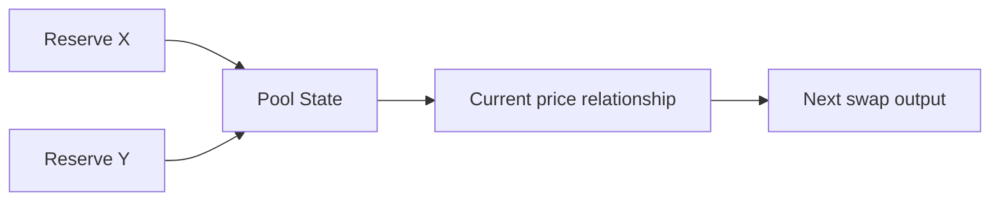

# 池子定价与流动性直觉

## 先理解什么

AMM 最值得先建立的直觉，不是公式，而是“价格来自池子状态”。  
你在普通交易所里熟悉的是订单簿；在 AMM 里，更核心的是储备关系。

也就是说，池子不是“放两种资产进去就行”，而是在持续表达一种可交换关系。

## 为什么重要

一旦你理解价格是状态关系，你就会更容易看懂：

- 为什么 swap 会引起价格变化
- 为什么大额交易会产生滑点
- 为什么流动性越深，价格越稳
- 为什么 LP 的角色不只是“存款拿奖励”

这些都是后面读 DEX 协议源码的基础。

## 核心机制

### 1. 池子储备决定了当前可交换关系

以最经典的恒定乘积直觉为例，你不一定要先背公式推导，但至少要知道：

- 池中两侧资产储备越均衡，交换关系越稳定
- 用户每一次 swap 都会改变储备
- 储备一变，下一位用户面对的价格也变

### 2. 滑点是状态变化速度的可感知结果

当你交易量相对池子深度太大时，储备变化会更明显，因此实际成交结果会偏离你开始看到的估算值，这就是滑点。

所以滑点不是“前端多弹一个提示”，而是池子状态响应的一种自然结果。

### 3. LP 提供的是可交换深度，而不只是资产停放

LP 的角色本质上是在给池子提供足够储备，使后续交换能在更平滑的状态曲线上发生。  
这也是为什么 LP 会获得手续费份额，因为他们在承担系统流动性的基础职责。

### 4. 费用与池子状态共同构成交易体验

swap 不是只看价格，还要看：

- 手续费
- 池子深度
- 状态变化后的输出

这些因素放在一起，才是用户真正感受到的“成交体验”。

## 常见误区

### 误区一：把价格看成链下喂来的静态值

在 AMM 里，价格很大程度上就是池子状态本身。

### 误区二：把 LP 看成纯收益角色

LP 的收益来自承担流动性职责，而不是无上下文地“放着就有奖励”。

### 误区三：把滑点理解成 UI 误差

滑点背后是池子状态被交易推动发生的真实变化。

## 工程判断

以后看 DEX 协议时，先问：

1. 池子主状态有哪些？
2. 哪些状态决定价格关系？
3. 费用如何计入结果？
4. LP 份额如何表达？

只要这四个问题先有答案，很多 DEX 代码就不会显得难以下手。

## 本节小结

AMM 里的价格不是外加标签，而是池子状态的一部分。理解储备、滑点、流动性和手续费之间的关系，是进入 DEX 协议设计的第一步。
