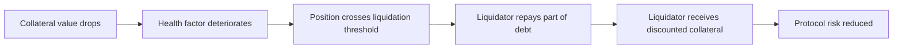

# 健康度、抵押率与清算机制

## 先理解什么

链上借贷和传统信用借贷最大的区别，是协议几乎不认识你。  
它不知道你是谁，不知道你有没有工资单，也不会去法院追债。  
在这种前提下，协议还能放贷，靠的不是身份信用，而是状态约束。

这个状态约束通常表现为：

- 你先抵押资产
- 协议根据价格给这些资产估值
- 你只能在一定比例内借出其他资产
- 一旦仓位过度危险，就允许外部清算

这就是链上借贷最核心的生存机制。

## 为什么重要

如果你不理解这套机制，后面看 Aave、Compound 之类协议时就会只看到一堆函数：

- supply
- borrow
- repay
- withdraw
- liquidate

但真正关键的不是函数名，而是这些函数都在维护同一个东西：  
协议必须确保系统整体始终有足够价值支撑未偿还债务。

## 核心机制

### 1. 超额抵押是无信用借贷的前提

在大多数 DeFi 借贷协议里，你不能先借后补，而是必须先存入价值更高的抵押品，再借出价值较低的资产。

例如：

- 你抵押价值 1000 美元的 ETH
- 协议允许你最多借出价值 700 美元的稳定币

为什么不让你借更多？  
因为抵押品价格会波动，协议必须给自己留缓冲空间。

### 2. 健康度本质上是在衡量“仓位离危险还有多远”

不同协议命名不完全一样，但核心思想相近。  
系统会根据：

- 抵押品价值
- 借款价值
- 抵押因子 / 清算阈值
- 实时价格

计算一个风险指标。这个指标越低，说明仓位越接近被清算。

你可以把它理解成：

```text
仓位安全边际 = 抵押可支撑的最大债务 / 当前债务
```

当然真实实现会更复杂，但工程直觉先抓住这一层就够了。

### 3. 清算不是惩罚功能，而是系统自救机制

很多新人会把清算理解成“协议惩罚用户”。  
更准确地说，清算是协议在抵押不足时，允许外部参与者帮系统回收风险。

清算者通常会：

1. 替部分债务人偿还借款
2. 按折扣拿走对应抵押品

这个折扣就是清算激励。  
没有它，外部执行者就没有动力在高波动市场中帮协议处理坏账风险。



### 4. 借贷协议极度依赖价格输入

你可能已经注意到了：上面整套机制都建立在“抵押品和债务资产价值可被实时估计”这个前提上。  
这意味着借贷协议天然依赖 Oracle。

如果价格错了，清算线就错了。  
如果价格可被操纵，健康度就会瞬间失真。

于是借贷协议的核心不只是状态机，还包括：

- 价格来源是否可靠
- 更新频率是否足够
- 清算参数是否保守
- 极端波动下系统是否还能自洽

### 5. 工程上要把借贷看成“风险控制系统”

成熟开发者看借贷协议，不会只看“借钱流程”，而会特别关注：

- 谁决定哪些资产可抵押
- 各资产抵押因子怎么设置
- 清算激励会不会太低或太高
- 是否允许部分清算
- 极端行情下是否会出现坏账

借贷协议不是简单资金池，它更像一个高度依赖参数与外部输入的风险管理引擎。

## 工程判断

以后你读任何借贷协议时，先别急着看所有函数，先画出下面这条主线：

1. 用户把什么作为抵押存入
2. 协议怎样给抵押估值
3. 借款上限由什么参数决定
4. 哪个条件触发清算
5. 清算后系统风险如何下降

这条主线一旦画清楚，复杂协议也会变得可读很多。

## 本节小结

链上借贷的基础不是“借钱功能”，而是“抵押价值必须持续覆盖债务”的状态约束。健康度用来衡量风险边距，清算用来在仓位危险时让系统自救。理解这套结构，你才能真正读懂 DeFi 借贷协议。
