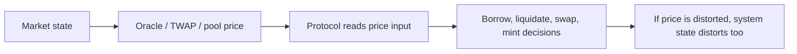

# 预言机设计与价格失败模式

## 先理解什么

很多人第一次听到“预言机”时，会把它理解成一个报价接口。  
但对协议设计来说，预言机远不只是“提供数字”的工具，它实际上在回答：

- 协议相信谁
- 协议在什么时间窗口里相信什么
- 协议愿意承受多高的失真风险

因此价格输入从来不是孤立模块，而是风险控制体系的一部分。

### 先把几个词钉牢

**TWAP** 是按时间窗口平均得出的价格指标。直觉上它像不看瞬时尖峰，而是看一段时间里的平均温度。工程上这意味着 TWAP 常被用来降低短时价格操纵的影响，但也会带来响应滞后。

**Manipulation** 是攻击者通过资金、时序或输入扭曲系统感知结果的行为。直觉上它像有人故意把温度计放到火边，让系统以为天气变了。工程上这意味着任何价格或外部输入，只要能影响关键逻辑，就值得单独思考操纵成本。

**Price Feed** 是协议实际读取和消费的价格输入源。直觉上它像协议每天盯着看的那块报价屏。工程上这意味着价格源的更新频率、来源质量和聚合方式，会直接决定协议风险特征。

## 为什么重要

如果价格输入有问题，协议里的很多核心判断都会跟着错：

- 抵押品估值
- 借款上限
- 清算资格
- 资产兑换比例

这就是为什么你会反复看到：

- 价格操纵攻击
- Oracle 停更
- TWAP 与现货价偏离
- 多源报价不一致

DeFi 不只是要“有价格”，而是要“有足够可信、足够适用的价格”。

## 核心机制

### 1. 现货价格快，但容易被瞬时影响

最直接的价格来源，通常是某个流动性池当前时刻的 spot price。  
优点是简单、实时。  
缺点也很明显：如果流动性不够深，攻击者可以在短时间内把价格推偏。

因此单池现货价常常不适合直接驱动高价值决策。

### 2. TWAP 试图降低瞬时操纵影响

TWAP 的核心思想，是用一段时间窗口内的平均价格代替瞬时价格。  
这样攻击者如果想操纵结果，就不能只在一个区块里短暂推价，而要在更长窗口内持续付出成本。

这并不代表 TWAP 万无一失，但它通常能显著提高操纵门槛。

### 3. 外部预言机强调的是独立数据来源与聚合

像 Chainlink 这类系统的核心价值，不只是“也能给价格”，而是：

- 数据源更独立
- 不直接依赖单个 AMM 池
- 有更新、心跳、偏差阈值等机制

这类设计更适合借贷、清算等高价值场景，但它也会引入：

- 更新延迟
- freshness 判断
- 喂价异常时的容错问题

### 4. 价格系统的重点是“适配场景”

不是所有场景都该用同一种价格。

例如：

- 普通展示型前端可以接受更快但更松的价格
- 借贷协议更关心抗操纵与可验证性
- 交易撮合系统可能更在意时效性

也就是说，预言机设计不是找“最强价格”，而是找“最适合这个决策的价格系统”。

### 5. 失败模式往往比正常路径更值得看

真正成熟的协议设计不会只看：

- 正常时价格能不能工作

更会看：

- 数据停更怎么办
- 多源价格冲突怎么办
- 某个池子短时异常怎么办
- 清算时价格偏差过大怎么办

## 工程判断

以后看到任何价格设计，先做五个判断：

1. 价格来自哪里？
2. 这个来源能否被短时影响？
3. 更新时间与新鲜度如何保证？
4. 协议把它用在什么级别的决策上？
5. 如果价格异常，是否有回退或保险丝？

只要这五点里有几项含糊不清，协议风险就已经不低了。

## 本节小结

Oracle 设计的核心不是“把价格读进来”，而是决定协议应当信什么、信多久、信到什么程度。spot price、TWAP 和外部预言机各有适用场景，真正成熟的 DeFi 系统会把价格来源、操纵成本、新鲜度和失败模式一起考虑。
