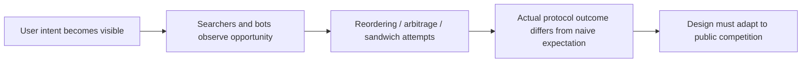

# 当协议在公开市场中竞争时会发生什么

## 先理解什么

很多人第一次学 DeFi，会把协议逻辑看成一种静态系统：

- 用户提交交易
- 协议按规则执行
- 状态更新完成

真实世界里，这个过程远没有这么安静。  
因为所有动作都发生在公开链上，其他人能看到：

- 你的意图
- 你的参数
- 你的利润空间

只要一笔交易带着明显价值，别人就可能围绕它行动。

## 为什么重要

如果你忽略这层公开竞争环境，就会高估很多协议设计的稳定性。  
你以为自己设计的是：

- 一个 swap 逻辑
- 一个清算逻辑
- 一个铸造流程

但放到真实链上，它们其实更像：

- 一个公开竞价场
- 一个可被观察与重排的机会集
- 一个激励驱动的博弈系统

这就是为什么 MEV、套利和前后夹击，不是“可选高级话题”，而是协议现实的一部分。

## 核心机制

### 1. 套利不是异常，而是协议状态回到市场一致性的力量

很多时候，套利者并不是坏人角色。  
他们常常在做的是：

- 把池子价格拉回外部市场
- 利用协议定价滞后获利

从系统角度看，这说明协议不是孤立存在的，它一直在和更大市场互动。

### 2. MEV 说明“可执行”不等于“按你期待顺序执行”

公开 mempool 和打包激励意味着一件事：  
你的交易并不天然拥有顺序主权。

只要别人能在你前后插入动作并获利，就可能出现：

- 抢跑
- 跟跑
- 夹击

这会直接影响：

- 用户实际成交价格
- 清算收益归属
- 某些敏感操作的公平性

### 3. 参数设计会直接暴露或缓解博弈面

很多协议参数并不是单纯产品调优，而是在决定博弈边界，例如：

- 滑点设置
- 清算奖励
- 时间窗口
- 报价延迟

这些参数会影响别人围绕你的协议能做什么、能赚多少、值不值得出手。

### 4. “公开环境可观察”本身就是设计约束

Web2 系统很多动作发生在服务端私有环境。  
DeFi 不一样，关键意图常常在上链前就暴露。

所以成熟设计会问：

- 这笔交易是不是暴露了可被剥削的利润
- 有没有给用户足够的保护参数
- 是否应该采用更稳的报价机制

### 5. 协议不是在真空里运行，而是在持续被试探

一旦协议里存在：

- 价格滞后
- 可预测奖励
- 可抢夺清算
- 用户大额滑点容忍

市场参与者就会围绕这些设计寻找机会。

## 工程判断

以后你看一个 DeFi 协议设计，先问：

1. 哪些用户动作暴露了明显利润空间？
2. 谁能在公开环境中观察并抢占这些机会？
3. 参数设置是否在放大还是抑制这种行为？
4. 用户有没有足够保护机制？
5. 协议能否接受这种博弈结果，还是会被系统性伤害？

这五问会让你的设计判断更接近链上现实。

## 本节小结

DeFi 协议不是只和用户交互，也是在与公开市场、套利者、搜索者和打包激励持续互动。MEV 与套利不是边角现象，而是公开链设计环境下的长期约束。理解这一点后，你会更自然地把博弈性带回协议设计与阅读中。
