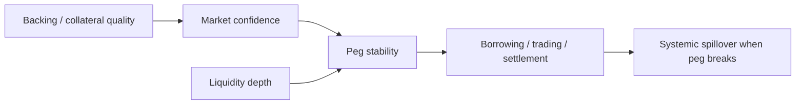

# 稳定系统是如何维持、又是如何失稳的

## 先理解什么

很多人谈稳定币时，第一反应是：

- 1 个代币应该等于 1 美元

但这只是表面现象。  
真正的问题是：

- 为什么市场愿意把它当作接近 1 美元的资产
- 当价格偏离时，什么力量会把它拉回去
- 如果拉回机制失效，会怎样沿协议网络扩散

所以“稳定”不是静态属性，而是一套持续维持的经济结构。

## 为什么重要

稳定币在 DeFi 里常常是：

- 计价单位
- 抵押资产
- 结算媒介
- 收益承载资产

这意味着一旦稳定性动摇，影响很少只停在一个池子里。  
它往往会同时牵动：

- 借贷健康度
- 抵押价值
- 流动性池价格
- 清算行为
- 用户信心

所以稳定币风险本质上是系统性风险入口之一。

## 核心机制

### 1. 稳定性来自可兑现预期，而不只是挂钩口号

一个稳定系统之所以能接近 peg，关键在于市场相信：

- 它有足够支撑资产
- 有合理赎回或套利路径
- 流动性足够承接偏离修复
- 在压力时不会迅速失去秩序

也就是说，peg 的核心是“市场为什么相信偏离后能回去”。

### 2. 不同稳定机制，对风险来源的暴露完全不同

你以后看稳定币，至少要区分几类支撑方式：

- 法币或现实资产储备支撑
- 超额抵押链上资产支撑
- 更复杂的算法或混合机制

它们不是“实现不同但本质一样”，而是风险面不同：

- 资产托管风险
- 抵押波动风险
- 流动性枯竭风险
- 机制反馈失灵风险

### 3. peg 修复往往依赖套利，但套利要建立在路径真实可执行

大家常说：

- 偏离了就会有人套利把它拉回去

这句话只在几个条件同时成立时才靠谱：

- 可以方便地买入或卖出
- 赎回路径顺畅
- 费用与滑点可接受
- 市场仍相信系统不会进一步恶化

如果这些条件受损，理论套利机制就可能在现实中失效。

### 4. 稳定系统最怕“资产、流动性、信心”三者同时走弱

价格脱锚最危险的不是一时偏离，而是负反馈链启动：

- 支撑资产价值下跌
- 市场流动性变差
- 用户担心进一步失稳而抢先退出
- 退出行为又进一步放大卖压与清算压力

这会让系统从局部波动变成加速失稳。

### 5. 系统性风险来自协议之间的依赖网络

稳定币一旦被广泛接入，就不只是“一个项目的资产”，而会成为：

- 借贷协议中的抵押品或债务资产
- DEX 池中的基准资产
- 收益策略中的底层仓位
- 其他协议价格锚或结算单位

因此稳定系统失灵时，真正危险的不是单点价格，而是依赖网络的连锁反应。

### 6. 阅读稳定币系统时，要同时看机制内和机制外

只读白皮书里的内部机制远远不够。  
你还要看：

- 外部流动性在哪里
- 主要交易对和深度如何
- 赎回门槛和摩擦有多大
- 哪些其他协议深度依赖它

## 工程判断

以后分析稳定币或相关协议时，先问：

1. 这个 peg 主要靠什么力量维持？
2. 偏离后真实可执行的修复路径是什么？
3. 压力时，资产、流动性和信心哪一项最先脆弱？
4. 哪些协议把它当作核心依赖？
5. 如果它失稳，风险会沿哪条路径传染？

只要这五个问题不清楚，你对稳定系统的理解就还停留在表面。

## 本节小结

稳定币并不是“天然稳定的美元替身”，而是一套需要持续被资产质量、流动性与市场预期共同维持的系统。一旦维持机制受损，风险会迅速从单一资产扩散成 DeFi 网络级问题。
