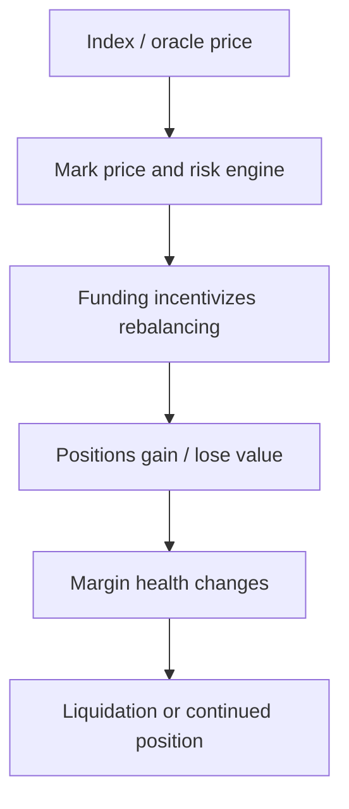

# 链上衍生品怎样通过资金费率贴近现货

## 先理解什么

第一次接触永续合约的人，最容易困惑的是：

- 它没有到期日
- 却又想跟现货价格保持接近
- 那它到底靠什么回到锚点？

这就是 funding 机制存在的核心背景。  
永续不是“没有到期日的普通期货”这么简单，它必须持续想办法把市场价格拉回参考价格附近。

## 为什么重要

如果你不理解永续系统的几个关键部件，就很难真正看懂：

- 为什么多空持仓会互相支付资金费
- 为什么 UI 里要同时显示 mark price、index price 和 funding rate
- 为什么高杠杆市场会和预言机、清算系统高度耦合
- 为什么某些协议在极端行情下会触发 ADL、保险基金或限价保护

链上衍生品不是“给现货加个倍率按钮”，而是一整套价格、风险和激励系统。

## 核心机制

### 1. 永续合约需要一个“参考真相”

一个永续市场通常至少会围绕两种价格运转：

- index price：外部参考价格，通常来自现货或预言机
- mark price：系统内部用于结算、风险控制和清算判断的价格

为什么不只用一个价格？

因为系统既要：

- 贴近外部市场
- 又要避免短时异常成交直接引爆清算

所以 mark price 往往承担“更稳的风险锚”角色。

### 2. funding 的本质是让偏离价格的一侧持续付费

如果永续市场价格长期高于现货参考价，通常意味着：

- 做多需求过强

这时系统会倾向于让：

- 多头向空头支付 funding

反过来，如果永续价格长期低于参考价，则更可能：

- 空头向多头支付 funding

它的高层逻辑可以粗略表达为：

```text
funding direction depends on whether perp price is above or below the reference
```

重点不在公式本身，而在激励：

- 偏离越持续，站在拥挤一侧的成本越高
- 这会推动交易者重新平衡仓位，帮助价格靠近参考锚

### 3. 杠杆把小波动放大成仓位生死问题

一旦加上杠杆，系统就必须持续回答两个问题：

- 这个仓位当前还能不能承受波动？
- 如果不能，谁来接手风险？

于是永续系统一定会搭配：

- initial margin
- maintenance margin
- liquidation engine

你可以把它理解成：

- 仓位在波动中不断被重新估值
- 当保证金不足以覆盖继续持仓风险时，系统强制收缩风险

### 4. 清算不是附属功能，而是市场活下去的核心条件

很多新手把清算理解成“极端情况下才会发生的补充流程”。  
其实对杠杆系统来说，清算是核心生命线。

因为如果亏损仓位不能及时被处理，问题就会从个人仓位传导到：

- 对手方
- 协议保险基金
- 整个市场偿付能力

这也是为什么链上永续协议必须高度重视：

- 预言机质量
- mark 价格设计
- 清算激励
- 极端情况下的系统保护机制

### 5. 链上永续比传统交易系统更公开，也更受底层基础设施影响

它和传统中心化撮合环境最大的差别之一，是很多东西都更公开、更可组合：

- 持仓风险会和链上 oracle 紧耦合
- 订单与执行会受链上延迟和排序影响
- 保险机制和清算参与者通常也是公开可见的

这意味着永续协议不只是市场设计，还同时是：

- oracle 设计题
- MEV 设计题
- liveness 设计题

### 6. 看永续协议时，要把价格、资金费和风险引擎一起看

真正稳的分析顺序通常是：

1. 参考价格从哪里来  
2. mark price 怎样形成  
3. funding 怎样调节偏离  
4. 保证金怎样计算  
5. 何时触发清算  
6. 极端行情下由谁 absorb residual risk



## 工程判断

以后你看一个永续协议或相关前端时，优先问：

1. 参考价格和风险价格分别是什么，为什么这样分？
2. funding 在调节哪一种偏离？
3. 用户看到的高收益、高杠杆背后，清算机制是否足够清楚？
4. 协议对预言机异常、极端波动和系统亏空准备了什么缓冲？
5. UI 是在帮助用户理解风险，还是只在放大刺激感？

把这些问题问明白，你就真的开始看懂永续产品了。

## 本节小结

永续合约之所以能长期存在，不是因为“没有到期日也没关系”，而是因为系统通过参考价格、mark price、funding、保证金和清算引擎不断把市场拉回可持续区间。理解这套联动，你才能真正理解链上杠杆产品。
