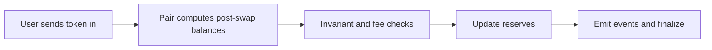

# Pair 状态与 Swap 主线如何阅读

## 先理解什么

读 Uniswap V2 最容易犯的错误，是一上来就被 Router、Library、Factory、Pair 一堆文件包围，然后开始逐行翻译。那样非常累，而且读到后面常常忘了自己为什么在看这一段。

更有效的方式是先抓核心问题：

- 资金主要存在哪里？
- 哪个合约维护池子状态？
- swap 为什么能成立？
- 哪些不变量在约束状态变化？

当你这样读时，Pair 合约就会自然成为中心。

## 为什么重要

Uniswap V2 是很多后续协议设计的起点。  
你读懂它，不只是学会一个 AMM，而是在训练一种非常有价值的能力：

- 从状态入手理解协议
- 从资金流梳理函数意义
- 从不变量理解看似复杂的实现

这套方法以后读任何 DeFi 协议都用得上。

## 核心机制

### 1. 先识别“最重要状态”而不是“最多函数”

Pair 合约真正关键的不是函数数量，而是少数几个高价值状态：

- 两种代币储备量
- LP token 总量
- 上次更新时间
- 价格累计值等辅助状态

这些状态支撑了池子的核心行为：  
添加流动性、移除流动性、交换、价格观察。

所以你读源码时第一步不是把所有函数记下来，而是先问：  
“这些函数最终都在维护哪些状态？”

### 2. 把 swap 看成“在不变量约束下重排池内资产”

对 Uniswap V2 的最小心智模型可以这样表述：

- 池子里有两种资产储备
- 用户拿一种进来，拿另一种出去
- 协议通过不变量与手续费规则约束这次变化是否合法

很多资料会直接说 `x * y = k`。  
这个公式当然重要，但更值得你先抓住的是：  
swap 的本质不是“神秘定价函数”，而是“池内状态变化必须满足一组约束”。

### 3. 阅读顺序最好按“结构 -> 状态 -> 入口 -> 校验”

推荐顺序是：

1. 先看 Factory 做什么，知道 Pair 从哪里来
2. 再看 Pair 的状态变量与构造约束
3. 再读 `mint`、`burn`、`swap` 这些核心入口
4. 最后再去理解 Router 如何组织多步调用

这样读的好处是，你始终知道每个入口函数在整个系统里的角色，而不会被局部实现细节带跑。

### 4. 关注不变量与失败路径，比关注语法更重要

看 `swap` 时最值得你抓的不是每一行代码细枝末节，而是这些问题：

- 用户拿走的数量受到什么约束
- 储备量何时更新
- 手续费怎样影响有效输入
- 哪些条件不满足时必须回滚

一旦这条主线清楚，代码就不再只是“很多 if 和计算”，而是“在保护池子状态不被破坏”。

### 5. 用“协议讲解文档”反向检验自己是否真的读懂

读完一段后，试着不用源码原话，而是自己写一段解释：

- Pair 为什么要记录 reserves
- LP token 为什么代表份额
- swap 为什么不能随便取走资产
- 事件发出后，链下系统能读到什么

如果你能把这些讲给另一个开发者听，说明你不是在机械翻译，而是真的开始理解结构。

## 工程判断

以后读 Uniswap V2，建议每次只做一件事：

1. 今天只读 Pair 状态
2. 明天只读 `mint` / `burn`
3. 后天只读 `swap`
4. 然后补 Router 与 Library

把协议阅读切成可管理的小块，比试图一次啃完整仓库有效得多。

## 本节小结

阅读 Uniswap V2 的关键，不在于一次看完所有文件，而在于先抓 Pair 的核心状态与 swap 主线，再用不变量和资金流把实现组织起来。这样你读到的就不是“经典代码片段”，而是一台真正运行中的协议机器。
